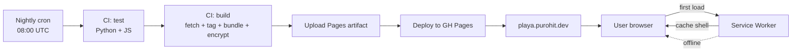

# System Overview

## Overview

Playa Camps is a **single-page static site** that lets a private group
of friends browse + plan around the official Burning Man theme-camp
directory before and during the burn. The pipeline pulls public data
from `directory.burningman.org`, transforms it, and ships a
self-contained, password-gated, offline-capable PWA to GitHub Pages.

The shape of every architectural decision falls out of three
constraints:

1. **Public code repo, private data.** The repo is public for
   portability; camp content (which is copyrighted by the camps) must
   never land in git.
2. **No backend.** Everything runs at build time (Python on a CI
   runner) or at view time (TypeScript in the browser). No app server,
   no database, no API to operate.
3. **Burn-week reality.** Most users will be on cellular or no network
   on-playa. The site must work fully offline after one good load.

## Decisions

- **Static site over dynamic.** GH Pages is free, reliable, and the
  artifact is one HTML file. No backend means no auth, no rate limits,
  no service to maintain.
- **Build-time data baking.** Camp data is fetched, parsed, tagged,
  encrypted, and inlined into `index.html` at build time. Avoids
  per-request fetches at runtime — important for the offline mode
  and for keeping the live site readable from cache.
- **Symmetric encryption + shared password.** A friend group with one
  shared secret is the right access model for this audience. Real
  per-user auth would be 10× the complexity for ~10× more security
  than this needs.
- **Public repo, hard `.gitignore`.** Code lives publicly, data never
  hits git. Every CI run fetches fresh from upstream and uploads only
  the built artifact.

## Mechanism

Two halves of the codebase:

- **`backend/src/playa/`** (Python 3.12, stdlib + openssl CLI):
  fetch HTML, parse, tag, encrypt, write `site/index.html` + `sw.js` +
  `version.txt`.
- **`client/src/`** (TypeScript + Preact + esbuild): bundled into one
  `~35 KB` IIFE that the Python builder inlines into the HTML. The
  client decrypts the embedded payload at runtime, renders the UI,
  manages favorites, runs the map, etc.

The boundary between them is the HTML template
(`backend/src/playa/templates/site.html`) — the Python side fills
placeholder tokens (`__DATA_SCRIPT__`, `__BUNDLE__`, `__VERSION__`,
`__RELEASE_NOTES__`, etc.) and emits the final document.

## Failure modes & trade-offs

- **Single-password access** — losing or rotating the password requires
  a rebuild + redeploy + re-distribution to friends. Acceptable since
  the audience is small. See
  [revocation-plan.md](./revocation-plan.md).
- **Build is the only update path.** Tag changes, parser fixes, etc.
  require a CI run to reach users. Force-refresh handles the
  sub-day window; nightly cron is the worst case.
- **Camp data is a snapshot.** Anything edited on the upstream
  directory after the last fetch is invisible until the next nightly.
  The About modal makes this explicit ("anything changed after the
  nightly refresh — trust less").

## Code references

- `backend/src/playa/builder.py` — pipeline orchestrator
- `client/src/index.tsx` — client entry
- `backend/src/playa/templates/site.html` — the HTML shell
- `.github/workflows/refresh.yml` — CI orchestration
- `Makefile` — local dev surface
