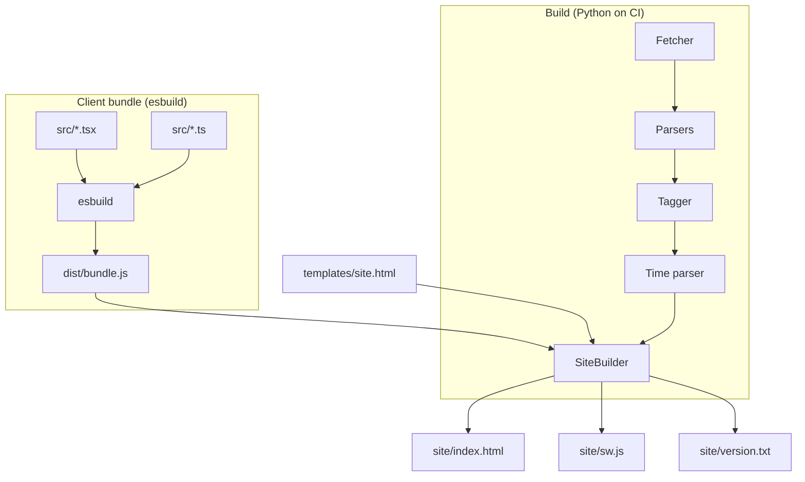

# Tech Stack & Tool Choices

## Overview

Each library and tool was picked to minimize ongoing operational cost.
The site lives at the edge (Pages CDN); maintenance is mostly "do
nothing and the cron keeps refreshing it."

## Decisions

### Server side — Python 3.12, stdlib only

- **Python over Node**: the fetch + parse + transform pipeline is
  imperative I/O glue. Python's stdlib has `urllib`, `re`, `csv`,
  `concurrent.futures`, `json`, `zoneinfo` — everything we need.
- **No third-party dependencies**: the only external program is
  `openssl` (pre-installed on `ubuntu-latest`). Means CI has no
  `pip install` step beyond an editable install of the project itself,
  no Renovate noise on Python packages.
- **`openssl` CLI for crypto**: shells out for the camp-data
  encryption (`AES-256-CBC + PBKDF2`). Battle-tested, available
  everywhere, and the JS-side decryption uses the same well-known
  parameters via Web Crypto. Round-trip tests verify both sides agree.

### Client side — Preact + TypeScript + esbuild

- **Preact (3 KB) over React (40 KB)**: same hooks API, much smaller.
  At our scale we never hit a Preact gap. Bundle ships in the same
  request as the page, so size matters.
- **TypeScript strict**: every flag on (`strict`, `noImplicitAny`,
  `noUnusedLocals`, `noImplicitReturns`). Catches state-shape bugs
  before they ship — the alternative would be runtime crashes on
  someone's phone in the desert.
- **JSX via esbuild's automatic runtime**: standard JSX with
  `jsxImportSource: "preact"`. We tried `htm` early on; dropped it
  because it hadn't been updated in 4+ years and standard JSX gets
  better editor + linter support.
- **esbuild over Webpack/Rollup**: zero config, single binary, sub-100ms
  builds. The whole "build the client" step is `node esbuild.config.mjs`
  — no plugin ecosystem to babysit.

### Test runner — `node --test` + happy-dom + tsx

- `node --test` is built-in to Node 22 and runs TypeScript via `tsx`.
  No Jest/Vitest config surface, no transformer chain.
- `happy-dom` over `jsdom`: faster, lighter, runs in Node without a
  shim for `localStorage`/`SubtleCrypto` (we use both).
- Tests render real Preact into a happy-dom document — they exercise
  actual DOM output, not snapshot fixtures.

### CI/CD — GitHub Actions + GitHub Pages

- **Pages over a real host**: free, custom-domain-ready, and the
  deploy story is just "upload an artifact." No DNS rewriting, no
  CDN config, no SSL renewal.
- **Three-job workflow** (test → build → deploy): test gate prevents a
  broken parser from ever overwriting the live site. See
  `.github/workflows/refresh.yml`.
- **Nightly cron at 08:00 UTC** (≈ 01:00 PT): low-traffic time, fresh
  data ready before anyone in PST wakes up.

### Dependency management — Renovate

- Bot opens grouped non-major PRs weekly with a 14-day cooling-off
  window. Auto-merges when CI passes.
- Major bumps land as separate PRs labelled `major`, no auto-merge.
  TypeScript / esbuild / preact major jumps usually carry breaking
  changes worth a human read.
- **No semver-tightening**: package.json uses `^` ranges, lockfile
  pins exact versions. Reproducible builds, controlled updates.

## Mechanism

## Failure modes & trade-offs

- **No backend = no per-user features**. Wishlist items like push
  notifications or live event updates would require infra we
  deliberately don't have. We accept that gap.
- **Stdlib-only Python locks us in to standard parsers**. If the
  upstream HTML structure changes, we patch regex; we don't pull in
  a beautifulsoup-shaped dep.
- **Preact gaps vs React**: rare bugs in third-party React libs that
  hit Preact's compatibility layer. We mostly write our own components,
  so this almost never bites.

## Code references

- `backend/pyproject.toml` — Python project / `playa` console script
- `client/package.json` — Node dependency list
- `client/esbuild.config.mjs` — bundler config
- `client/tsconfig.json` — TS strict flags
- `renovate.json` — bot schedule + grouping rules
