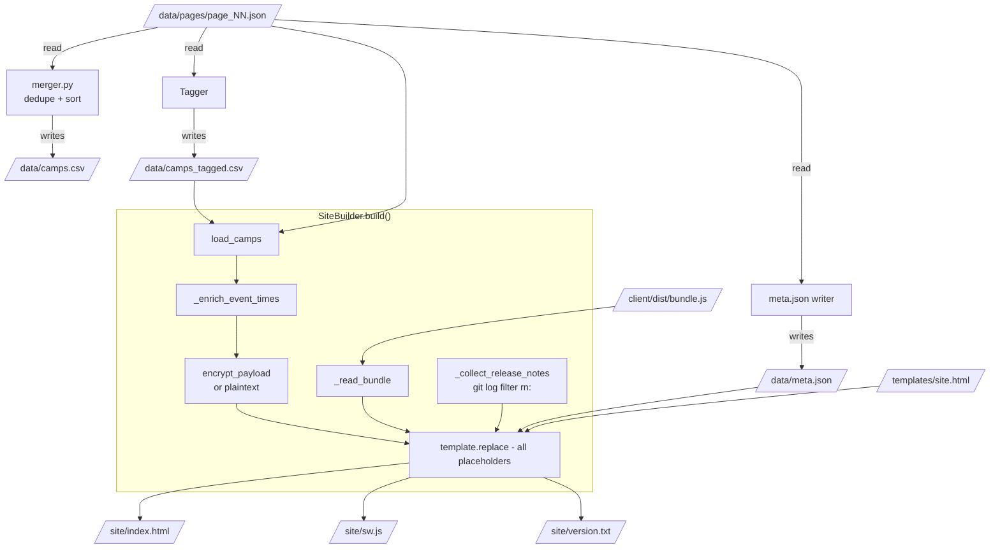

# Build Pipeline

## Overview

The build is the only mutation path between the upstream directory and
the live site. Locally a single `make rebuild` walks the entire
pipeline; in CI three Actions jobs (`test → build → deploy`) wrap it
with the safety + artifact-upload story.

## Decisions

- **Two-stage build, single artifact.** Client is bundled into one
  IIFE with esbuild; Python builder inlines that IIFE into the HTML
  shell along with the data. Output is one self-contained
  `index.html` plus a couple of small auxiliary files. No multi-asset
  loader, no chunk splitting — keeps the install + offline story
  simple.
- **Pure functions where possible.** Each stage (`fetch`, `merge`,
  `tag`, `meta`, `build`) is a separate idempotent step that reads its
  inputs and writes its outputs to disk. Lets us iterate on tags or
  template tweaks via `make rebuild` without re-fetching.
- **Min-camps rail.** `SiteBuilder.build()` refuses to produce a site
  with fewer than `MIN_CAMPS` (default 500) camps loaded. Prevents a
  parser regression from overwriting the live deploy with a broken
  near-empty build.

## Mechanism

### Stages, in order

1. **`fetch` / `fetch-all`** (`Fetcher`) — pulls listing pages 1..N
   in parallel via `ThreadPoolExecutor`, walks each detail page,
   writes `data/pages/page_NN.json`. Sleeps 200 ms between detail
   fetches to stay polite. Falls back to listing-page data if a
   detail fetch fails.
2. **`meta`** (`write_meta`) — counts pages/camps/events, stamps an
   ISO timestamp + Pacific date + version (`vYYYY.MM.DD.HHMM`).
3. **`merge`** (`merge_csv`) — dedupes by id, sorts alphabetically,
   writes `data/camps.csv` (tags column blank).
4. **`tag`** (`Tagger`) — runs the keyword taxonomy from
   `tagger.py` over the haystack (name + description + events) for
   each camp, writes `data/camps_tagged.csv`.
5. **`build`** (`SiteBuilder.build`) — loads camps, enriches event
   times, encrypts the JSON payload (or leaves plaintext), reads the
   bundle, collects `rn:` release notes, fills template placeholders,
   writes `site/index.html` + `site/sw.js` + `site/version.txt`.

`make fetch` runs all five. `make rebuild` skips step 1 (and uses
existing `data/pages/`). `make dev` lazy-fetches once when the cache
is empty, otherwise rebuilds.

### Safety rails

- **`MIN_CAMPS` rail** in `SiteBuilder.build`: aborts when too few
  camps loaded. CI relies on this to avoid pushing a broken artifact.
- **Bundle `</script>` guard**: the builder rejects any bundle that
  contains a literal `</script>`, since that string would terminate
  the inline `<script>` block early. esbuild doesn't produce one,
  but the check is a defensive belt-and-suspenders.
- **`fetch-all` snapshot**: `make fetch` first moves the existing
  `data/pages/*.json` to `data/pages-backups/<timestamp>/` before
  re-fetching. Lets us roll back to a known-good fetch if upstream
  HTML drifts.

## Failure modes & trade-offs

- **Polite-but-slow fetch (5 parallel × 30 pages × 50 camps × 200 ms ≈
  60 s)** is fine for nightly cron, painful for local iteration. Hence
  `fetch-small` (3 pages) and the snapshot/restore flow.
- **Tag taxonomy is keyword-based**, so semantic misses are common.
  The /update-tags Claude skill walks the periodic audit.
- **One artifact = no incremental updates.** A typo fix in the legend
  text re-uploads the whole 2.7 MB site. Acceptable since deploy is
  ~30 s end-to-end.

## Code references

- `backend/src/playa/builder.py` — orchestrator
- `backend/src/playa/cli.py` — CLI subcommand routing
- `backend/src/playa/fetcher.py` — HTTP, retries, parallelism
- `backend/src/playa/tagger.py` — taxonomy + matching
- `backend/src/playa/timeparser.py` — event time normalization
- `Makefile` — `dev`, `fetch`, `fetch-small`, `rebuild`, etc.
