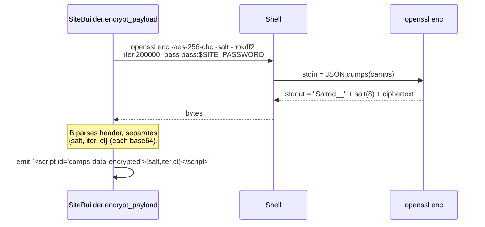
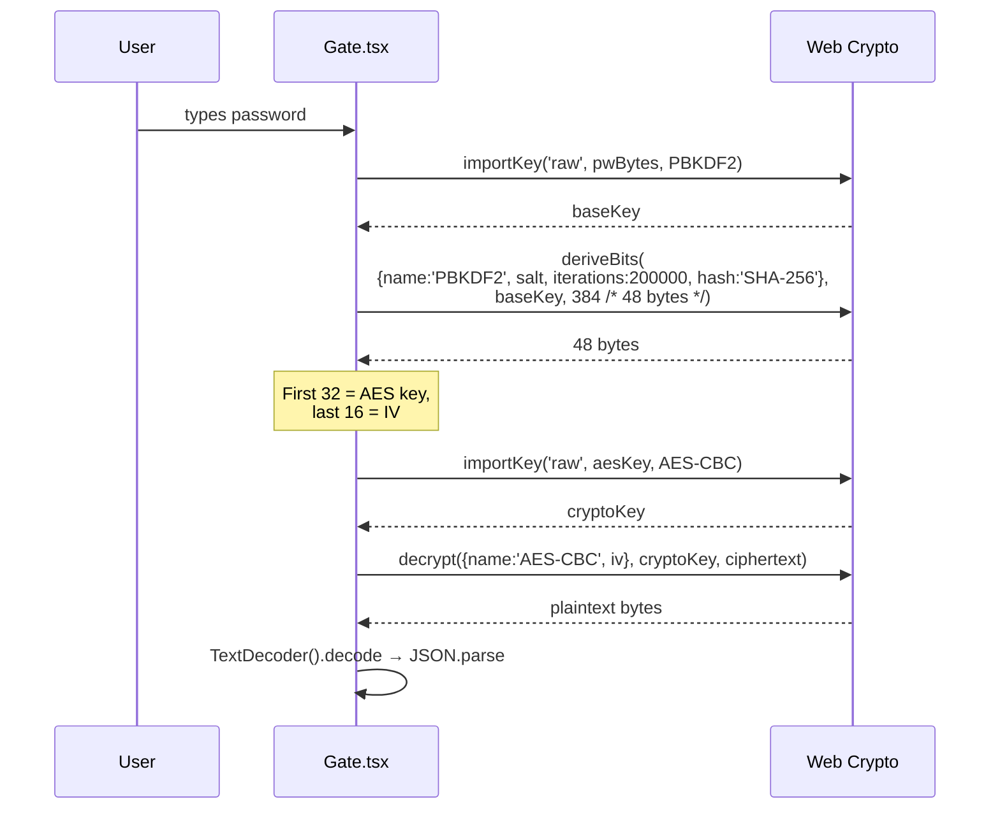

# Camp Data Encryption

## Overview

When `SITE_PASSWORD` is set at build time, the inlined camp JSON is
**AES-256-CBC encrypted with PBKDF2-HMAC-SHA256 key derivation**. The
Python builder shells out to `openssl`; the browser decrypts via Web
Crypto. Both sides agree on the same well-known parameters, and the
test suite proves the round-trip.

When `SITE_PASSWORD` is unset (local dev), the payload ships
plaintext — no gate, faster iteration.

## Decisions

- **AES-256-CBC** — wide compatibility (`openssl enc` ships with every
  Linux/Mac, Web Crypto supports it everywhere). AES-GCM would be
  modern but adds complexity to the openssl pipeline (no `-mode gcm`
  in the simple `enc` interface).
- **PBKDF2-HMAC-SHA256, 200_000 iterations** — slow enough to make
  brute-forcing a leaked share painful, fast enough that the unlock
  feels instant on a modern phone (~100–300 ms).
- **`openssl enc` salt convention** — the binary output starts with
  `Salted__` + 8-byte salt + ciphertext. Both encrypt + decrypt sides
  parse this header so we don't roll our own framing.
- **Symmetric, single shared password** — the audience is "friends in
  a group chat." Public-key would be infrastructurally heavier without
  meaningful upgrade for this threat model.

## Mechanism

### Encrypt (Python build time)

### Decrypt (browser, runtime)

## Failure modes & trade-offs

- **Wrong password → catch** + show `Wrong password. Try again.`. No
  oracle leak; the same generic error fires for any decrypt failure.
- **Public repo means everyone sees the encrypted ciphertext** as soon
  as the site is loaded. Privacy of the data depends entirely on
  password strength + that PBKDF2 iteration count. 200k is comfortable
  for personal-use; well-funded attackers with GPU farms are out of
  scope.
- **One password for the whole site** — rotation requires a rebuild +
  redistribution. Documented in
  [revocation-plan.md](./revocation-plan.md).
- **AES-CBC has no integrity tag**. A bit-flipped ciphertext could in
  principle decrypt to garbage that JSON.parse may or may not reject.
  In practice the JSON parser catches the corruption; we don't add an
  HMAC because the threat (active attacker tampering with cached
  bytes) isn't in our model.

## Code references

- `backend/src/playa/builder.py` — `encrypt_payload`, parsing the
  `Salted__` header
- `backend/src/playa/templates/site.html` — embedded decrypt JS
  (search for `loadCamps`)
- `client/src/crypto.ts` — actual decrypt path used by the bundled
  client (replaces the inline JS post-bundle)
- `client/tests/crypto.test.ts` — round-trips against the real
  `openssl` binary via `spawnSync`, verifies parity + wrong-password
  rejection
- `backend/tests/test_builder.py::EncryptPayloadTests` — round-trip
  on the Python side too
