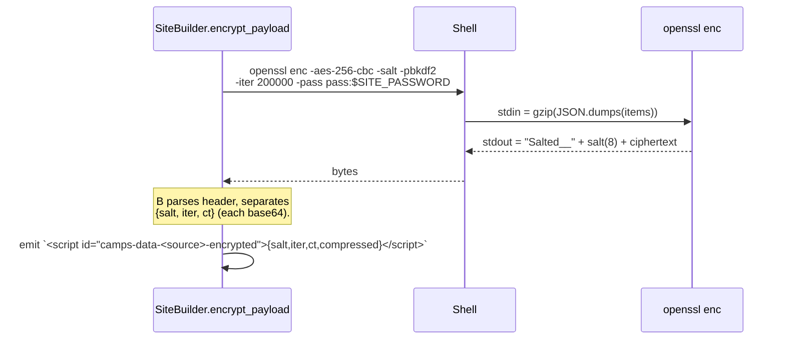
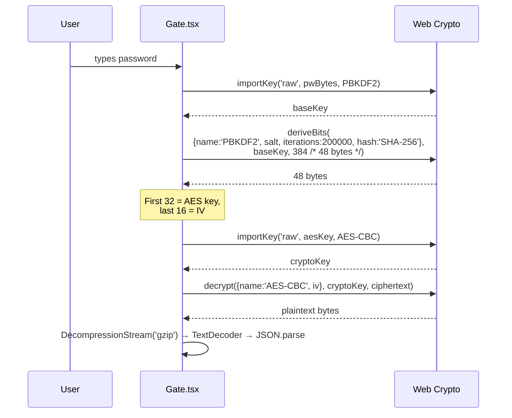

# Data Encryption

## Overview

When `SITE_PASSWORD` is set at build time, each inlined camps/art JSON payload is
**AES-256-CBC encrypted with PBKDF2-HMAC-SHA256 key derivation**. The
Python builder shells out to `openssl`; the browser decrypts via Web
Crypto. Both sides agree on the same well-known parameters, and the
test suite proves the round-trip.

When both `SITE_PASSWORD` and `SITE_TIERS` are unset (local dev), payloads ship
as gzip+base64 without encryption—no gate, faster iteration. Production uses
multi-tier envelope encryption through `SITE_TIERS`; the legacy shared-password
path remains supported.

## Decisions

- **AES-256-CBC** — wide compatibility (`openssl enc` ships with every
  Linux/Mac, Web Crypto supports it everywhere). AES-GCM would be
  modern but adds complexity to the openssl pipeline (no `-mode gcm`
  in the simple `enc` interface).
- **PBKDF2-HMAC-SHA256, 200_000 iterations** — slow enough to make
  brute-forcing a leaked share painful, fast enough that the unlock
  feels instant on a modern phone (~100–300 ms).
- **`openssl enc` salt convention** — native password-encrypted output is
  `Salted__` (bytes 0–7) + an 8-byte salt (bytes 8–15) + ciphertext
  (bytes 16 onward). Python validates and splits those offsets into the JSON
  `{salt, iter, ct}` envelope; browser code consumes the split fields rather
  than reparsing the native header. Encrypted API cache files retain the native
  frame because Python passes the entire file back to openssl.
- **Symmetric, single shared password** — the audience is "friends in
  a group chat." Public-key would be infrastructurally heavier without
  meaningful upgrade for this threat model.

## Mechanism

### Encrypt (Python build time)

```mermaid
sequenceDiagram
  participant B as SiteBuilder.encrypt_payload
  participant SH as Shell
  participant O as openssl enc

  B->>SH: openssl enc -aes-256-cbc -salt -pbkdf2<br>-iter 200000 -pass pass:$SITE_PASSWORD
  SH->>O: stdin = gzip(JSON.dumps(items))
  O-->>SH: stdout = "Salted__" + salt(8) + ciphertext
  SH-->>B: bytes
  Note over B: B parses header, separates<br>{salt, iter, ct} (each base64).
  B->>B: emit `<script id="camps-data-<source>-encrypted">{salt,iter,ct,compressed}</script>`
```

### Decrypt (browser, runtime)

```mermaid
sequenceDiagram
  participant U as User
  participant G as Gate.tsx
  participant W as Web Crypto

  U->>G: types password
  G->>W: importKey('raw', pwBytes, PBKDF2)
  W-->>G: baseKey
  G->>W: deriveBits(<br>{name:'PBKDF2', salt, iterations:200000, hash:'SHA-256'},<br>baseKey, 384 /* 48 bytes */)
  W-->>G: 48 bytes
  Note over G: First 32 = AES key,<br>last 16 = IV
  G->>W: importKey('raw', aesKey, AES-CBC)
  W-->>G: cryptoKey
  G->>W: decrypt({name:'AES-CBC', iv}, cryptoKey, ciphertext)
  W-->>G: plaintext bytes
  G->>G: DecompressionStream('gzip') → TextDecoder → JSON.parse
```

### Envelope mode (`SITE_TIERS`)

The builder generates one random 32-byte DEK per source. Camps and art share
that DEK but use separate random IVs, then each gzipped payload is encrypted
with raw AES-256-CBC. Every permitted `(tier, source)` pair gets a small
password-encrypted 48-byte wrapper containing `DEK || camps IV`. Password
wrappers use the same PBKDF2/openssl framing shown above; raw source ciphers do
not have a `Salted__` header because their key and IV are supplied explicitly.

At unlock, `EnvelopeGate` walks wrapper indices for every source. The first
wrapper that decrypts to exactly 48 bytes unlocks that source; an all-source
failure produces the same generic wrong-password UI. Current cipher objects
carry their own IV, so art uses its distinct IV and the wrapped camps IV remains
as a compatibility fallback. See [D10](./15-data-sources.md#d10--tiered-access-via-envelope-encryption)
for the full build/client walkthrough and size rationale.

## Failure modes & trade-offs

- **Wrong password → catch** + show `Wrong password. Try again.`. No
  oracle leak; the same generic error fires for any decrypt failure.
- **Public repo means everyone sees the encrypted ciphertext** as soon
  as the site is loaded. Privacy of the data depends entirely on
  password strength + that PBKDF2 iteration count. 200k is comfortable
  for personal-use; well-funded attackers with GPU farms are out of
  scope.
- **One password for the whole site** — rotation requires a rebuild +
  redistribution. Documented in
  [revocation-plan.md](./revocation-plan.md).
- **AES-CBC has no integrity tag**. A bit-flipped ciphertext could in
  principle decrypt to garbage. Padding, gzip, payload-length checks, and
  JSON parsing catch ordinary corruption, but none is cryptographic
  authentication. We don't add an
  HMAC because the threat (active attacker tampering with cached
  bytes) isn't in our model.

## Code references

- `backend/src/playa/builder.py` — `encrypt_payload`, parsing the
  `Salted__` header
- `backend/src/playa/templates/site.html` — script/meta placeholders that carry
  encrypted payloads and wrapper manifests
- `client/src/crypto.ts` — actual decrypt path used by the bundled
  client (replaces the inline JS post-bundle)
- `client/tests/crypto.test.ts` — round-trips against the real
  `openssl` binary via `spawnSync`, verifies parity + wrong-password
  rejection
- `backend/tests/test_builder.py::EncryptPayloadTests` — round-trip
  on the Python side too
