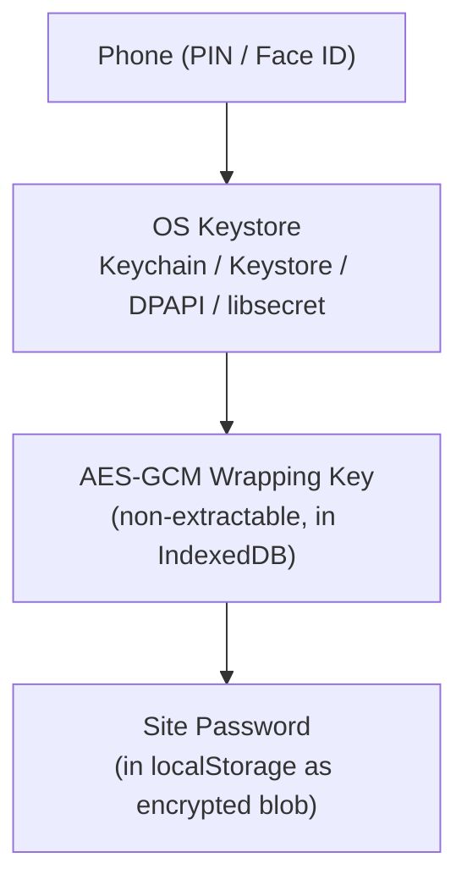
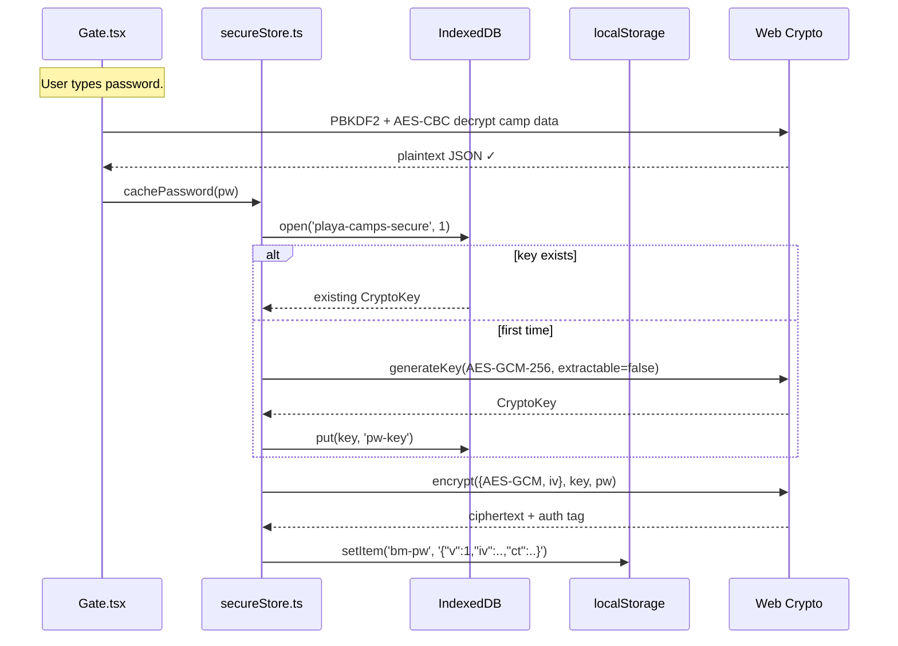
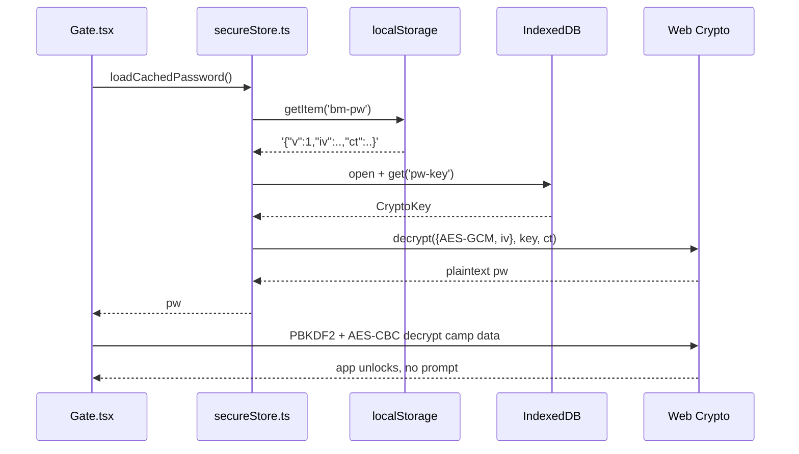

# Password Management & Secure Cache

## Overview

The user's typed site password is the key to the entire app — it
unlocks the camp data and stays remembered across visits. Two design
problems sit on top of that:

1. **Don't make the user retype after every tab kill** — mobile
   browsers reclaim background tabs aggressively.
2. **Don't leak the password to backups, forensic dumps, or other
   apps reading browser data** — even though localStorage is
   same-origin isolated.

The solution is a **Web Crypto AES-GCM wrapping key** stored as a
non-extractable `CryptoKey` in IndexedDB, encrypting the password
before it ever lands in localStorage.

## Decisions

- **localStorage over sessionStorage for the cache** — sessionStorage
  evaporates on tab kill, which mobile Safari/Chrome do constantly.
  localStorage survives. The previous "re-prompt every 30 min on
  iOS" complaint went away with this single move.
- **AES-GCM-256 over plaintext localStorage** — the typed password is
  the user's main credential for the data. Browser data backs up to
  iCloud / Google account; forensic tools dump localStorage; other
  family members on a shared device might poke around. Encrypting at
  rest neutralizes all three.
- **Non-extractable CryptoKey in IndexedDB** — the wrapping key is
  *generated* by the browser, can be used by Web Crypto, but its raw
  bytes can't be read by any JS (`subtle.exportKey` throws). Stored
  in IDB via structured-clone, the user agent wraps it with the OS
  keystore at rest.
- **No fallback to plaintext** — if Web Crypto + IDB aren't both
  available (locked-down private mode on some browsers), the cache is
  silently skipped and the user re-prompts each visit. We never let a
  plaintext password land on disk as a "compatibility" path.

## Mechanism

### Three nested locks

Each layer can only be opened from inside the previous one. Without
your unlocked phone, the OS keystore is sealed; without the keystore,
the wrapping key is opaque; without the wrapping key, the localStorage
blob is gibberish.

### Unlock + cache flow

### Subsequent visit

### Migration: legacy session-cached password

Older builds wrote the password to `sessionStorage['bm-pw']`. The Gate
checks that slot once on boot, copies any value into the encrypted LS
form via `cachePassword`, and clears the legacy slot. After all live
tabs have loaded the new build at least once, the legacy slot is
empty everywhere.

## Failure modes & trade-offs

| Threat | Defended? | Notes |
|---|---|---|
| Cloud backup of browser data (iCloud, Google) | ✅ | Backup includes only encrypted blob + UA-wrapped CryptoKey. |
| Forensic dump of `localStorage` SQLite file | ✅ | Encrypted blob only. |
| Forensic dump of IndexedDB | ✅ | UA wraps the CryptoKey at rest. |
| Casual snooper on an unlocked device | ❌ | The site auto-unlocks for them. Mitigation: device PIN + browser sandbox. |
| Browser-process compromise / extension malware | ❌ | Same JS+Crypto access we have. Inherent to the platform. |
| OS keystore compromise (root, jailbreak) | ❌ | The wrapping root is at the OS layer. |

The big win is the **at-rest** category (rows 1–3). Active attacks at
runtime aren't fixable from JS in any browser-based app.

### "Clear all local data" semantics

`clearCachedPassword()` removes the LS blob AND deletes the entire
`playa-camps-secure` IndexedDB database — so even the wrapping key is
wiped. Combined with the sessionStorage clear, nothing identifying the
unlock state survives the click.

## Code references

- `client/src/components/Gate.tsx` — gate UI + unlock orchestration
- `client/src/utils/secureStore.ts` — `cachePassword` /
  `loadCachedPassword` / `clearCachedPassword`
- `client/src/components/InfoModal.tsx` — "Clear all local data"
  button calls into both
- `client/src/components/App.tsx` — long-lived BroadcastChannel
  responder (so other tabs can ask for the password — see
  [06-multi-tab-sync.md](./06-multi-tab-sync.md))
