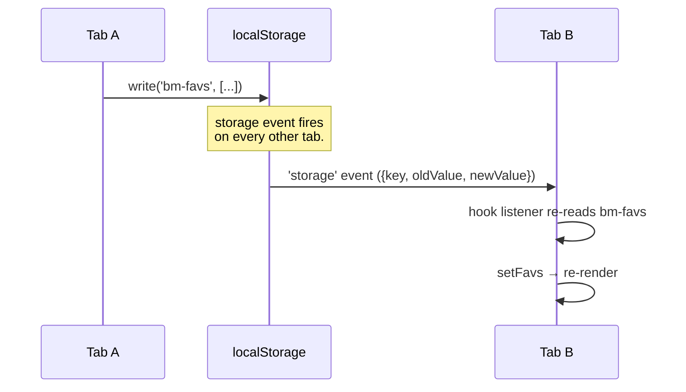

# Multi-tab Synchronization

## Overview

Two tabs of Playa Camps in the same browser should feel like one app:

1. Star a camp in tab A → tab B's UI reflects it without refresh.
2. Open a fresh tab → it inherits the unlocked password from any
   already-open tab, no re-prompt.

Two web platform APIs power this, used for two different jobs:

- **`storage` events** — for everything backed by `localStorage`
  (favs, friends, theme, meet spots, my camp, nickname).
- **`BroadcastChannel('playa-camps-pw')`** — for the cached password,
  which is too sensitive to leave in plain `localStorage` for sibling
  tabs to read.

## Decisions

- **`storage` events for state.** Browser fires them on *every other
  tab* of the same origin when localStorage is written. Free, no
  setup, no message size limits. Each hook (`useFavorites`,
  `useFriends`, `useMeetSpots`, `useTheme`) listens for its own LS
  key and re-reads on change.
- **BroadcastChannel for the password specifically.** The password
  on disk is encrypted (see [05-password-management.md](./05-password-management.md)).
  Sibling tabs that want to skip the prompt need the *plaintext*,
  which lives only in JS memory of an unlocked tab. BroadcastChannel
  passes JS values between same-origin tabs without round-tripping
  through disk.
- **Long-lived listener in `App.tsx`** for password requests, not in
  the Gate. The Gate unmounts after unlock; an older version had its
  channel die with it, so a second tab opened later got no response.
  Fixing meant putting the responder in App where it stays for the
  whole session.

## Mechanism

### State sync via `storage` events



The pattern in each hook:

```ts
useEffect(() => {
  const win = typeof window !== 'undefined' ? window : null;
  if (!win) return;
  function onStorage(e: StorageEvent) {
    if (e.key !== null && e.key !== storageKey) return;
    setFavs(readStringSet(storageKey));
  }
  win.addEventListener('storage', onStorage);
  return () => win.removeEventListener('storage', onStorage);
}, [storageKey]);
```

`e.key === null` covers `localStorage.clear()` — re-read defensively.
`win` is captured in the effect closure so cleanup uses the same
`window` reference even if test infra swaps `globalThis.window`.

### Password sync via BroadcastChannel

```mermaid
sequenceDiagram
  participant New as New tab (Gate)
  participant Ch as BroadcastChannel
  participant Old as Existing tab (App.tsx)
  participant SS as secureStore

  Note over Old: Already unlocked; App.tsx<br>has long-lived listener.
  New->>New: sessionStorage / LS empty
  New->>Ch: postMessage({type:'request'})
  Ch->>Old: onmessage
  Old->>SS: loadCachedPassword()
  SS-->>Old: pw
  Old->>Ch: postMessage({type:'share', pw})
  Ch->>New: onmessage
  New->>New: tryPassword(pw) → unlock silently
```

If no sibling answers within `PW_REQUEST_TIMEOUT_MS` (700 ms), the
Gate falls through to the prompt.

### Sender-receiver guarantees

- BroadcastChannel **does not deliver to the sender**, so the
  unlocking tab broadcasting `{type:'share', pw}` doesn't loop back
  to itself.
- Both the Gate AND App.tsx listen for `request`. The Gate's listener
  exists so two fresh tabs that *both* hit the gate simultaneously
  can share once one of them unlocks. The App listener kicks in
  after Gate unmount.

## Failure modes & trade-offs

- **`storage` events don't fire in the writing tab.** That's
  by-design — we update local state in the same `setFavs(next)` call
  that wrote LS. Listeners only need to handle *foreign* writes.
- **BroadcastChannel availability varies in private modes.** Code
  guards with `'BroadcastChannel' in window`. If absent, multi-tab
  unlock simply doesn't share — each tab prompts.
- **No conflict resolution.** Last writer wins for every key. Two
  tabs racing on the same favorite produce one of them. Acceptable
  given how rarely the user has two tabs editing simultaneously.
- **Listener leak risk** if hooks aren't paired with cleanup. All
  current hooks follow the `useEffect → return cleanup` pattern
  exactly, but new code should mirror it.

## Code references

- `client/src/hooks/useFavorites.ts` — canonical listener pattern
- `client/src/hooks/useFriends.ts`
- `client/src/hooks/useMeetSpots.ts`
- `client/src/hooks/useTheme.ts`
- `client/src/components/NicknamePill.tsx` — also listens for
  `LS.nickname` changes
- `client/src/components/App.tsx` — myCampId listener +
  long-lived BroadcastChannel responder
- `client/src/components/Gate.tsx` — fresh-tab BroadcastChannel
  request + share-on-success
