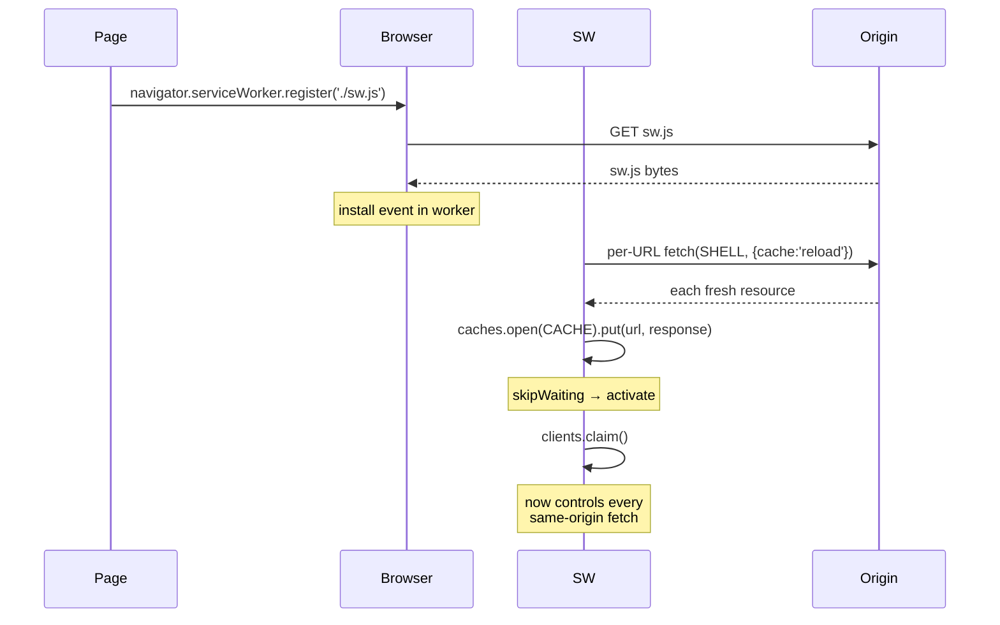
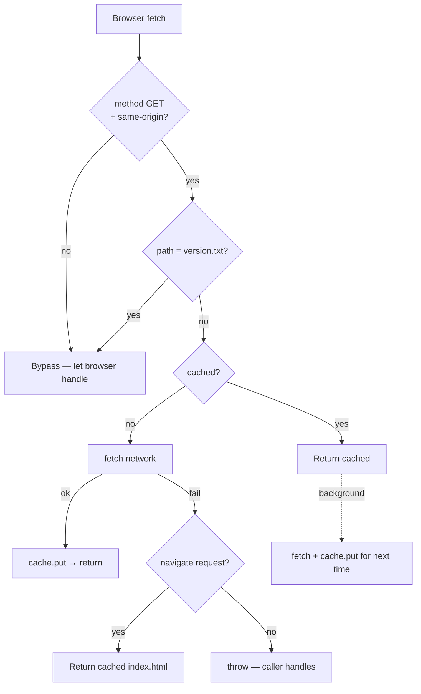
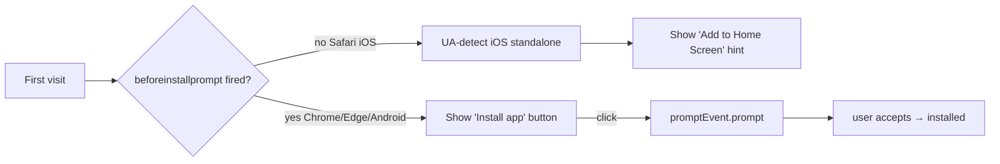

# Offline + PWA

## Overview

Once the site has loaded once with signal, it works fully offline —
including the map, the schedule, GPS, the entire camp index, and the
password gate. The mechanism is a **service worker** with a
cache-first strategy over a fixed shell, and a **PWA manifest** so
users can "Add to Home Screen" for a real app feel.

## Decisions

- **Cache-first with background refresh.** The SW returns the cached
  shell immediately, then re-fetches from the network in the
  background and updates the cache for next time. Pages-style CDN is
  fast enough that the background refresh barely matters, but the
  pattern means an offline burner gets the cached site instantly.
- **Tiny shell.** SHELL = `['./', './index.html', './robots.txt',
  './manifest.webmanifest', './icon.svg']`. Everything else is the
  inlined bundle + data inside `index.html`. No multi-asset cache.
- **Per-URL cache: 'reload' on install + REFRESH_SHELL.** The SW's
  `install` handler explicitly bypasses the HTTP cache (`fetch(url,
  { cache: 'reload' })`) so a brand-new SW installs with bytes from
  origin, never with stale max-age cached bytes. This was the bug
  that caused the "first force-refresh didn't update the legend"
  case — see [08-versioning-and-release-notes.md](./08-versioning-and-release-notes.md).
- **`version.txt` excluded from SW interception.** That file is the
  polling endpoint; if the SW served it from cache the polling check
  would always read its own cached value.

## Mechanism

### Lifecycle

### Fetch handling

### REFRESH_SHELL message handler

The page can ask the SW to re-pull the shell from origin into its
cache, before reloading. Used by the "Force refresh" button + the
"new version available" banner. Per-URL failures are swallowed — the
old cached entry survives, so a network blip mid-refresh leaves the
user on a working site.

The full sequence (page → SW → reload, including the historical bug
where a deploying-during-reload race could leave the user on stale
bytes) is documented in [14-refresh-cycle.md](./14-refresh-cycle.md).

### Install prompt

Three signals merge in `useInstallPrompt.ts`:

1. `beforeinstallprompt` event (Chromium / Android-Firefox).
2. UA-sniffed iOS Safari (`/iPad|iPhone|iPod/i.test(ua) && !standalone`).
3. `navigator.serviceWorker.ready` for the "Offline ✓" pill.

## Failure modes & trade-offs

- **First visit on a flaky network**: install can succeed but cache
  population can fail mid-way. The `install` handler swallows
  per-URL failures so the rest of the SHELL still caches.
  Worst-case: missing icon.svg → a slightly broken offline icon.
- **SW bug requires a hard recovery**. The "About modal → Force
  refresh" button non-destructively reloads with a bypass. If a
  truly bad SW shipped, last resort is "Clear all local data" which
  also nukes `playa-camps-secure` IDB.
- **Pages CDN cache TTL**. GH Pages serves with a `Cache-Control`
  max-age window. If the SW's install ran during that window and
  used the HTTP cache, it could capture stale bytes. Solved by
  `cache: 'reload'` on every install fetch.

## Code references

- `backend/src/playa/builder.py::_write_service_worker` — the entire
  `sw.js` source as a Python string. Read this to understand exact
  handler shapes.
- `backend/src/playa/templates/site.html` — links manifest + apple
  meta tags
- `client/src/hooks/useInstallPrompt.ts` — install + offline-ready
  signal
- `client/src/utils/refresh.ts` — `forceRefresh()` non-destructive
  shell-refresh
- `site/manifest.webmanifest` — name, theme_color, icon
- `site/icon.svg` — single-asset icon (rounded square + tent)
- `site/.nojekyll` — disables Pages-side Jekyll rewriting
