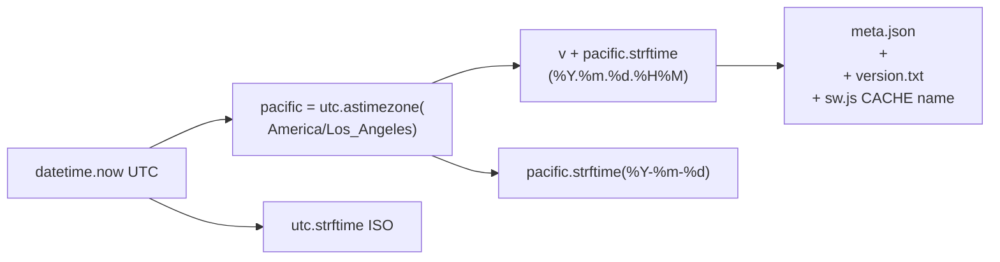
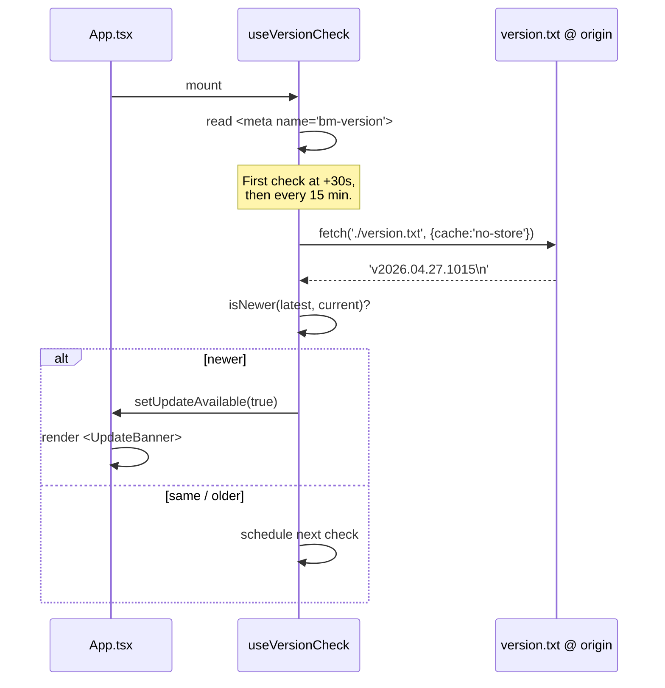
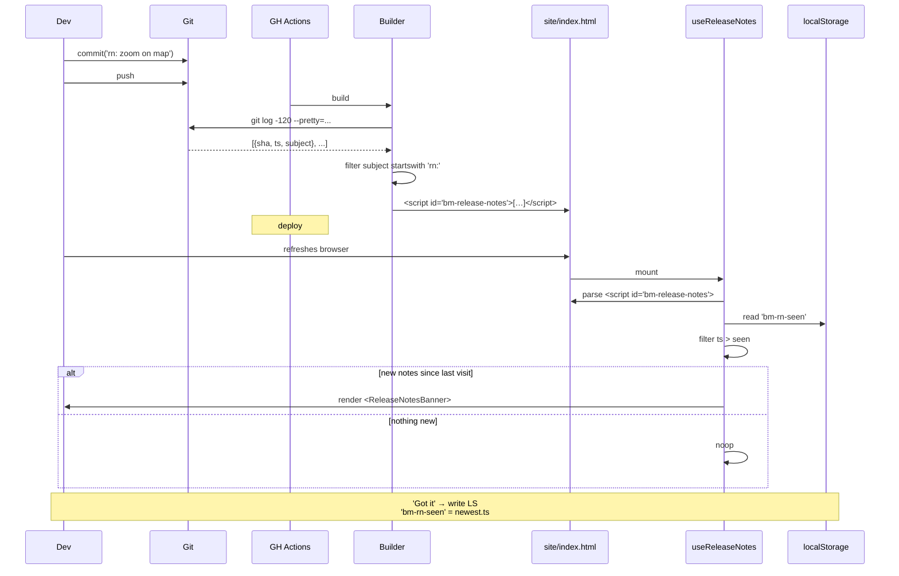

# Versioning & Release Notes

## Overview

Three closely-related subsystems coordinate around the version stamp:

1. **Version generation** — `vYYYY.MM.DD.HHMM` baked at build time.
2. **Update detection** — the running client polls `version.txt` and
   shows a "new version available" banner when the server is newer.
3. **Release notes** — commits with `rn:` subject prefixes are
   collected into the build and surfaced as a "what's new" banner
   after the user upgrades.

## Decisions

- **Date-+-minute version** — `vYYYY.MM.DD.HHMM` (Pacific). Lex-sorts
  in chronological order, two same-day deploys get distinct strings,
  and the leading `vYYYY.MM.DD` matches `fetched_date` so they read
  as one human-friendly value. Time zone is **Pacific** for both
  fields so the date prefix never disagrees with HHMM around the
  midnight boundary.
- **Plain text `version.txt`** as the polling endpoint — 12 bytes,
  no parsing, no SW interception. Easier and cheaper than parsing
  HTML or hitting a `/version` API (which doesn't exist on Pages
  anyway).
- **Strict `>` comparison, not `!=`** — a server-side rollback
  shouldn't masquerade as an "upgrade." `isNewer(latest, current)`
  parses both into integer tuples and returns true only when latest
  exceeds current.
- **`rn:` commit prefix as the release-notes API** — no separate
  changelog file, no manual list to maintain. Author-time commits
  with `rn: …` and they ship automatically. Subject-only by design;
  body lines aren't parsed.

## Mechanism

### Version generation

- `meta.py::write_meta` is the source of truth.
- `builder.py::load_meta` falls back to file mtimes if `meta.json`
  is missing (e.g., partial fetch).

### Update detection

The hook also re-checks immediately on `visibilitychange` becoming
visible — covers the "tab in background since yesterday" case
without waiting for the next 15-min tick.

### Release notes flow

### Service worker caching key

`CACHE = 'playa-' + VERSION`. Every build evicts old caches in the
`activate` handler — no stale assets linger across deploys. Combined
with `cache: 'reload'` on per-URL install fetches, this means:

- A new SW installs with origin-fresh bytes (no HTTP cache pollution).
- The new SW's cache name diverges from any previous cache.
- The activate handler deletes everything not matching the new name.

That is what makes the "force refresh" path reliable, even under GH
Pages' max-age cache window.

## Failure modes & trade-offs

- **Polling cost**: 4 polls/hour × ~12 bytes = ~50 bytes/hour per tab.
  Effectively free.
- **Service worker takeover race during upgrade**: handled by
  `skipWaiting()` + `clients.claim()` in the new SW's install +
  activate. New SW takes over the navigation request after a reload.
- **Empty release-notes list in CI** if `git log` doesn't have enough
  history. The workflow uses `fetch-depth: 200` to ensure the last
  several months of commits are available.
- **First-ever visit suppression**: the release-notes hook anchors
  the watermark to the newest note's timestamp on first run, so a
  fresh install doesn't dump backlog on the user.

## Code references

- `backend/src/playa/meta.py` — version stamping
- `backend/src/playa/builder.py::_collect_release_notes` — git log
  filter for `rn:`
- `backend/src/playa/builder.py::_write_service_worker` — emits
  `sw.js` with VERSION + CACHE
- `client/src/hooks/useVersionCheck.ts` — polling + comparison
- `client/src/hooks/useReleaseNotes.ts` — embedded notes parser +
  watermark
- `client/src/components/UpdateBanner.tsx`
- `client/src/components/ReleaseNotesBanner.tsx`
- `client/src/utils/refresh.ts` — `forceRefresh()` shell-refresh
  + reload (deep dive in [14-refresh-cycle.md](./14-refresh-cycle.md))
