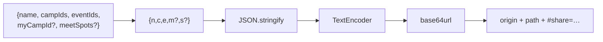
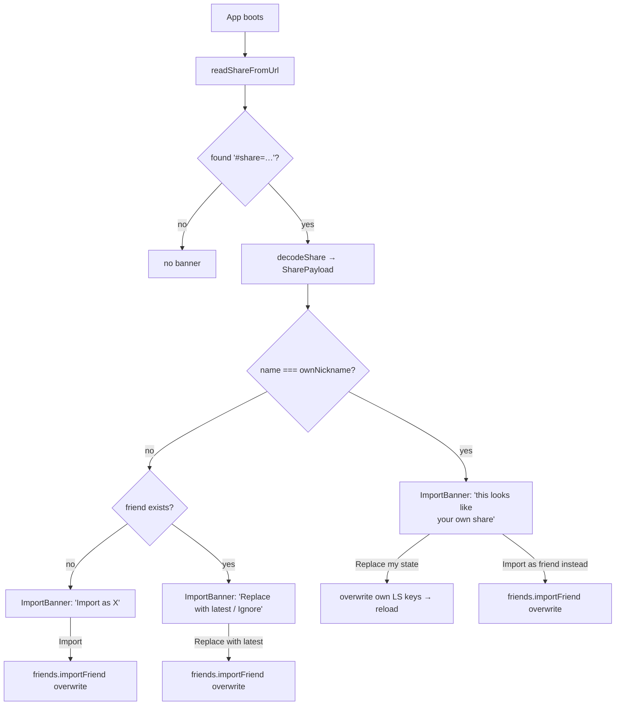
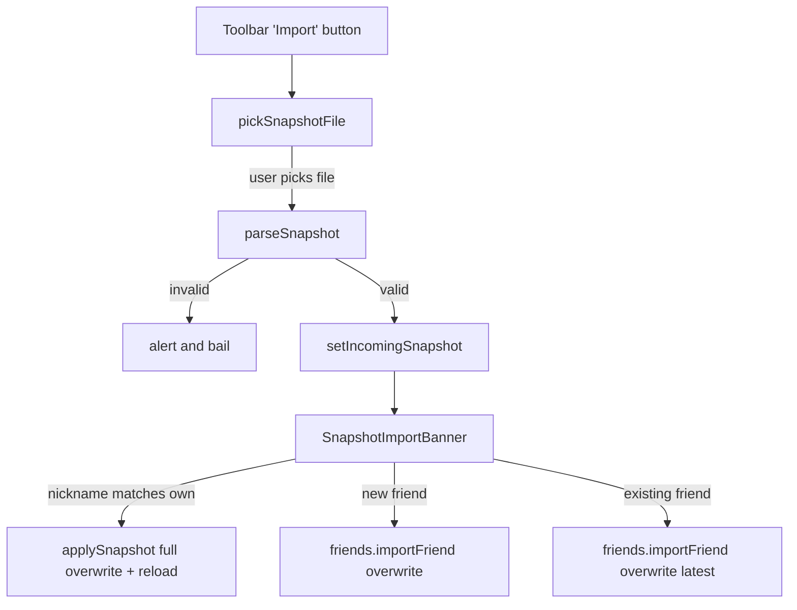

# Share Links & Snapshot Import/Export

## Overview

Two transports move user state between devices and between friends:

- **Share links** — a URL fragment carrying the user's starred camps,
  starred events, home camp, and meet spots. Pasteable, no server
  round-trip.
- **JSON snapshots** — a downloadable file containing all of the
  above PLUS hidden days, imported friends, and the user's own
  nickname. Used for cross-device transfer or sending a richer state
  to a friend.

Both paths use the same banner UX, the same self-vs-friend
recognition, and the same "latest snapshot replaces" semantics.

## Decisions

- **URL fragment, not query string.** Fragments don't reach the
  server — the data stays client-side end-to-end. GH Pages logs see
  only the path. Fits the "private data" stance of the whole app.
- **Base64url-encoded JSON** in the fragment — `base64` would mangle
  in mail clients (`+`, `/`, `=` all problematic in URLs). The
  fragment is capped at `MAX_ENCODED_LEN` (200 KB) before decode to
  bound DoS.
- **Compact field names** in the share envelope (`n`, `c`, `e`, `m`,
  `s`) — keeps URLs short. Optional fields are omitted when empty so
  byte-equivalent shares from different code paths produce identical
  URLs.
- **Latest-wins for repeats.** Re-importing the same nickname always
  prompts "Replace with latest" or "Ignore" — no merge option. The
  share IS a snapshot of "right now"; merging stale local with new
  remote leaves zombie entries the sender intended to drop.
- **Self-recognition by nickname.** When the incoming share or
  snapshot has the same nickname as the importer's, offer a "Restore
  my own state" branch. Lets the user move their own setup between
  devices via either transport.
- **Adversarial input validation.** Both decoders reject:
  - Oversized payloads (size cap before decode).
  - Top-level arrays/primitives (only object envelopes).
  - C0/C1 controls, zero-width chars, bidi overrides in nicknames
    (UI-spoofing attacks).
  - `__proto__` / `constructor` / `prototype` as nicknames (object
    pollution).
  - Whole-list reject when over MAX_IDS — drops the attack rather
    than letting MAX_IDS items through.

## Mechanism

### Share link envelope

### Receiver flow

### Snapshot import via JSON file

### Asymmetry: share vs snapshot

| Field | Share link | Snapshot file |
|---|---|---|
| Nickname | ✓ | ✓ |
| Camp favorites | ✓ | ✓ |
| Event favorites | ✓ | ✓ |
| My camp | ✓ | ✓ |
| Meet spots | ✓ | ✓ |
| Hidden days | ✗ | ✓ |
| Imported friends list | ✗ | ✓ |

Snapshots are richer because they're meant for self-restore (every LS
key recovered). Shares are friend-shaped (URL-friendly, only the
publicly-shareable subset).

## Failure modes & trade-offs

- **Long-URL pain** for huge favorite lists. Empirically: 5000 ids ×
  ~5 chars + base64 overhead ≈ ~40 KB encoded. Fits in every modern
  browser's URL handling.
- **No revocation of a leaked share link**. The data is in the URL;
  once it's out, it's out. Mitigation: shares carry only public-ish
  state (which camps you starred), not credentials.
- **JSON file = on-disk artifact** with the user's full state. They
  should manage these as they would any other personal file.
- **Adversarial nickname ↔ snapshot.friends mismatch**. If a friend's
  snapshot has them named "alice" but I already have an "alice" who
  is a different real person, the latest-wins rule overwrites my
  alice. The "Replace with latest / Ignore" prompt makes this
  explicit, but it's an inherent limitation of nickname-as-key.

## Code references

- `client/src/utils/share.ts` — encode/decode + validation primitives
- `client/src/utils/exportImport.ts` — Snapshot type, build/parse/apply,
  download/picker helpers
- `client/src/components/ImportBanner.tsx` — share-link banner
- `client/src/components/SnapshotImportBanner.tsx` — JSON-file banner
- `client/src/components/ShareModal.tsx` — outbound share-link
  generator
- `client/src/components/Toolbar.tsx` — Share / Export / Import
  buttons
- `client/src/components/InfoModal.tsx` — Export / Import in About
  modal Actions
- `client/src/hooks/useFriends.ts::importFriend` — universal landing
  point for both transports
