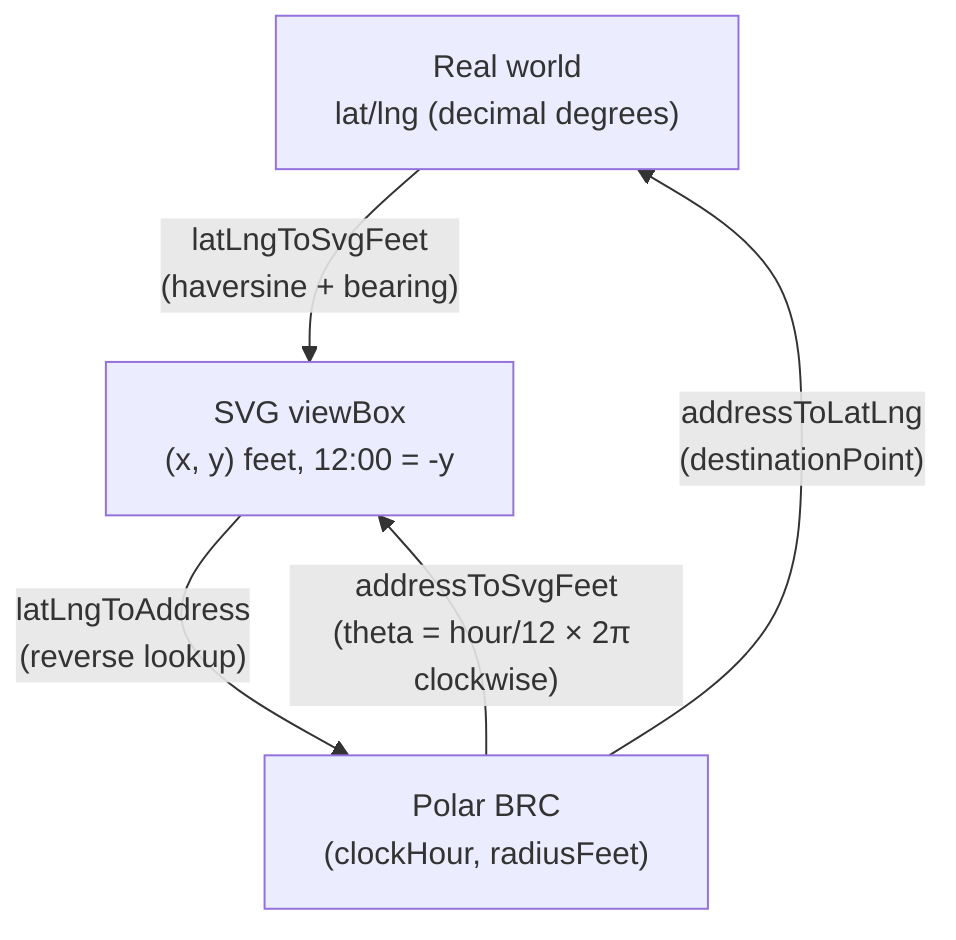
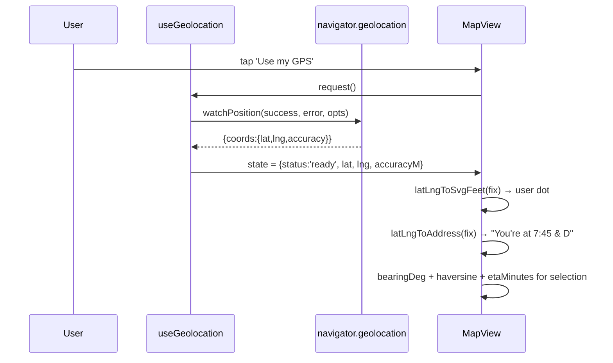

# Map System

## Overview

Black Rock City has a distinctive **clock × letter polar grid**
(2:00–10:00 hours × Esplanade–K rings, with the open-playa side facing
12:00). The map is a hand-rolled SVG, drawn from year-specific
constants in `client/src/map/data.ts` — no third-party map library,
no tile server. That's a hard requirement: on-playa the only working
"map" is the one that shipped in the bundle.

GPS is supported when granted, with a "you are here" dot, a current
clock-and-letter address readout, and a bearing line to whatever the
user has selected.

## Decisions

- **Pure SVG, zero tile fetches.** Every line, label, and pin is
  drawn from constants. Works on airplane mode after first load.
- **Year-isolated constants in `data.ts`.** The golden-spike lat/lng,
  block depths, themed street names, 12-bearing, and POI list all
  live in one file with the year stamped at the top. The
  `/update-map` Claude skill walks the annual refresh.
- **Polar-coord math, not real projections.** BRC fits in a
  ~1.6 km radius. Treating it as a flat polar plane is accurate to
  ~20 ft at the edge — well within any UX tolerance. Real
  spherical/equirectangular math would be overkill.
- **Polyline-approximated arcs.** SVG `A` arc commands have
  large-arc/sweep flags whose meaning depends on coordinate-system
  orientation. Our y-inverted system produces the wrong arc half
  intuitively. Iterating clock hours from 2 → 10 with line segments
  draws the city-occupied arc the long way around without any flag
  guesswork.
- **viewBox-based zoom + pan**. Real SVG re-rendering at every zoom
  level (no rasterized loss) plus a transparent hit-catcher per pin
  for fat-finger touch.

## Mechanism

### Coordinate system

Three coordinate systems, three pure-math conversion functions in
`address.ts`. None depend on Preact / DOM — easy to unit-test.

### Layered rendering

```mermaid
flowchart TB
  subgraph Svg
    Bg["brc-playa background"]
    Streets["Concentric arcs (Esplanade–K)"]
    Radials["Radial spokes (2:00–10:00)"]
    Man["The Man dot at (0,0)"]
    Labels["Address readouts near Man"]
    POIs["POIs (Center Camp, Playa Info)"]
    Pins["Starred camp pins<br>(transparent hit-catcher + halo + dot)"]
    MyCamp["My-camp tent (teal)"]
    FriendCamps["Friend tents (per-name hue)"]
    MeetSpots["Meet-spot diamonds (rotated 45°)"]
    User["GPS 'you are here' dot"]
    Bearing["Dashed bearing line<br>user → selected"]
  end
  Bg --> Streets --> Radials --> Man --> Labels
  Labels --> POIs --> Pins --> MyCamp --> FriendCamps
  FriendCamps --> MeetSpots --> User --> Bearing
```

Render order matters: later elements paint on top. POIs are below
camp pins (so a starred camp at the same address isn't covered);
meet spots paint above tents (rendezvous plans are more important
than home-camp markers); user-position + bearing are on top.

### GPS pipeline

GPS is opt-in. `useGeolocation` only calls
`navigator.geolocation.watchPosition` after the user explicitly
clicks "Use my GPS" — the App modal explains this in the privacy
section.

### Zoom + pan

- `zoom` and `center` state in `MapView.tsx`.
- viewBox computed: `${cx - vbW/2} ${cy - vbH/2} ${vbW} ${vbH}` where
  `vbW = DEFAULT_VB_WIDTH / zoom`.
- Pointer Events API for pan: `pointerdown` records anchor;
  `pointermove` updates `center` once a 6-pixel screen-space
  threshold is crossed; threshold defers `setPointerCapture` so taps
  on child pins still route normally to their `onClick`.
- Auto-recenter on selection when `zoom > 1` so tapping any pin pans
  to keep it in view.

## Failure modes & trade-offs

- **GPS off-grid**: when the user's fix is outside the city's clock
  arc, `latLngToAddress` returns null and the address readout shows
  `off-grid · ±Nm`. The bearing line still draws to the selected pin
  even if the user is off-map, but enters from the viewport edge —
  the legend covers what to make of that.
- **Pin density at zoom=1** can be visually noisy if a user has
  hundreds of starred camps. Mitigation: zoom in. We don't
  auto-cluster; the camps list in the sidebar is the dense view.
- **Address ambiguity**. "7:30 & F" and "F & 7:30" both occur in the
  directory. `parseAddress` accepts either order. Edge cases like
  `None Listed` / `-` return null.
- **Themed street names year-shift.** Each year the letters' fancy
  names change ("Ararat", "Bodhi", etc.). `parseAddress` matches
  letter codes (A–K) AND the year's themed names — so old cached
  shares with last-year's names still resolve when the data refresh.
- **Empty pin set still renders the map.** When zero camps have
  resolvable addresses (e.g., the current-year API source pre-
  location-release), the SVG grid + POIs (Center Camp, Playa Info)
  still draw — the city is the primary value of the view. A small
  contextual hint sits above the map suggesting how to pin
  (star a camp, set my-camp, add a meet spot) but does NOT replace
  the map. Copy is tier-agnostic — doesn't reference the source
  switcher since not every tier has multi-source access.

## Code references

- `client/src/map/data.ts` — year-specific constants
- `client/src/map/address.ts` — pure math helpers
- `client/src/components/MapView.tsx` — renderer + interactions
- `client/src/hooks/useGeolocation.ts` — opt-in GPS wrapper
- `client/src/components/MapInfoModal.tsx` — legend
- `.claude/skills/update-map/SKILL.md` — annual refresh procedure
