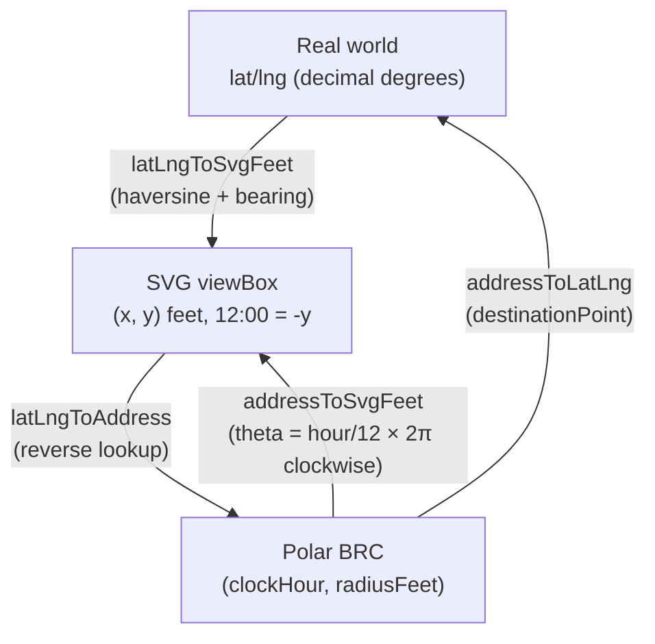
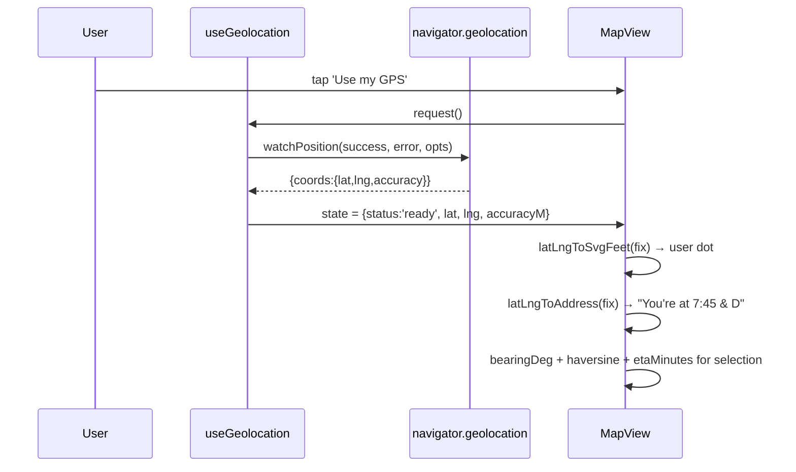

# Map System

## Overview

Black Rock City has a distinctive **clock × letter polar grid**
(2:00–10:00 hours × Esplanade–K rings, with the open-playa side facing
12:00). The map is a hand-rolled SVG, drawn from year-specific
constants in `client/src/map/data.ts` — no third-party map library,
no tile server. That's a hard requirement: on-playa the only working
"map" is the one that shipped in the bundle.

GPS is supported when granted, with a "you are here" dot, a current
clock-and-letter address readout, and a bearing line to whatever the
user has selected.

## Decisions

- **Pure SVG, zero tile fetches.** Every line, label, and pin is
  drawn from constants. Works on airplane mode after first load.
- **Year-isolated constants in `data.ts`.** The golden-spike lat/lng,
  block depths, themed street names, 12-bearing, and POI list all
  live in one file with the year stamped at the top. The
  `/update-map` Claude skill walks the annual refresh.
- **Polar-coord math, not real projections.** BRC fits in a
  ~1.6 km radius. Treating it as a flat polar plane is accurate to
  ~20 ft at the edge — well within any UX tolerance. Real
  spherical/equirectangular math would be overkill.
- **Polyline-approximated arcs.** SVG `A` arc commands have
  large-arc/sweep flags whose meaning depends on coordinate-system
  orientation. Our y-inverted system produces the wrong arc half
  intuitively. Iterating clock hours from 2 → 10 with line segments
  draws the city-occupied arc the long way around without any flag
  guesswork.
- **viewBox-based zoom + pan**. Real SVG re-rendering at every zoom
  level (no rasterized loss) plus a transparent hit-catcher per pin
  for fat-finger touch.

## Accepted extension: official GIS landmarks and services

**Decision date:** 2026-08-06<br>
**Implementation status:** accepted and specified; not yet implemented

The map will add a curated set of official, year-specific Black Rock City
landmarks, participant services, safety resources, transport points, portable
toilet banks, and selected boundary overlays. The source is Burning Man
Project's official annual GIS export, not addresses inferred from camp data and
not a third-party map.

This is an extension of the existing map system, not a replacement for it. The
hand-built clock-and-letter SVG remains the base map because it is compact,
legible, source-aware, and available offline. Official GIS features sit in
additional SVG layers and use the existing GPS-to-SVG conversion.

### Authoritative sources and terms

Primary sources for the 2026 decision:

- 2026 GIS dataset description:
  <https://innovate.burningman.org/dataset/2026-gis-map-data/>
- Official repository:
  <https://github.com/burningmantech/innovate-GIS-data>
- 2026 GeoJSON directory:
  <https://github.com/burningmantech/innovate-GIS-data/tree/master/2026/GeoJSON>
- Participant-facing descriptions and operating details:
  <https://survival.burningman.org/city-infrastructure/on-playa-resources/>
- Safety-resource descriptions:
  <https://survival.burningman.org/survival-health-and-safety/getting-help/>
- 2026 city-plan and portable-toilet guidance:
  <https://survival.burningman.org/city-infrastructure/2026-city-plan/>
- Data terms:
  <https://innovate.burningman.org/terms-of-service-for-burning-man-apis-and-datasets/>

The 2026 GIS release is dated July 13, 2026 and requires no API key. "Publicly
accessible" and "keyless" do **not** mean public domain or open-license data.
The GIS repository's `LICENSE.md` grants no additional rights and incorporates
the API/Dataset Terms. Continue to satisfy the app-wide non-commercial,
no-advertising, attribution, and no-affiliation requirements in
`docs/13-tos-compliance.md`.

The published GIS release is distinct from the keyed API's confidential early
camp/art locations. GIS overlays must be selected by map year, not coupled to
the camp/art embargo implementation. If Burning Man changes the publication
model or terms, review that conclusion again rather than carrying it forward by
assumption.

### Verified 2026 source inventory

The following inventory was inspected on 2026-08-06. Sizes are the raw files
reported by the official GitHub repository and may change when Burning Man
updates a file in place.

| File | Raw size | Intended use here | Decision |
|---|---:|---|---|
| `cpns.geojson` | 11,045 B | Named city-plan nodes / points of interest | In scope, curated allowlist only |
| `toilets.geojson` | 22,036 B | Portable-toilet bank footprints | In scope |
| `trash_fence.geojson` | 626 B | Actual city/perimeter boundary | In scope |
| `plazas.geojson` | 31,029 B | Authoritative plaza shapes/centers | In scope after core POIs |
| `dmz.geojson` | 1,351 B | Deep-Playa Music Zone boundary | Optional layer |
| `gate_road.geojson` | 18,439 B | Arrival/exodus orientation | Optional transport layer |
| `street_lines.geojson` | 236,258 B | Exact street centerlines | Deferred; current SVG is clearer/smaller |
| `city_blocks.geojson` | 1,520,547 B | Block polygons | Out of scope |
| `street_outlines.geojson` | 1,629,109 B | Detailed street polygons | Out of scope |

The selected small files total about 85 KB before normalization or gzip. Do not
pull in the two 1.5+ MB polygon layers merely because they exist. They add
visual density and bundle weight while duplicating a base grid that the app
already renders well.

Verified details that the importer must preserve:

- `cpns.geojson` is a `FeatureCollection` containing 60 `Point` features in
  2026. Coordinates are GeoJSON order: `[longitude, latitude]`. Properties are
  `OBJECTID`, `FID`, `NAME`, and `TYPE`.
- Every inspected 2026 CPN has the generic `TYPE` value `CPN`. That field is not
  a participant-friendly category and must not drive icons or filters.
- `toilets.geojson` contains 45 `Polygon` features in 2026. They represent bank
  footprints/areas, not a count or coordinate for every individual unit.
  Properties are `OBJECTID`, `class`, `Shape_Length`, and `Shape_Area`.
- Toilet `class` values observed in 2026 include `in city`, `2/10`, `man`,
  `playa`, `temple`, and null. Treat them as source metadata, not prose labels
  suitable for the UI.
- Upstream identifiers are year-local. A stable client key must include the
  year and feature kind; an `OBJECTID` or `FID` by itself is insufficient.

These counts are validation baselines, not eternal constants. A later year may
legitimately contain a different number of features. Validation should detect
unexpected schema/type changes and implausibly empty data, while the annual map
refresh explicitly reviews count changes.

### Curated POI policy

Do not render all CPN records. The official file mixes participant-facing
destinations, map geometry anchors, arrival infrastructure, operational names,
and opaque entries such as `Point 1` through `Point 5`. A raw dump would create
clutter and expose labels that are meaningless without internal context.

Use a committed, year-specific allowlist that maps the official `NAME` to:

```text
source name -> stable slug, user-facing label, layer, icon kind,
               short description/source URL, default visibility
```

The allowlist is application-authored metadata. It may improve capitalization
or expand an abbreviation, but it must not move the source coordinate or imply
that an unofficial interpretation came from Burning Man. When a label changes
materially, retain the original source name in the normalized record for
debugging and provenance.

#### Base landmarks — always rendered

- The Man (already rendered at the Golden Spike)
- The Temple
- Center Camp / Center Camp Plaza
- Official plazas
- Trash-fence boundary

These are orientation anchors rather than optional services. Avoid duplicate
pins: once an official point replaces a hard-coded `POIS` entry, remove the
hard-coded counterpart in the same change.

#### Essentials — visible by default

- Portable-toilet banks
- Medical / Emergency Services Department stations at the 3:00, 6:00, and
  9:00 sides of the city
- Ranger Headquarters and the 3:00 / 9:00 Ranger outposts
- Arctica ice locations, including the large-order outpost when present
- Playa Info

Safety-resource labels should use the participant-facing terminology in the
current Survival Guide. For example, the raw CPN names `Ranger Station Berlin`
and `Ranger Station Tokyo` should be presented as the relevant 3:00 and 9:00
Ranger outposts, with the source name retained internally. Similarly, internal
or legacy names such as `Rampart` must not be guessed into a medical category;
use the explicit ESD records plus the current official guide.

#### Services — optional, default off

- ARTery
- Recycle Camp
- Yellow Bike Shop / Project
- Placement and Lost & Found, represented as services at Playa Info rather
  than duplicate colocated pins
- Department of Mutant Vehicles
- Media Mecca

Co-located services belong in one point's detail panel. Stacking several icons
at Playa Info or Center Camp makes the map less usable and suggests false
physical separation.

#### Transport / arrival — optional, default off

- Burner Express Bus Depot
- Airport
- Gate and Greeters
- Box Office, Will Call, D-Lot, and Gate Road

These features sit well outside the compact city grid. Hidden transport points
must not expand the default SVG `viewBox`; otherwise the city becomes tiny to
make room for locations most users do not need during the event. Turning on the
transport layer may intentionally expand/recenter the view, and resetting the
layer returns to the normal city extent.

#### Excluded unless clarified

- Generic `Point 1`–`Point 5` records
- Operational or ambiguous records whose participant purpose is not explained
  by a current official guide
- BLM/law-enforcement and internal infrastructure points unless there is a
  clear participant navigation use and appropriate explanatory copy

Exclusion is not deletion from the upstream data. It is a presentation choice;
the next annual audit can promote a point when documentation becomes clear.

### Layer controls and interaction

The intended controls are:

| Layer | First-visit default | Contents |
|---|---|---|
| Base landmarks | On, not hideable | Man, Temple, Center Camp, plazas, fence |
| Essentials | On | Toilets, medical/ESD, Rangers, ice, Playa Info |
| Services | Off | ARTery, recycling, bikes, DMV, Media Mecca |
| Transport | Off | Airport, bus depot, Gate/Greeters, Box Office/Will Call |
| Sound zones | Off | DMZ boundary/label |

Layer preferences should persist locally under a versioned key such as
`bm-map-layers/v1`. The version suffix gives us a clean default reset if layers
are reorganized. Preferences are device-local and should participate in the
existing "Clear all local data" behavior.

Rendering rules:

- At overview zoom, toilet polygons render as compact toilet-bank symbols at a
  computed polygon centroid. At closer zoom, their footprint may render beneath
  the symbol. Do not show 45 permanent text labels.
- Other POIs use distinct shape **and** color categories. Safety information
  must not rely on color alone.
- Labels appear on selection/focus and in the detail panel, not permanently at
  overview zoom.
- Every interactive marker needs a large transparent hit target, keyboard
  focus, an `aria-label`, and the same tap-to-toggle semantics as existing map
  items.
- A selected official point participates in the existing GPS distance/bearing
  experience. Its panel should include name, category, short official-purpose
  summary, coordinates/address when meaningful, and the existing external-map
  link when available.
- Hidden features must be removed from selection, navigation calculations, and
  dynamic viewBox extents. Changing map year clears a selected GIS feature that
  does not exist in the new year.
- The legend must explain icons, layer controls, source year, and that the map
  is a planned snapshot rather than a live operational feed.

Do not add marker clustering initially. The allowlist plus layer defaults keeps
the visible point count manageable, and toilets do not need individual labels.
Revisit clustering only if real-device testing shows unusable density.

### Data acquisition, normalization, and offline behavior

There must be no runtime dependency on GitHub, Burning Man servers, a tile
provider, or an API key. GIS data follows the existing single-file/offline
architecture:


```mermaid
flowchart LR
  Upstream["Official annual GeoJSON"]
  Fetch["build-time GIS fetch"]
  Cache["gitignored data/gis/YEAR/"]
  Validate["schema + bounds validation"]
  Normalize["allowlist + compact geometry"]
  Embed["year-keyed gzip payload in index.html"]
  Convert["latLngToSvgFeet using active BRC year"]
  Render["SVG landmark/service layers"]

  Upstream --> Fetch --> Cache --> Validate --> Normalize --> Embed
  Embed --> Convert --> Render
```

Implementation requirements:

1. Fetch only the explicitly configured files for a requested year into
   `data/gis/<year>/`. The raw cache remains gitignored; do not commit fetched
   GIS payloads merely because the source is publicly reachable.
2. Record source URL, retrieval time, upstream Git blob/commit SHA when
   available, and a content digest in generated metadata. Build logs should
   report aggregate counts and identifiers, not dump entire source records.
3. Validate before replacing a usable cache. At minimum: `FeatureCollection`,
   supported geometry types, finite coordinate pairs, plausible BRC-region
   bounds, unique normalized IDs, and non-empty required layers.
4. Normalize only the fields the client needs. Drop ArcGIS bookkeeping such as
   `Shape_Area` after validation unless it serves a documented UI purpose.
5. Preserve coordinates in longitude/latitude form in the embedded normalized
   data. Client conversion must call
   `latLngToSvgFeet({lat: coordinate[1], lng: coordinate[0]}, brc)`. Keeping the
   geographic coordinate preserves provenance and supports external-map links.
6. Preserve polygon ring structure, including holes, even if the current toilet
   polygons do not exercise every valid GeoJSON shape.
7. Embed one GIS payload per year, not per directory/API source and not per
   password tier. `directory` selects `DIRECTORY_MAP_YEAR`; `api-YYYY` selects
   `YYYY`. Two sources for the same year share one map layer.
8. Gzip/base64 the normalized payload using the same browser-supported
   decompression path as other embedded data. The upstream GIS data is already
   public, so it does not need a separate encryption envelope; it remains
   inaccessible as UI until the normal app gate is passed.
9. Service-worker behavior remains unchanged: once `index.html` is installed,
   the GIS snapshot is part of the offline shell. Never fetch updated GIS data
   opportunistically in the browser.

### Refresh and release behavior

Annual data changes are expected. Extend the existing `/update-map` workflow so
one annual operation updates the Golden Spike/street constants and GIS overlay
configuration together.

For each new year:

1. Confirm the official GIS release page and current Terms.
2. Inspect the repository's year directory; do not infer filenames or schema
   from the previous year.
3. Fetch into the gitignored cache and print file digests, geometry types,
   counts, property keys, and coordinate bounds.
4. Review the CPN names against the current Survival Guide. Add, rename, remove,
   or reclassify allowlist entries intentionally.
5. Verify required safety/service points manually against participant-facing
   documentation. Absence of a familiar name must fail review rather than be
   silently copied from last year's coordinates.
6. Run coordinate-transform, normalization, UI, accessibility, offline-build,
   and source-switching tests.
7. Preview overview and close zoom on a phone-sized viewport with every layer
   combination, especially Essentials + many user pins.
8. Record the refresh date, upstream source revision, and meaningful changes in
   this ADR or the annual data manifest.

The nightly production build may refresh an already-released current-year GIS
cache. If upstream is unavailable or validation fails, the build must not
deploy a silently empty or partial Essentials layer. Prefer the last validated
cache when available; otherwise fail the production build so GitHub Pages keeps
the last-good deployment. Local builds may warn and fall back to the existing
hard-coded base map, but must clearly report that official overlays are absent.

### Testing contract

Add focused coverage for:

- GeoJSON feature, geometry, property, and coordinate validation
- `[longitude, latitude]` to `{lat, lng}` ordering
- polygon rings and centroid calculation
- stable year-qualified feature IDs
- allowlisted CPN inclusion and opaque/unapproved CPN exclusion
- duplicate detection between official and hard-coded POIs
- required current-year essentials and deliberate failure when absent
- source-to-map-year selection (`directory`, `api-YYYY`, unknown future year)
- layer defaults, local persistence/versioning, and clear-local-data behavior
- hidden-layer removal from selection and viewBox calculations
- transport-layer viewBox expansion only while visible
- keyboard focus, accessible names, and non-color-only category distinction
- offline build output containing no runtime GIS URL fetch
- The Man/Golden Spike projecting near `(0, 0)` and representative official
  points/polygons landing in plausible positions

Do not hardcode exact total feature counts as a permanent cross-year assertion.
Use the verified 2026 counts in 2026 fixtures and review them when the fixture
year changes.

### Rollout plan

Implement in small, independently reviewable stages:

1. **Fetcher + normalizer:** build-time acquisition, cache, source metadata,
   schema validation, fixtures, and tests. No UI change.
2. **Base official geometry:** year-keyed embed, Temple, authoritative plazas,
   and trash fence. Remove duplicate hard-coded POIs only after visual parity.
3. **Essentials:** medical/ESD, Rangers, ice, Playa Info, toilet-bank centroids
   and close-zoom footprints; update legend and details.
4. **Controls:** persisted Essentials/Services/Transport/Sound toggles,
   selection behavior, accessible interactions, and mobile-density review.
5. **Optional layers:** services, transport, Gate Road, and DMZ after the core
   map is stable.
6. **Annual workflow:** update `/update-map`, operational docs, CI validation,
   and release metadata.

Each stage must keep the old map functional. Do not remove current POI constants
or change the default viewBox until the corresponding official layer is loaded,
tested, and visually verified.

### Alternatives rejected

- **Render every CPN:** rejected because raw data includes opaque and
  operational points, has no useful category field, and would overwhelm the
  existing user/friend/camp pins.
- **Fetch GeoJSON in the browser:** rejected because the map must work offline,
  runtime network availability on playa is unrealistic, and upstream changes
  should pass validation before reaching users.
- **Commit annual raw GeoJSON:** rejected to preserve the public-code/private-
  data posture and avoid creating an unnecessary redistribution mirror. Commit
  importer code, allowlists, fixtures small enough for tests, and provenance;
  keep complete fetched payloads and built HTML out of git.
- **Replace the SVG with Google Maps, Mapbox, or Leaflet tiles:** rejected due to
  network dependency, payload/UI overhead, privacy, and poor on-playa utility.
- **Replace the base grid immediately with street/block polygons:** rejected
  because the current geometry is compact and legible. Exact street lines can
  be evaluated later as an annual-maintenance improvement.
- **Manually transcribe official coordinates into `data.ts`:** rejected for the
  new layers because it invites annual drift and makes provenance/validation
  weaker. Curated presentation metadata is manual; geometry is imported.

## Mechanism

### Coordinate system


```mermaid
flowchart TB
  RealWorld["Real world<br>lat/lng (decimal degrees)"]
  Polar["Polar BRC<br>(clockHour, radiusFeet)"]
  SVG["SVG viewBox<br>(x, y) feet, 12:00 = -y"]
  RealWorld -->|"latLngToSvgFeet<br>(haversine + bearing)"| SVG
  Polar -->|"addressToSvgFeet<br>(theta = hour/12 × 2π clockwise)"| SVG
  Polar -->|"addressToLatLng<br>(destinationPoint)"| RealWorld
  SVG -->|"latLngToAddress<br>(reverse lookup)"| Polar
```

Three coordinate systems, three pure-math conversion functions in
`address.ts`. None depend on Preact / DOM — easy to unit-test.

### Layered rendering


```mermaid
flowchart TB
  subgraph Svg
    Bg["brc-playa background"]
    Streets["Concentric arcs (Esplanade–K)"]
    Radials["Radial spokes (2:00–10:00)"]
    Man["The Man dot at (0,0)"]
    Labels["Address readouts near Man"]
    POIs["POIs (Center Camp, Playa Info)"]
    Pins["Starred camp pins<br>(transparent hit-catcher + halo + dot)"]
    MyCamp["My-camp tent (teal)"]
    FriendCamps["Friend tents (per-name hue)"]
    MeetSpots["Meet-spot diamonds (rotated 45°)"]
    User["GPS 'you are here' dot"]
    Bearing["Dashed bearing line<br>user → selected"]
  end
  Bg --> Streets --> Radials --> Man --> Labels
  Labels --> POIs --> Pins --> MyCamp --> FriendCamps
  FriendCamps --> MeetSpots --> User --> Bearing
```

Render order matters: later elements paint on top. POIs are below
camp pins (so a starred camp at the same address isn't covered);
meet spots paint above tents (rendezvous plans are more important
than home-camp markers); user-position + bearing are on top.

### GPS pipeline


```mermaid
sequenceDiagram
  participant User
  participant H as useGeolocation
  participant N as navigator.geolocation
  participant V as MapView

  User->>V: tap 'Use my GPS'
  V->>H: request()
  H->>N: watchPosition(success, error, opts)
  N-->>H: {coords:{lat,lng,accuracy}}
  H->>V: state = {status:'ready', lat, lng, accuracyM}
  V->>V: latLngToSvgFeet(fix) → user dot
  V->>V: latLngToAddress(fix) → "You're at 7:45 & D"
  V->>V: bearingDeg + haversine + etaMinutes for selection
```

GPS is opt-in. `useGeolocation` only calls
`navigator.geolocation.watchPosition` after the user explicitly
clicks "Use my GPS" — the App modal explains this in the privacy
section.

### Zoom + pan

- `zoom` and `center` state in `MapView.tsx`.
- viewBox computed: `${cx - vbW/2} ${cy - vbH/2} ${vbW} ${vbH}` where
  `vbW = DEFAULT_VB_WIDTH / zoom`.
- Pointer Events API for pan: `pointerdown` records anchor;
  `pointermove` updates `center` once a 6-pixel screen-space
  threshold is crossed; threshold defers `setPointerCapture` so taps
  on child pins still route normally to their `onClick`.
- Auto-recenter on selection when `zoom > 1` so tapping any pin pans
  to keep it in view.

## Failure modes & trade-offs

- **GPS off-grid**: when the user's fix is outside the city's clock
  arc, `latLngToAddress` returns null and the address readout shows
  `off-grid · ±Nm`. The bearing line still draws to the selected pin
  even if the user is off-map, but enters from the viewport edge —
  the legend covers what to make of that.
- **Pin density at zoom=1** can be visually noisy if a user has
  hundreds of starred camps. Mitigation: zoom in. We don't
  auto-cluster; the camps list in the sidebar is the dense view.
- **Address ambiguity**. "7:30 & F" and "F & 7:30" both occur in the
  directory. `parseAddress` accepts either order. Edge cases like
  `None Listed` / `-` return null.
- **Themed street names year-shift.** Each year the letters' fancy
  names change ("Ararat", "Bodhi", etc.). `parseAddress` matches
  letter codes (A–K) AND the year's themed names — so old cached
  shares with last-year's names still resolve when the data refresh.
- **Empty pin set still renders the map.** When zero camps have
  resolvable addresses (e.g., the current-year API source pre-
  location-release), the SVG grid + POIs (Center Camp, Playa Info)
  still draw — the city is the primary value of the view. A small
  contextual hint sits above the map suggesting how to pin
  (star a camp, set my-camp, add a meet spot) but does NOT replace
  the map. Copy is tier-agnostic — doesn't reference the source
  switcher since not every tier has multi-source access.

## Code references

- `client/src/map/data.ts` — year-specific constants
- `client/src/map/address.ts` — pure math helpers
- `client/src/components/MapView.tsx` — renderer + interactions
- `client/src/hooks/useGeolocation.ts` — opt-in GPS wrapper
- `client/src/components/MapInfoModal.tsx` — legend
- `.claude/skills/update-map/SKILL.md` — annual refresh procedure
