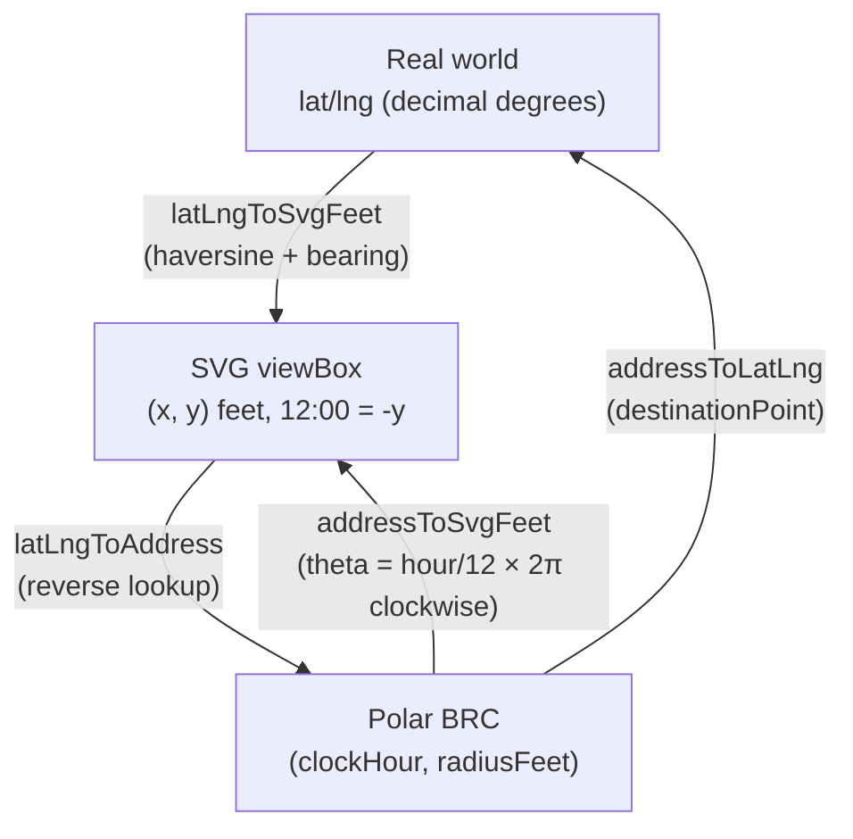
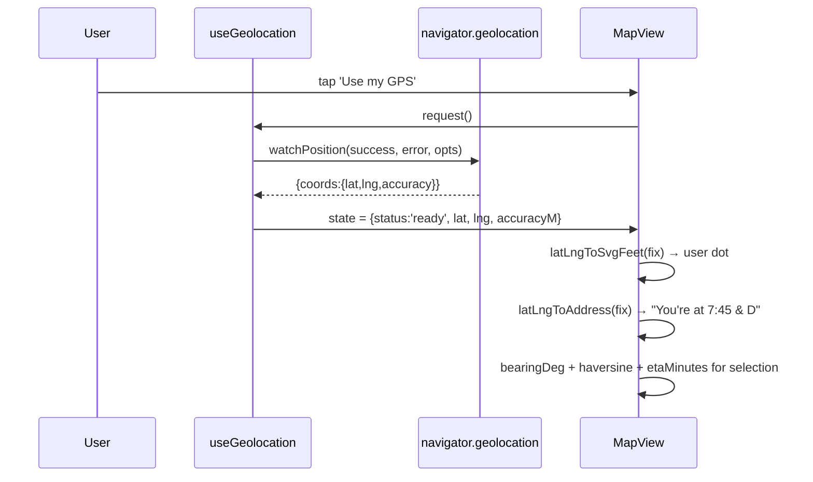

# Map System

## Overview

Black Rock City has a distinctive **clock × letter polar grid**
(2:00–10:00 hours × Esplanade–K rings, with the open-playa side facing
12:00). The map is a hand-rolled SVG, drawn from year-specific
constants in `client/src/map/data.ts` — no third-party map library,
no tile server. That's a hard requirement: on-playa the only working
"map" is the one that shipped in the bundle.

GPS is supported when granted, with a "you are here" bullseye, a current
clock-and-letter address readout, and a dashed arrow from the GPS marker to
whatever the user has selected.

For deterministic local and headless review, `?gps=<latitude>,<longitude>`
feeds a fixed coordinate through the same `useGeolocation` hook used by Map,
Schedule, and Food. The override persists across route changes/reloads and is
visibly labeled until “Use real location” clears it.

## Decisions

- **Pure SVG, zero tile fetches.** Every line, label, and pin is
  drawn from constants. Works on airplane mode after first load.
- **Saved lists are not limited to drawable markers.** Starred camps and art
  remain in their Map sidebar lists even when a location is blank, embargoed,
  or outside the address parser. Only the SVG marker is omitted; saved state is
  never made invisible merely because map coordinates are unavailable.
- **Year-isolated constants in `data.ts`.** The golden-spike lat/lng,
  street centerline radii, themed street names, radial ranges, 12-bearing,
  and POI list all
  live in one file with the year stamped at the top. The
  `/update-map` Claude skill walks the annual refresh.
- **Polar-coord math, not real projections.** BRC fits in a
  ~1.6 km radius. Treating it as a flat polar plane is accurate to
  ~20 ft at the edge — well within any UX tolerance. Real
  spherical/equirectangular math would be overkill.
- **Polyline-approximated arcs.** SVG `A` arc commands have
  large-arc/sweep flags whose meaning depends on coordinate-system
  orientation. Our y-inverted system produces the wrong arc half
  intuitively. Iterating clock hours from 2 → 10 with line segments
  draws the city-occupied arc the long way around without any flag
  guesswork.
- **Official street centerlines, not accumulated block depths.** The 2025 and
  2026 GIS `street_lines.geojson` files put Esplanade through K at
  `[2500, 2935, 3215, 3495, 3775, 4060, 4545, 4825, 5105, 5385, 5565, 5755]`
  feet from the Golden Spike. A measurements-PDF block depth is the clear
  space between street edges, so center-to-center spacing must add half the
  width of both bordering streets. Omitting those half-widths compounds the
  error and pulls K 355 feet inward.
- **Annual radial ranges.** The same 2025/2026 street exports contain every
  quarter hour from 2:00 through 10:00. `:00` and `:30` streets span
  Esplanade–K; `:15` and `:45` streets exist only in the outer city from F–K.
  The renderer reads these ranges from `BrcMapData` rather than drawing a
  hard-coded set of half-hour lines.
- **viewBox-based zoom + pan**. Real SVG re-rendering at every zoom
  level (no rasterized loss) plus a transparent hit-catcher per pin
  for fat-finger touch.
- **Sticky map controls below dynamic site chrome.** The map title, zoom/unit/GPS
  actions, legend, and horizontally scrollable layer toggles stay visible while
  the user scrolls the landmark lists and SVG. `App` observes the existing
  `.site-chrome` height and publishes `--site-chrome-height`; the control panel
  uses that live value as its sticky offset, including while the global mobile
  chrome collapses ([ADR 18](./18-mobile-scroll-chrome.md)). Do not replace it
  with a fixed pixel value: the header height varies by phone width, active
  source, transient banners, and scroll state.

## Accepted extension: official GIS landmarks and services

**Decision date:** 2026-08-06<br>
**Implementation status:** core scope implemented and verified 2026-08-07.
The Gate Road, DMZ/Sound-zone, and D-Lot overlays are **out of scope
(won't-do)** by owner decision, not deferred backlog — see the layer notes
below.

The map adds a curated set of official, year-specific Black Rock City
landmarks, participant services, safety resources, transport points, portable
toilet banks, and selected boundary overlays. The source is Burning Man
Project's official annual GIS export, not addresses inferred from camp data and
not a third-party map.

This is an extension of the existing map system, not a replacement for it. The
hand-built clock-and-letter SVG remains the base map because it is compact,
legible, source-aware, and available offline. Official GIS features sit in
additional SVG layers and use the existing GPS-to-SVG conversion.

### Authoritative sources and terms

Primary sources for the 2026 decision:

- Innovate datasets/release index:
  <https://innovate.burningman.org/datasets-page/>
- 2026 GIS dataset description:
  <https://innovate.burningman.org/dataset/2026-gis-map-data/>
- Official repository:
  <https://github.com/burningmantech/innovate-GIS-data>
- 2026 GeoJSON folder:
  <https://github.com/burningmantech/innovate-GIS-data/tree/master/2026/GeoJSON>
- Participant-facing descriptions and operating details:
  <https://survival.burningman.org/city-infrastructure/on-playa-resources/>
- Safety-resource descriptions:
  <https://survival.burningman.org/survival-health-and-safety/getting-help/>
- 2026 city-plan and portable-toilet guidance:
  <https://survival.burningman.org/city-infrastructure/2026-city-plan/>
- Data terms:
  <https://innovate.burningman.org/terms-of-service-for-burning-man-apis-and-datasets/>

The 2026 GIS release is dated July 13, 2026 and requires no API key. "Publicly
accessible" and "keyless" do **not** mean public domain or open-license data.
The GIS repository's `LICENSE.md` grants no additional rights and incorporates
the API/Dataset Terms. Continue to satisfy the app-wide non-commercial,
no-advertising, attribution, and no-affiliation requirements in
`docs/13-tos-compliance.md`.

The published GIS release is distinct from the keyed API's confidential early
camp/art locations. GIS overlays must be selected by map year, not coupled to
the camp/art embargo implementation. If Burning Man changes the publication
model or terms, review that conclusion again rather than carrying it forward by
assumption.

### Verified 2026 source inventory

The following inventory was inspected on 2026-08-06. Sizes are the raw files
reported by the official GitHub repository and may change when Burning Man
updates a file in place.

| File | Raw size | Intended use here | Decision |
|---|---:|---|---|
| `cpns.geojson` | 11,045 B | Named city-plan nodes / points of interest | In scope, curated allowlist only |
| `toilets.geojson` | 22,036 B | Portable-toilet bank footprints | In scope |
| `trash_fence.geojson` | 626 B | Actual city/perimeter boundary | Annual base-geometry review input; compiled vertices live in `data.ts`, not the GIS payload |
| `plazas.geojson` | 31,029 B | Authoritative plaza shapes/centers | In scope; Center Camp footprint normalized annually |
| `dmz.geojson` | 1,351 B | Deep-Playa Music Zone boundary | Out of scope (won't-do); not fetched/rendered |
| `gate_road.geojson` | 18,439 B | Arrival/exodus orientation | Out of scope (won't-do); not fetched/rendered |
| `street_lines.geojson` | 236,258 B | Exact street centerlines/radial ranges | Annual `map-audit` input; derive reviewed constants, do not embed raw |
| `city_blocks.geojson` | 1,520,547 B | Block polygons | Out of scope |
| `street_outlines.geojson` | 1,629,109 B | Detailed street polygons | Out of scope |

The three currently fetched runtime-overlay inputs (`cpns`, `plazas`, and
`toilets`) total about 64 KB before normalization or gzip. Adding every accepted
optional/review input brings the small-file inventory to about 85 KB, but those
files are not silently fetched or rendered. Do not pull in the two 1.5+ MB
polygon layers merely because they exist. They add visual density and bundle
weight while duplicating a base grid that the app already renders well.

Verified details that the importer must preserve:

- `cpns.geojson` is a `FeatureCollection` containing 60 `Point` features in
  2026. Coordinates are GeoJSON order: `[longitude, latitude]`. Properties are
  `OBJECTID`, `FID`, `NAME`, and `TYPE`.
- Every inspected 2026 CPN has the generic `TYPE` value `CPN`. That field is not
  a participant-friendly category and must not drive icons or filters.
- `toilets.geojson` contains 45 `Polygon` features in 2026. They represent bank
  footprints/areas, not a count or coordinate for every individual unit.
  Properties are `OBJECTID`, `class`, `Shape_Length`, and `Shape_Area`.
- Toilet `class` values observed in 2026 include `in city`, `2/10`, `man`,
  `playa`, `temple`, and null. Treat them as source metadata, not prose labels
  suitable for the UI.
- `plazas.geojson` contains authoritative `Polygon` plaza footprints. The
  participant-facing name property drifted from `Name` in 2025 to `name` in
  2026; both spellings are part of the importer contract. Center Camp Plaza is
  normalized as an area linked to the existing `center-camp` POI, not as a
  second list item.
- Upstream identifiers are year-local. A stable client key must include the
  year and feature kind; an `OBJECTID` or `FID` by itself is insufficient.

These counts are validation baselines, not eternal constants. A later year may
legitimately contain a different number of features. Validation should detect
unexpected schema/type changes and implausibly empty data, while the annual map
refresh explicitly reviews count changes.

### Curated POI policy

Do not render all CPN records. The official file mixes participant-facing
destinations, map geometry anchors, arrival infrastructure, operational names,
and opaque entries such as `Point 1` through `Point 5`. A raw dump would create
clutter and expose labels that are meaningless without internal context.

Use a committed, year-specific allowlist that maps the official `NAME` to:

```text
source name -> stable slug, user-facing label, layer, icon kind,
               short description/source URL, default visibility
```

The allowlist is application-authored metadata. It may improve capitalization
or expand an abbreviation, but it must not move the source coordinate or imply
that an unofficial interpretation came from Burning Man. When a label changes
materially, retain the original source name in the normalized record for
debugging and provenance.

#### Base landmarks — always rendered

- The Man (already rendered at the Golden Spike)
- The Temple
- Center Camp / Center Camp Plaza
- Official plazas
- Medical / Emergency Services Department stations at the 3:00, 6:00, and
  9:00 sides of the city
- Ranger Headquarters and the 3:00 / 9:00 Ranger outposts

These are orientation anchors rather than optional services. Avoid duplicate
pins: once an official point replaces a hard-coded `POIS` entry, remove the
hard-coded counterpart in the same change.

Center Camp is both a navigable point and an annual footprint. Render the
official plaza polygon over the generic street grid so the map shows the real
cutout, while polygon taps delegate to the point's existing details and
navigation. Do not infer the footprint from a street address or reuse another
year's polygon.

#### Essentials — visible by default

- Arctica ice locations, including the large-order outpost when present

#### Boundary — optional, default off

- Exact trash-fence pentagon for the selected map year

The fence is useful for orientation but far wider than the compact city grid.
Keeping it off initially preserves a readable city scale on phones. Enabling
Boundary expands the viewBox to all five vertices; disabling it returns to the
compact ambient extent.

#### Toilets — optional, default off

- Portable-toilet banks

Toilets are separate from Essentials because the 2026 dataset contains 45
banks. Showing every footprint and centroid on first load obscures more useful
orientation and safety markers, especially on a phone. The dedicated toggle
keeps them one tap away without making the default map crowded.

Safety-resource labels should use the participant-facing terminology in the
current Survival Guide. For example, the raw CPN names `Ranger Station Berlin`
and `Ranger Station Tokyo` should be presented as the relevant 3:00 and 9:00
Ranger outposts, with the source name retained internally. Similarly, internal
or legacy names such as `Rampart` must not be guessed into a medical category;
use the explicit ESD records plus the current official guide.

#### Services — optional, default off

- ARTery
- Recycle Camp
- Yellow Bike Shop / Project
- Placement and Lost & Found, represented as services at Playa Info rather
  than duplicate colocated pins

Co-located services belong in one point's detail panel. Playa Info, Placement,
and Lost & Found therefore share one marker. Stacking several icons
at Playa Info or Center Camp makes the map less usable and suggests false
physical separation.

#### Transport — optional, default off

- Burner Express Bus Depot
- Airport

#### Arrival — optional, default off

- Department of Mutant Vehicles
- Media Mecca
- Gate and Greeters
- Box Office and Will Call

D-Lot and Gate Road are **out of scope (won't-do)** by owner decision, not
implemented destinations: the current allowlist has no verified participant-
facing CPN mapping for D-Lot, and Gate Road's official line geometry is a
deliberately dropped overlay. Do not add either.

These features sit well outside the compact city grid. Hidden transport points
must not expand the default SVG `viewBox`; otherwise the city becomes tiny to
make room for locations most users do not need during the event. Explicitly
turning on Transport or Arrival fits that layer's available markers into the
overview and resets an existing close zoom to 1×; turning it off returns to the
compact extent. Selecting one POI as the sole target still expands/recenters as
needed, matching existing camp/art navigation behavior.

#### Excluded unless clarified

- Generic `Point 1`–`Point 5` records
- Operational or ambiguous records whose participant purpose is not explained
  by a current official guide
- BLM/law-enforcement and internal infrastructure points unless there is a
  clear participant navigation use and appropriate explanatory copy

Exclusion is not deletion from the upstream data. It is a presentation choice;
the next annual audit can promote a point when documentation becomes clear.

### Layer controls and interaction

The intended controls are:

| Layer | First-visit default | Contents |
|---|---|---|
| Base landmarks | On, not hideable | Man, Temple, Center Camp, plazas, medical/ESD, Rangers |
| Boundary | Off | Exact trash-fence pentagon |
| Essentials | On | Arctica ice |
| Toilets | Off | Portable-toilet bank footprints and centroids |
| Services | Off | Playa Info/Placement/Lost & Found, ARTery, recycling, bikes |
| Transport | Off | Airport and bus depot |
| Arrival | Off | Gate/Greeters, Box Office/Will Call, DMV, Media Mecca |
| ~~Sound zones~~ *(won't-do)* | — | DMZ boundary/label — deliberately dropped; not a shipped control |

Layer preferences should persist locally under a versioned key such as
`bm-map-layers/v1`. The version suffix gives us a clean default reset if layers
are reorganized. Preferences are device-local and should participate in the
existing "Clear all local data" behavior.

Rendering rules:

- Toilet polygons render beneath compact toilet-bank symbols at computed
  polygon centroids. Do not show 45 permanent text labels, but each footprint
  and centroid must be tappable; selection surfaces the same label, details,
  distance/bearing, ETA, and external-map link as another POI.
- The Center Camp Plaza polygon renders above the generic street lines with
  even-odd ring filling. It has a keyboard/tap target and delegates selection
  to the `center-camp` point, so it does not duplicate the landmarks row.
- The exact trash fence renders and participates in the overview bounds only
  while Boundary is enabled. The SVG element's CSS aspect ratio follows the
  computed `viewBox`, avoiding extra letterboxing in either state.
- Unselected POIs do not determine the compact default extent. While Transport
  or Arrival is enabled, its distant POIs determine that explicit layer view;
  a sole selected POI also reframes the map to guarantee the focused
  destination is visible.
- Other POIs use distinct shape **and** color categories. Safety information
  must not rely on color alone.
- Labels appear on selection/focus and in the detail panel, not permanently at
  overview zoom.
- Every interactive marker needs a large transparent hit target, keyboard
  focus, an `aria-label`, and the same tap-to-toggle semantics as existing map
  items. Because screen-sized POI hit targets can overlap at arrival clusters,
  pointer taps resolve to the nearest visible centroid rather than whichever
  SVG group happens to render last.
- A selected official point participates in the existing GPS distance/bearing
  experience. Its panel should include name, category, short official-purpose
  summary, coordinates/address when meaningful, and the existing external-map
  link when available.
- Hidden features must be removed from selection, navigation calculations, and
  dynamic viewBox extents. Changing map year clears a selected GIS feature that
  does not exist in the new year.
- The legend must explain icons, layer controls, source year, and that the map
  is a planned snapshot rather than a live operational feed.

#### Marker shape vocabulary

Color is never the only category cue. The map, selected-item rows, and legend
must keep the same compound vocabulary of **silhouette + glyph + color**:

| Meaning | Silhouette | Glyph/color |
|---|---|---|
| The Man / Golden Spike | Head, body, arms, and legs | Orange effigy centered at `(0, 0)` |
| Medical/ESD | Octagon | White `✚` on red |
| Black Rock Rangers | Shield | White `R` on indigo |
| Temple | Diamond | White `T` on ochre/gold |
| Arctica | Hexagon | White `❄` on blue |
| Playa Info | Square | White `i` on dark blue |
| Toilet bank | Wide capsule | White `WC` on blue |
| Airport | Triangle | White airplane on slate |
| Other official services | Category shape | Stable glyph and color from `gis.ts` |
| Your home camp | Large tent with doorway | Teal |
| Friend home camp | Smaller tent | Friend's stable hue |
| Starred camp | Bookmark | White `★` on gold; `F` on friend-only orange |
| Starred art | Five-point star | Magenta for yours, teal for friend-only |
| Meet spot | Four-point rendezvous marker with center dot | Violet for yours, friend's stable hue otherwise |
| GPS position | Crosshair/bullseye | Blue |
| Unsaved camp navigation target | Dashed crosshair | Orange |
| Unsaved art navigation target | Hollow five-point star | Magenta |

Every official POI kind has a unique exact color in `POI_COLORS`; colors must
not be reused even when two categories live on different optional layers. The
exhaustive `Record<PoiKind, string>` forces newly added kinds to choose a color,
and the GIS metadata test rejects duplicate palette values. Shape and glyph
remain mandatory because color alone is not an accessible identifier.

When a starred camp is also a home camp, render only the tent at that
coordinate. The camp remains in the Starred camps list, but drawing a bookmark
under the tent makes both silhouettes less legible without adding information.
The invisible hit-catcher stays circular and generously sized regardless of
the visible silhouette.

Center Camp placements use internal sub-addresses that do not follow the
city-wide `<clock> & <letter street>` grammar. When the selected home camp's
location mentions Center Camp and normal parsing fails, anchor its tent to the
authoritative annual `center-camp` POI. The tent paints after official markers,
so it remains visible and receives taps even though the two coordinates are
identical. Preserve the original source location in the detail row; the fallback
only supplies map geometry.

Do not add marker clustering initially. The allowlist plus layer defaults keeps
the visible point count manageable, and toilet labels appear only on selection.
Revisit clustering only if real-device testing shows unusable density.

### Data acquisition, normalization, and offline behavior

There must be no runtime dependency on GitHub, Burning Man servers, a tile
provider, or an API key. GIS data follows the existing single-file/offline
architecture:


```mermaid
flowchart LR
  Upstream["Official annual GeoJSON"]
  Fetch["build-time GIS fetch"]
  Cache["gitignored data/gis/YEAR/"]
  Validate["schema + bounds validation"]
  Normalize["allowlist + compact geometry"]
  Embed["year-keyed gzip payload in index.html"]
  Convert["latLngToSvgFeet using active BRC year"]
  Render["SVG landmark/service layers"]

  Upstream --> Fetch --> Cache --> Validate --> Normalize --> Embed
  Embed --> Convert --> Render
```

Implementation requirements:

1. Fetch only the explicitly configured files for a requested year into
   `data/gis/<year>/`. The raw cache remains gitignored; do not commit fetched
   GIS payloads merely because the source is publicly reachable.
2. Record source URL, retrieval time, upstream Git blob/commit SHA when
   available, and a content digest in generated metadata. Build logs should
   report aggregate counts and identifiers, not dump entire source records.
3. Validate before replacing a usable cache. At minimum: `FeatureCollection`,
   supported geometry types, finite coordinate pairs, plausible BRC-region
   bounds, unique normalized IDs, and non-empty required layers.
4. Normalize only the fields the client needs. Drop ArcGIS bookkeeping such as
   `Shape_Area` after validation unless it serves a documented UI purpose.
5. Preserve coordinates in longitude/latitude form in the embedded normalized
   data. Client conversion must call
   `latLngToSvgFeet({lat: coordinate[1], lng: coordinate[0]}, brc)`. Keeping the
   geographic coordinate preserves provenance and supports external-map links.
6. Preserve polygon ring structure, including holes, even if the current toilet
   polygons do not exercise every valid GeoJSON shape.
7. Embed one GIS payload per year, not per password tier. `api-YYYY` selects
   `YYYY`; tiers sharing a year share one map layer.
8. Gzip/base64 the normalized payload using the same browser-supported
   decompression path as other embedded data. The upstream GIS data is already
   public, so it does not need a separate encryption envelope; it remains
   inaccessible as UI until the normal app gate is passed.
9. Service-worker behavior remains unchanged: once `index.html` is installed,
   the GIS snapshot is part of the offline shell. Never fetch updated GIS data
   opportunistically in the browser.

#### Implemented file contract (2026)

- `backend/src/playa/gis.py` owns `POI_RULES`, `AREA_RULES`, upstream-name aliases,
  introduction-year requirements, GeoJSON validation, polygon centroids,
  atomic cache replacement, SHA-256 provenance, a curation/cache version, and
  normalization. A version mismatch regenerates `normalized.json` from the
  cached raw GeoJSON before attempting any network download.
- `python -m playa gis-fetch [--year YYYY] [--force]` writes raw inputs plus
  `data/gis/YYYY/normalized.json`. With no `--year`, it resolves the current
  BRC year and configured API years; `make build`, `make rebuild`, and
  `make dev` ensure those caches exist.
- `SiteBuilder._gis_data_scripts()` validates and embeds each active map year
  once as `gis-data-YYYY`, gzip/base64. The builder also emits
  `bm-brc-map-year`; each `api-YYYY` source remains self-describing.
- `client/src/map/gis.ts` validates/decompresses that script and owns layer
  defaults plus icon/color mappings. `MapView.tsx` converts official WGS84
  coordinates and polygon rings through the active `BrcMapData`. The normalized
  area schema is `[polygon][ring][point][lng,lat]`, preserving holes and future
  `MultiPolygon` inputs.
- 2025 is the regression case for annual name drift: its medical nodes are
  `Station 3`, `Station 6`, and `Station 9`, while 2026 uses the `ESD Station`
  names. The stable IDs do not change. `Arctica Outpost` is required from 2026
  onward but is validly absent in 2025.
- The official `Center Camp Plaza` CPN replaces the static fallback when GIS is
  present. For 2026 both it and the distinct `Arctica Center Camp` point are
  inside the A–B block, at roughly 3,026 and 3,052 feet from the Man. A
  nearest-centerline reverse lookup therefore reports A even though the
  curated participant address refers to the adjacent B-side location. The
  official annual plaza polygon supplies the full Center Camp footprint
  independently of both points.

#### Staged-release behavior

Camp/event/art sources may become available before that year's complete city
geometry or GIS export. This is an expected partial state, not a build failure:

- `getBrcForYear(year)` resolves only an exact `BRC_BY_YEAR` entry. It never
  borrows the newest known year.
- When exact geometry is missing, the Map tab shows a year-specific “Map not
  available yet” state. Camps, events, art, favorites, and schedules continue
  to work.
- Schedule “Near me” is disabled for that source because its distance math also
  requires exact geometry. If it was active before a source switch, it is
  cleared rather than hiding events. Non-coordinate schedule filters remain
  available.
- A GIS HTTP 404 with no same-year cache logs a warning and omits official
  overlays for that year. A forced refresh that receives 404 retains a valid
  same-year cache.
- Other HTTP failures and released-but-invalid GIS data fail the explicit,
  strict `gis-fetch` operator command. Deployment-time best-effort refresh catches
  them per year, emits a loud warning/Actions annotation, and continues with a
  valid same-year cache or no overlay. Invalid data never replaces a known good
  map, and one failed year does not prevent later years from refreshing.
- The builder validates caches again as a defense against truncation/manual
  damage. An unusable cache is warned and skipped for that year while other
  valid annual overlays and the rest of the site continue building.
- As soon as reviewed geometry/GIS is added and the normal build runs again,
  the map appears without changing the already-enabled source or user state.

### Refresh and release behavior

Annual data changes are expected. Extend the existing `/update-map` workflow so
one annual operation updates the Golden Spike/street constants and GIS overlay
configuration together.

The canonical operator procedure is
[`dev/annual-map-update.md`](./dev/annual-map-update.md). It covers staged
upstream releases, historical geometry preservation, forced cache regeneration,
POI/layer review, year configuration, encrypted rebuilding, mobile screenshots,
and post-deploy checks. The checklist below is the architectural summary, not a
replacement for that runbook.

For each new year:

1. Confirm the official GIS release page and current Terms.
2. Inspect the repository's year folder; do not infer filenames or schema
   from the previous year.
3. Fetch into the gitignored cache and print file digests, geometry types,
   counts, property keys, and coordinate bounds.
4. Review the CPN names against the current Survival Guide. Add, rename, remove,
   or reclassify allowlist entries intentionally.
5. Verify required safety/service points manually against participant-facing
   documentation. Absence of a familiar name must fail review rather than be
   silently copied from last year's coordinates.
6. Run coordinate-transform, normalization, UI, accessibility, offline-build,
   and source-switching tests.
7. Preview overview and close zoom on a phone-sized viewport with every layer
   combination, especially Toilets + Essentials + many user pins.
8. Record the refresh date, upstream source revision, and meaningful changes in
   this ADR or the annual data manifest.

Each production deployment may refresh an already-released current-year GIS
cache. Actions caches `data/gis` under an exact key containing the upstream
`innovate-GIS-data` commit and configured API year set. With an exact
hit, `cmd_all` reuses validated files and does not redownload the three
GeoJSON files. A new upstream commit or year set yields a miss and downloads
once; there is deliberately no stale-prefix restore. HTTP 404 is the
staged-release signal described above. Timeouts, non-404 HTTP failures,
malformed JSON, and schema/name drift use the same build-isolation boundary:
warn, retain a valid same-year normalized cache when present, otherwise omit
that overlay, and finish the non-map deployment. The strict operator command
remains the annual-review gate. Published invalid data must never deploy a
silently partial Essentials layer or replace the last validated cache. Other
GIS years continue refreshing independently.

### Testing contract

Use the [mobile visual testing runbook](./dev/mobile-visual-testing.md) for the
phone-sized manual/headless pass and encrypted-build restoration procedure.

Add focused coverage for:

- GeoJSON feature, geometry, property, and coordinate validation
- `[longitude, latitude]` to `{lat, lng}` ordering
- polygon rings and centroid calculation
- stable year-qualified feature IDs
- allowlisted CPN inclusion and opaque/unapproved CPN exclusion
- duplicate detection between official and hard-coded POIs
- required current-year essentials and deliberate failure when absent
- source-to-map-year selection (`api-YYYY` and unknown future year)
- exact-year geometry for current/historical sources and a non-rendering,
  non-failing state for a future source whose geometry is not yet available
- staged GIS 404 with and without a validated same-year cache
- transient network and required-name/schema failures remaining strict for an
  explicit fetch but isolated per year during deployment orchestration
- a corrupt cached year being omitted without suppressing another valid year
- deployment orchestration using `force=False`, with the workflow cache key
  changing for an upstream revision, configured-year change, or normalizer
  code change; a stale derived cache is regenerated from cached raw GeoJSON
- layer defaults, local persistence/versioning, and clear-local-data behavior
- hidden-layer removal from selection and viewBox calculations
- compact default extent; fitted Boundary, Transport, and Arrival views while
  enabled; and sole-selected-POI reframing
- annual Center Camp polygon rendering, ring preservation, and tap delegation
  to the existing Center Camp details row
- overlapping Gate/Box Office/Will Call hit targets selecting the nearest icon
- keyboard focus, accessible names, and non-color-only category distinction
- offline build output containing no runtime GIS URL fetch
- The Man/Golden Spike projecting near `(0, 0)` and representative official
  points/polygons landing in plausible positions
- official directional anchors: Temple on 12:00/NE, 3:00 medical on the right,
  9:00 medical on the left, and Center Camp/Arctica on 6:00/SW; these
  disambiguate the two directions of the published 4:30/10:30 N/S axis

Do not hardcode exact total feature counts as a permanent cross-year assertion.
Use the verified 2026 counts in 2026 fixtures and review them when the fixture
year changes.

### Rollout plan

Implement in small, independently reviewable stages:

1. **Completed — fetcher + normalizer:** build-time acquisition, cache, source
   metadata, schema validation, fixtures, and tests.
2. **Completed — base official geometry:** year-keyed embed, Temple,
   authoritative plazas, and the default-off Boundary overlay.
3. **Completed — essentials:** always-on medical/ESD and Rangers; default-on
   ice; default-off toilet-bank centroids/footprints; legend and details.
4. **Completed for shipped layers — controls:** persisted Boundary, Toilets,
   Essentials, Services, Transport, and Arrival controls plus selection,
   accessibility, and mobile-density review. Sound zones are out of scope
   (won't-do).
5. **Shipped optional layers:** Services and Transport ship. Gate Road,
   DMZ/Sound, and D-Lot are out of scope (won't-do) — deliberately dropped.
6. **Completed — annual workflow foundation:** `/update-map`, the canonical
   runbook, CI/cache validation, mobile testing, and the read-only `map-audit`
   geometry extractor/report. Annual human review remains mandatory.

Each stage must keep the old map functional. Do not remove current POI constants
or change the default viewBox until the corresponding official layer is loaded,
tested, and visually verified.

### Alternatives rejected

- **Render every CPN:** rejected because raw data includes opaque and
  operational points, has no useful category field, and would overwhelm the
  existing user/friend/camp pins.
- **Fetch GeoJSON in the browser:** rejected because the map must work offline,
  runtime network availability on playa is unrealistic, and upstream changes
  should pass validation before reaching users.
- **Commit annual raw GeoJSON:** rejected to preserve the public-code/private-
  data posture and avoid creating an unnecessary redistribution mirror. Commit
  importer code, allowlists, fixtures small enough for tests, and provenance;
  keep complete fetched payloads and built HTML out of git.
- **Replace the SVG with Google Maps, Mapbox, or Leaflet tiles:** rejected due to
  network dependency, payload/UI overhead, privacy, and poor on-playa utility.
- **Replace the base grid immediately with street/block polygons:** rejected
  because the current geometry is compact and legible. Exact street lines can
  be evaluated later as an annual-maintenance improvement.
- **Manually transcribe official coordinates into `data.ts`:** rejected for the
  new layers because it invites annual drift and makes provenance/validation
  weaker. Curated presentation metadata is manual; geometry is imported.

## Mechanism

### Coordinate system


```mermaid
flowchart TB
  RealWorld["Real world<br>lat/lng (decimal degrees)"]
  Polar["Polar BRC<br>(clockHour, radiusFeet)"]
  SVG["SVG viewBox<br>(x, y) feet, 12:00 = -y"]
  RealWorld -->|"latLngToSvgFeet<br>(haversine + bearing)"| SVG
  Polar -->|"addressToSvgFeet<br>(theta = hour/12 × 2π clockwise)"| SVG
  Polar -->|"addressToLatLng<br>(destinationPoint)"| RealWorld
  SVG -->|"latLngToAddress<br>(reverse lookup)"| Polar
```

Three coordinate systems, three pure-math conversion functions in
`address.ts`. None depend on Preact / DOM — easy to unit-test.

### Layered rendering


```mermaid
flowchart TB
  subgraph Svg
    Bg["brc-playa background"]
    Streets["Concentric arcs (Esplanade–K)"]
    Radials["Radial spokes (2:00–10:00)"]
    Man["The Man effigy at (0,0)"]
    Labels["Address readouts near Man"]
    POIs["POIs (Center Camp, Playa Info)"]
    Pins["Starred camp bookmarks<br>(transparent hit-catcher + halo)"]
    MyCamp["My-camp tent (teal)"]
    FriendCamps["Friend tents (per-name hue)"]
    MeetSpots["Four-point rendezvous markers"]
    User["GPS crosshair/bullseye"]
    Bearing["Dashed bearing arrow<br>user → selected"]
  end
  Bg --> Streets --> Radials --> Man --> Labels
  Labels --> POIs --> Pins --> MyCamp --> FriendCamps
  FriendCamps --> MeetSpots --> User --> Bearing
```

Render order matters: later elements paint on top. POIs are below
camp pins (so a starred camp at the same address isn't covered);
meet spots paint above tents (rendezvous plans are more important
than home-camp markers); user-position + bearing are on top.

### GPS pipeline


```mermaid
sequenceDiagram
  participant User
  participant H as useGeolocation
  participant N as navigator.geolocation
  participant V as MapView

  User->>V: tap 'Use my GPS'
  V->>H: request()
  H->>N: watchPosition(success, error, opts)
  N-->>H: {coords:{lat,lng,accuracy}}
  H->>V: state = {status:'ready', lat, lng, accuracyM}
  V->>V: latLngToSvgFeet(fix) → user dot
  V->>V: latLngToAddress(fix) → "You're at 7:45 & D"
  V->>V: bearingDeg + haversine + etaMinutes for selection
```

GPS is opt-in. `useGeolocation` only calls
`navigator.geolocation.watchPosition` after the user explicitly
clicks "Use my GPS" — the App modal explains this in the privacy
section.

### Zoom + pan

- `zoom` and `center` state in `MapView.tsx`.
- viewBox computed: `${cx - vbW/2} ${cy - vbH/2} ${vbW} ${vbH}` where
  `vbW = DEFAULT_VB_WIDTH / zoom`.
- Pointer Events API for pan: `pointerdown` records anchor;
  `pointermove` updates `center` once a 6-pixel screen-space
  threshold is crossed; threshold defers `setPointerCapture` so taps
  on child pins still route normally to their `onClick`.
- Auto-recenter on selection when `zoom > 1` so tapping any pin pans
  to keep it in view.

## Failure modes & trade-offs

- **GPS off-grid**: when the user's fix is outside the city's clock
  arc, `latLngToAddress` returns null and the address readout shows
  `off-grid · ±Nm`. The bearing arrow still draws to the selected pin
  even if the user is off-map, but enters from the viewport edge —
  the legend covers what to make of that.
- **Pin density at zoom=1** can be visually noisy if a user has
  hundreds of starred camps. Mitigation: zoom in. We don't
  auto-cluster; the camps list in the sidebar is the dense view.
- **Address ambiguity**. "7:30 & F" and "F & 7:30" both occur in source
  records. `parseAddress` accepts either order. Edge cases like
  `None Listed` / `-` return null.
- **Themed street names year-shift.** Each year the letters' fancy
  names change ("Ararat", "Bodhi", etc.). `parseAddress` matches
  letter codes (A–K) AND the year's themed names — so old cached
  shares with last-year's names still resolve when the data refresh.
- **Empty pin set still renders the map.** When zero camps have
  resolvable addresses (e.g., the current-year API source pre-
  location-release), the SVG grid + POIs (Center Camp, Playa Info)
  still draw — the city is the primary value of the view. A small
  contextual hint sits above the map suggesting how to pin
  (star a camp, set my-camp, add a meet spot) but does NOT replace
  the map. Copy is tier-agnostic — doesn't reference the source
  switcher since not every tier has multi-source access.

## Code references

- `client/src/map/data.ts` — year-specific constants
- `client/src/map/address.ts` — pure math helpers
- `client/src/components/MapView.tsx` — renderer + interactions
- `client/src/hooks/useGeolocation.ts` — opt-in GPS wrapper
- `client/src/components/MapInfoModal.tsx` — legend
- `backend/src/playa/mapaudit.py` — read-only annual street/radial extractor
- `.claude/skills/update-map/SKILL.md` — annual refresh procedure
