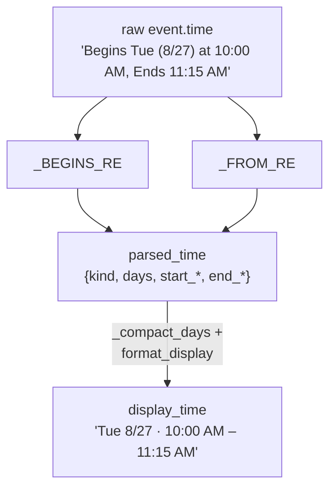
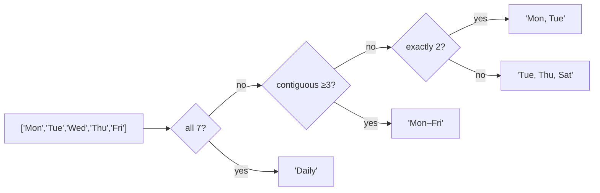
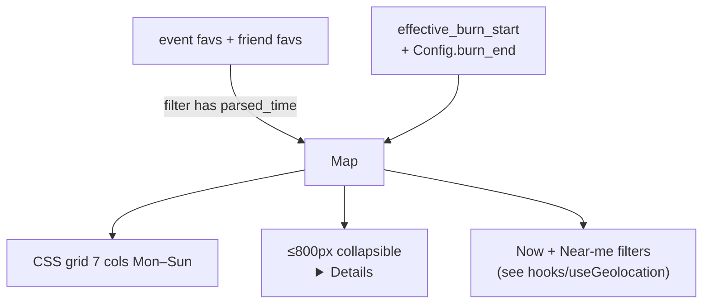

# Schedule System

## Overview

The Schedule tab lays starred events out on a per-day grid for the
whole burn week. The hard parts are:

1. **Parsing the directory's free-text time strings** into a
   structured form (kind / days / start / end).
2. **Bucketing recurring events** correctly across the day columns.
3. **Year-agnostic dates** — the directory's `(M/D)` tuples drift
   each year; we derive the week map from the data itself.

## Decisions

- **Server-side parsing**, client-side rendering. `timeparser.py`
  runs at build time and stamps every event with a structured
  `parsed_time` plus a pre-rendered `display_time` string. The
  client never sees the raw upstream format.
- **Year-agnostic dates from the data.** `derive_week_map` scans
  every single-occurrence parse in the fetch and builds
  `{day_abbrev → "M/D"}` from the `(M/D)` tuples the directory
  itself posted. Recurring events look up their start date in this
  map. When the burn rolls over to next year, the map updates
  automatically on the next fetch.
- **Day-of-week labels, not dates, in the calendar.** Burners think
  in "Wednesday of burn week," not "Aug 27." The columns are
  Mon-first (matches camp usage) and labelled by short day name +
  date.
- **Explicit-only event stars.** Starring a camp does NOT auto-star
  every event at that camp. Schedule is *what you'll be at*, not
  *what's happening at places you like*. Camp star = "I want to
  visit" / event star = "I'll be at this exact thing."

## Mechanism

### Time parsing pipeline

Two regex flavors handle ~99.98% of the corpus:

- **Begins/Ends form** — single occurrence, sometimes spans
  midnight: `Begins Thu (8/29) at 9:00 PM, Ends Fri at 2:00 AM`.
- **From/On form** — recurring: `From 11:00 AM to 3:00 PM on Mon,
  Tue, Wed, Thu, Fri`.

Anything that doesn't match keeps an empty `display_time`; the
template falls back to `e.display_time || e.time` so unparsed events
still render with their raw string. The build prints a coverage
percentage to catch parser regressions.

### Day compaction

The exact-2 case is forced to comma form because `Mon–Tue` reads
ambiguously (could be a single label like "Mon-day Tue-sday").

### Calendar rendering (client)

Recurring events render once **per day they recur**. A "Mon–Fri"
event shows in 5 columns. Unparsed events land in a dashed-border
"Unscheduled" section with their raw time so nothing is lost.

### Filters

- **⚡ Now**: events starting in the next 2 hours of `Date.now()`.
- **📍 Near me**: events at camps within ~1 km of the user's GPS fix.
  Reuses the same `latLngToSvgFeet` math the map uses.

## Failure modes & trade-offs

- **Format drift** in the directory will tank the parse rate. The
  build log prints the percentage; if it falls below ~99% we
  inspect samples and add a regex.
- **Day labels span two Sundays** (Sun and Sun2 in the directory).
  The parser strips trailing `2`/`3` digits and dedupes — second
  occurrence is collapsed into the first. The calendar columns
  derive from the actual date window so this is fine.
- **Recurring events with no date tuple** get their `(starts M/D)`
  annotation from the earliest day in their day-list, looked up in
  the year's derived week map. If the map is empty (no
  single-occurrence events to seed from), recurring annotations
  silently drop — extremely rare in practice.

## Code references

- `backend/src/playa/timeparser.py` — all parsing + compaction
- `backend/tests/test_timeparser.py` — AM/PM boundaries, day
  compaction, year-free guarantee
- `backend/src/playa/builder.py::_enrich_event_times` — two-pass
  walk that derives the week map then formats display strings
- `client/src/components/ScheduleView.tsx` — calendar grid +
  filters + day-hide
- `client/src/hooks/useGeolocation.ts` — opt-in GPS for Near-me
