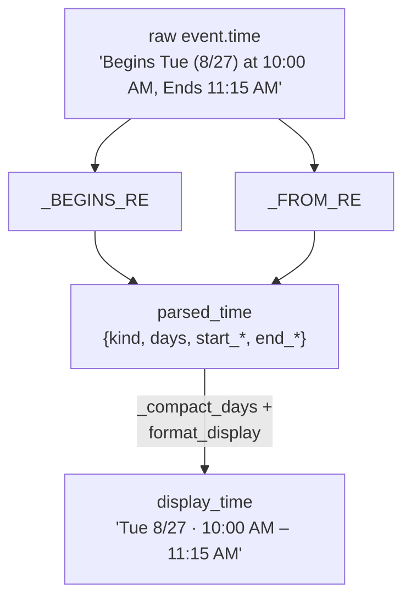
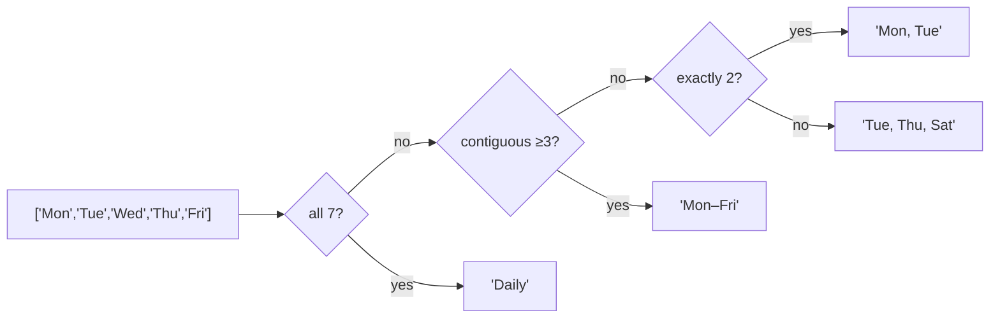
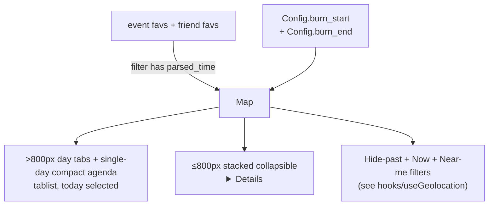

# Schedule System

## Overview

The Schedule tab lays starred events out on a per-day grid for the
whole burn week. The hard parts are:

1. **Parsing API free-text time strings** into a
   structured form (kind / days / start / end).
2. **Bucketing recurring events** correctly across the day columns.
3. **Year-aware occurrence dates** — valid `(M/D)` tuples distinguish repeated
   weekdays across the two-week window, while stale prior-year tuples must be
   detected and repaired.

## Decisions

- **Server-side parsing**, client-side rendering. `timeparser.py`
  runs at build time and stamps every event with a structured
  `parsed_time` plus a pre-rendered `display_time` string. The
  client never sees the raw upstream format.
- **Configured window is authoritative.** `BURN_WINDOW_OPEN_FROM` and
  `BURN_WINDOW_OPEN_TO` define the calendar's first and last columns. Event
  records outside that interval do not expand the schedule.
- **Occurrence-aware single dates.** A valid explicit `(M/D)` is retained when
  it falls inside the configured event window and its weekday agrees with the
  current burn year. This distinguishes the second Saturday from the first.
  Stale tuples whose weekday no longer agrees are repaired through the
  canonical burn-window map. Overnight end dates are derived from the resolved
  start occurrence, so a second-week Saturday ends on the following Sunday.
- **Day-of-week labels, not dates, in the calendar.** Burners think
  in "Wednesday of burn week," not "Aug 27." The columns are
  Mon-first (matches camp usage) and labelled by short day name +
  date.
- **Explicit-only event stars.** Starring a camp does NOT auto-star
  every event at that camp. Schedule is *what you'll be at*, not
  *what's happening at places you like*. Camp star = "I want to
  visit" / event star = "I'll be at this exact thing."
- **One day at a time, defaulting to today.** As the schedule fills, showing
  every day at once makes the page unusably tall. The two form factors solve
  that differently because a side-by-side grid can't reclaim height by
  collapsing one column — the row stays as tall as the fullest open day.
  - **Desktop (>800px): day tabs + a single-day agenda.** A horizontal strip
    of day pills (weekday, date, post-filter event count) selects one day;
    its events render below as a compact agenda — time on the left, then name ·
    camp with the description beneath, and stars/actions on the right. This is a
    full `role="tablist"` / `tab` / `tabpanel` pattern with the APG keyboard
    model: roving tabindex, Arrow/Home/End move the selection
    (activation-follows-focus), and each tab's `aria-controls` targets the one
    agenda panel. The strip is a single non-wrapping row that scrolls
    horizontally when narrow — never a wrapped grid, because a nine-day burn
    window can strand a lone pill on a second row at widths where all-but-one
    fit. The selected tab is scrolled into view when the selection changes.
  - **Every event is a bordered card.** Both form factors render each event as
    a bordered card (the Food tab's card idiom) with a thin accent left edge as
    a calendar-style cue — theme tokens throughout, so it holds in every theme.
    On mobile the day accordion is a lightweight collapsible header, not a card,
    so we don't box a day-card around the event cards.
  - **Mobile (≤800px): a stacked accordion.** Days stack vertically, each a
    native `
` with a rotating chevron; full event rows keep their
    descriptions. Stacking collapses cleanly, so per-day open/close is the
    right primitive here.
  - **Centered, capped column.** The schedule content (filters, notice, tabs,
    agenda) is a single centered column (`.schedule-wrap` max-width + auto
    margins) rather than hugging the left, since the single-day agenda is one
    column and wide screens would otherwise leave a large empty right margin.
  - **Shared selection philosophy.** Both the desktop selected tab and the
    mobile open set are *derived* each render — today when it falls inside the
    burn window, otherwise the first day — so they follow late burn metadata
    and BRC-midnight rollover instead of a value seeded once, until the user
    makes an explicit choice. Under an active Hide-past/Near-me filter the
    default prefers today when it still has matches, else the first day that
    does, so filtered results are never hidden behind an empty selection. The
    per-day count is the at-a-glance signal of where events live.
  - **Echo-safe toggling.** A `
` fires `toggle` for our own
    programmatic `open` changes (a filter/midnight shift, the twin desktop/
    mobile trees re-syncing) as well as for user clicks, and can dispatch
    synchronously mid-commit under a stale handler closure. The accordion's
    toggle handler compares against a ref of the state it last rendered, not a
    recomputed default, so a programmatic echo is ignored and only a genuine
    user flip is recorded.

## Mechanism

### Time parsing pipeline

```mermaid
flowchart TD
  Raw["raw event.time<br>'Begins Tue (8/27) at 10:00 AM, Ends 11:15 AM'"]
  R1[_BEGINS_RE]
  R2[_FROM_RE]
  Parsed["parsed_time<br>{kind, days, start_*, end_*}"]
  Display["display_time<br>'Tue 8/27 · 10:00 AM – 11:15 AM'"]
  Raw --> R1 --> Parsed
  Raw --> R2 --> Parsed
  Parsed -->|"_compact_days +<br>format_display"| Display
```

Two regex flavors handle ~99.98% of the corpus:

- **Begins/Ends form** — single occurrence, sometimes spans
  midnight: `Begins Thu (8/29) at 9:00 PM, Ends Fri at 2:00 AM`.
- **From/On form** — recurring: `From 11:00 AM to 3:00 PM on Mon,
  Tue, Wed, Thu, Fri`.

Anything that doesn't match keeps an empty `display_time`; the
template falls back to `e.display_time || e.time` so unparsed events
still render with their raw string. The build prints a coverage
percentage to catch parser regressions.

After parsing, `resolve_single_start_date` validates explicit single-event
dates against the configured burn year, weekday, and event window. Valid dates
survive; invalid/stale dates fall back to `canonical_week_map`. The resolved
start occurrence also drives `resolve_end_date`, keeping both `display_time`
and structured `parsed_time.end_date` aligned for overnight events.

### Day compaction

```mermaid
flowchart LR
  Days["['Mon','Tue','Wed','Thu','Fri']"]
  R1{contiguous ≥3?}
  R2{all 7?}
  R3{exactly 2?}
  Days --> R2 -->|yes| Daily["'Daily'"]
  R2 -->|no| R1
  R1 -->|yes| Range["'Mon–Fri'"]
  R1 -->|no| R3
  R3 -->|yes| Comma2["'Mon, Tue'"]
  R3 -->|no| CommaN["'Tue, Thu, Sat'"]
```

The exact-2 case is forced to comma form because `Mon–Tue` reads
ambiguously (could be a single label like "Mon-day Tue-sday").

### Calendar rendering (client)

```mermaid
flowchart TD
  StarredEvents[event favs + friend favs]
  Window["Config.burn_start<br>+ Config.burn_end"]
  Cells["Map<dayKey → events[]>"]
  StarredEvents -->|filter has parsed_time| Cells
  Window --> Cells
  Cells --> ColumnsDesktop[">800px day tabs + single-day compact agenda<br>tablist, today selected"]
  Cells --> AccordMobile["≤800px stacked collapsible <details>, today open"]
  Cells --> Filters["Hide-past + Now + Near-me filters<br>(see hooks/useGeolocation)"]
```

Recurring events render once **per day they recur, on or after their stamped
`start_date`**. A Tue/Wed/Fri event that starts on the second Tuesday does not
fan backward into the prior week's matching columns. Unparsed events land in a dashed-border
"Unscheduled" section with their raw time so nothing is lost.

### Filters

- **🕘 Hide past**: removes scheduled occurrences whose end time is at or
  before the shared clock value, using Black Rock City local time. In-progress
  and unparseable events remain visible. App supplies a fresh clock snapshot
  once per minute and whenever Schedule is opened, so an installed PWA can
  remain open without the cutoff going stale.
- **⚡ Now**: events starting in the next 2 hours of the shared
  `utils/clock.now()` value. This normally uses the device clock and honors the
  `?now=<ISO>` manual-test override described in the mobile visual runbook.
- **📍 Near me**: events at camps within ~1 km of the user's GPS fix.
  Reuses the same `latLngToSvgFeet` math the map uses. The button is a toggle;
  press it again (or use Clear filters) to restore the prior schedule and stop
  Schedule's GPS watch. For deterministic testing,
  `?gps=<latitude>,<longitude>` supplies a fixed GPS position through the shared
  hook without a permission prompt; see the mobile visual-testing runbook.

## Failure modes & trade-offs

- **Format drift** in API strings will tank the parse rate. The
  build log prints the percentage; if it falls below ~99% we
  inspect samples and add a regex.
- **Day labels can span two Sundays** (Sun and Sun2 in source data).
  The parser strips trailing `2`/`3` digits and dedupes — second
  occurrence is collapsed into the first. The calendar columns
  derive from the actual date window so this is fine.
- **Recurring events with no date tuple** get their `(starts M/D)` annotation
  from the earliest mapped calendar date among their weekdays—not from a
  Monday-first weekday ordering. This handles event windows that begin on
  Sunday. The builder stamps the same date into `parsed_time.start_date` so
  Food and Schedule display/date-gating agree.

## Code references

- `backend/src/playa/timeparser.py` — all parsing + compaction
- `backend/tests/test_timeparser.py` — AM/PM boundaries, day
  compaction, year-free guarantee
- `backend/src/playa/builder.py::_enrich_event_times` — two-pass
  walk that derives the week map then formats display strings
- `client/src/components/ScheduleView.tsx` — calendar grid +
  filters + day-hide
- `client/src/utils/clock.ts` — shared real/simulated clock
- `client/src/hooks/useGeolocation.ts` — opt-in GPS for Near-me
- `client/src/utils/mockGps.ts` — persistent `?gps=` test override
