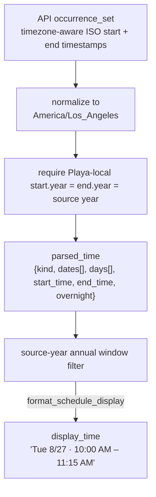
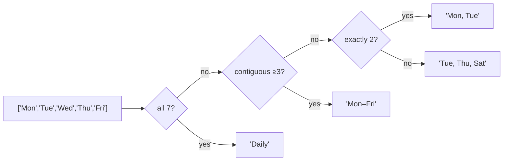
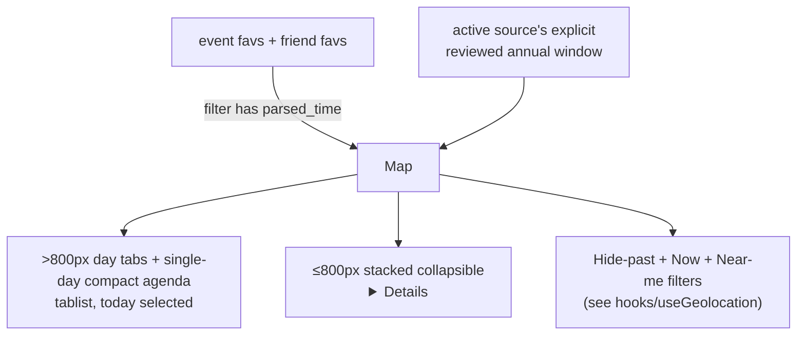

# Schedule System

## Overview

The Schedule tab lays starred events out on a per-day grid for the
whole burn week. The hard parts are:

1. **Normalizing API occurrence timestamps** without a lossy display-string
   round trip.
2. **Bucketing single and recurring occurrences** on their literal dates.
3. **Preserving annual source identity** so a date from `api-YYYY` can never be
   interpreted as belonging to another year.

## Decisions

- **Server-side normalization, client-side rendering.** `sources/api.py`
  converts upstream ISO occurrence timestamps directly into structured
  `parsed_time`; `schedule.py` filters/formats that structure at build time.
  Calendar placement never reparses `event.time` or `display_time`.
- **Reviewed source-year windows are authoritative.** Every supported
  `api-YYYY` has an explicit annual window in `schedule.py`, added only after
  checking an official Burning Man Project page. The current reviewed entries
  are [2025: August 24–September 1](https://history.burningman.org/timeline/2025/)
  and [2026: August 30–September 7](https://burningman.org/event/black).
  The builder emits the explicit window for each embedded source; the client
  parses that metadata and never projects one year's dates into another year.
  There is no environment override, and a missing annual entry fails the build.
- **Exact occurrence dates, not a weekday fan-out** *(2026-08-24, supersedes the
  earlier weekday-set + start-date model)*. Each event carries the explicit list
  of its in-window occurrence start dates — `parsed_time.dates`
  (`YYYY-MM-DD`, sorted) —
  read straight from the API `occurrence_set` and filtered to the configured
  window. The client places an event on exactly those dates; it never infers
  placement by matching weekdays across the calendar. The prior model stored a
  weekday set plus one start date and fanned it across the window, which was
  lossy two ways: it kept only the first night of a multi-night overnight event
  (40 events / ~150 nights dropped in the 2026 snapshot), and it fabricated
  entries on every matching weekday past an event's real last occurrence (26
  phantom closing-Sunday events). With exact dates the builder trusts the
  normalizer's structured occurrences instead of **re-parsing the display
  string** — that round-trip was itself lossy (a date-less `"…on Sun"` string
  re-read as a weekly recurrence and collapsed onto the opening Sunday, moving 18
  real 9/6 events to 8/30). Out-of-window occurrences are dropped, never
  remapped. The API adapter drops a tuple unless both its start and end belong
  to the source's `api-YYYY`; this also rejects Dec 31 → Jan 1 occurrences.
  The builder then drops dates outside that source year's reviewed window.
  `parsed_time.overnight` marks an occurrence whose end crosses midnight within
  the same year, so the card renders the end on `date + 1`.
- **Day-of-week labels, not dates, in the calendar.** Burners think
  in "Wednesday of burn week," not "Aug 27." The columns are
  Mon-first (matches camp usage) and labelled by short day name +
  date.
- **Explicit-only event stars.** Starring a camp does NOT auto-star
  every event at that camp. Schedule is *what you'll be at*, not
  *what's happening at places you like*. Camp star = "I want to
  visit" / event star = "I'll be at this exact thing."
- **One day at a time, defaulting to today.** As the schedule fills, showing
  every day at once makes the page unusably tall. The two form factors solve
  that differently because a side-by-side grid can't reclaim height by
  collapsing one column — the row stays as tall as the fullest open day.
  - **Desktop (>800px): day tabs + a single-day agenda.** A horizontal strip
    of day pills (weekday, date, post-filter event count) selects one day;
    its events render below as a compact agenda — time on the left, then name ·
    camp with the description beneath, and stars/actions on the right. This is a
    full `role="tablist"` / `tab` / `tabpanel` pattern with the APG keyboard
    model: roving tabindex, Arrow/Home/End move the selection
    (activation-follows-focus), and each tab's `aria-controls` targets the one
    agenda panel. The strip is a single non-wrapping row that scrolls
    horizontally when narrow — never a wrapped grid, because a nine-day burn
    window can strand a lone pill on a second row at widths where all-but-one
    fit. The selected tab is scrolled into view when the selection changes.
  - **Every event is a bordered card.** Both form factors render each event as
    a bordered card (the Food tab's card idiom) with a thin accent left edge as
    a calendar-style cue — theme tokens throughout, so it holds in every theme.
    On mobile the day accordion is a lightweight collapsible header, not a card,
    so we don't box a day-card around the event cards.
  - **Mobile (≤800px): a stacked accordion.** Days stack vertically, each a
    native `
` with a rotating chevron; full event rows keep their
    descriptions. Stacking collapses cleanly, so per-day open/close is the
    right primitive here.
  - **Centered, capped column.** The schedule content (filters, notice, tabs,
    agenda) is a single centered column (`.schedule-wrap` max-width + auto
    margins) rather than hugging the left, since the single-day agenda is one
    column and wide screens would otherwise leave a large empty right margin.
  - **Shared selection philosophy.** Both the desktop selected tab and the
    mobile open set are *derived* each render — today when it falls inside the
    burn window, otherwise the first day — so they follow late burn metadata
    and BRC-midnight rollover instead of a value seeded once, until the user
    makes an explicit choice. Under an active Hide-past/Near-me filter the
    default prefers today when it still has matches, else the first day that
    does, so filtered results are never hidden behind an empty selection. The
    per-day count is the at-a-glance signal of where events live.
  - **Echo-safe toggling.** A `
` fires `toggle` for our own
    programmatic `open` changes (a filter/midnight shift, the twin desktop/
    mobile trees re-syncing) as well as for user clicks, and can dispatch
    synchronously mid-commit under a stale handler closure. The accordion's
    toggle handler compares against a ref of the state it last rendered, not a
    recomputed default, so a programmatic echo is ignored and only a genuine
    user flip is recorded.

## Mechanism

### Occurrence normalization pipeline

```mermaid
flowchart TD
  Raw["API occurrence_set<br>timezone-aware ISO start + end timestamps"]
  Playa["normalize to<br>America/Los_Angeles"]
  Guard["require Playa-local start.year = end.year = source year"]
  Parsed["parsed_time<br>{kind, dates[], days[], start_time, end_time, overnight}"]
  Window["source-year annual window filter"]
  Display["display_time<br>'Tue 8/27 · 10:00 AM – 11:15 AM'"]
  Raw --> Playa --> Guard --> Parsed --> Window
  Window -->|"format_schedule_display"| Display
```

Same-time occurrences coalesce into one event with multiple exact dates;
mixed-time occurrences remain separate records. Every timezone-aware upstream
timestamp is first converted to `America/Los_Angeles`; naive or invalid
timestamps, wrong-year timestamps, and cross-New-Year spans do not enter
`parsed_time`. A normalized
event with no date inside its source window remains visible as Unscheduled via
an exact-date fallback time derived from its unfiltered normalized occurrence
set. That fallback is also used by Camp cards and Ask results, so even a wholly
out-of-window recurrence cannot degrade to an ambiguous weekday-only label.
The old free-text parsing and week-map helpers were deleted; there is no
fallback path that can remap an occurrence.

Recurring card labels retain their exact occurrence bounds rather than showing
a weekday pattern alone: for example, `Daily 8/31–9/6 · 10:00 AM – 11:00 AM`
and `Sun 8/30 & 9/6 · 12:00 PM – 1:00 PM`. Recurring overnight labels append
`+1`. These are display summaries only; calendar placement continues to use
every literal date in `parsed_time.dates`.

### Day compaction

```mermaid
flowchart LR
  Days["['Mon','Tue','Wed','Thu','Fri']"]
  R1{contiguous ≥3?}
  R2{all 7?}
  R3{exactly 2?}
  Days --> R2 -->|yes| Daily["'Daily'"]
  R2 -->|no| R1
  R1 -->|yes| Range["'Mon–Fri'"]
  R1 -->|no| R3
  R3 -->|yes| Comma2["'Mon, Tue'"]
  R3 -->|no| CommaN["'Tue, Thu, Sat'"]
```

The exact-2 case is forced to comma form because `Mon–Tue` reads
ambiguously (could be a single label like "Mon-day Tue-sday").

### Calendar rendering (client)

```mermaid
flowchart TD
  StarredEvents[event favs + friend favs]
  Window["active source's explicit<br>reviewed annual window"]
  Cells["Map<dayKey → events[]>"]
  StarredEvents -->|filter has parsed_time| Cells
  Window --> Cells
  Cells --> ColumnsDesktop[">800px day tabs + single-day compact agenda<br>tablist, today selected"]
  Cells --> AccordMobile["≤800px stacked collapsible <details>, today open"]
  Cells --> Filters["Hide-past + Now + Near-me filters<br>(see hooks/useGeolocation)"]
```

An event renders once **per date in `parsed_time.dates`** — the exact calendar
days it occurs. There is no weekday fan-out and no start/end gate: a Tue/Wed/Fri
event that runs only the second week appears on precisely those three dates, and
a multi-night overnight event appears on each of its nights. Events with no
in-window date land in a dashed-border "Unscheduled" section with their raw time
so nothing is lost.

### Filters

- **🕘 Hide past**: removes scheduled occurrences whose end time is at or
  before the shared clock value, using Black Rock City local time. In-progress
  and unparseable events remain visible. App supplies a fresh clock snapshot
  once per minute and whenever Schedule is opened, so an installed PWA can
  remain open without the cutoff going stale.
- **⚡ Now**: events starting in the next 2 hours of the shared
  `utils/clock.now()` value. This normally uses the device clock and honors the
  `?now=<ISO>` manual-test override described in the mobile visual runbook.
- **📍 Near me**: events at camps within ~1 km of the user's GPS fix.
  Reuses the same `latLngToSvgFeet` math the map uses. The button is a toggle;
  press it again (or use Clear filters) to restore the prior schedule and stop
  Schedule's GPS watch. For deterministic testing,
  `?gps=<latitude>,<longitude>` supplies a fixed GPS position through the shared
  hook without a permission prompt; see the mobile visual-testing runbook.

## Failure modes & trade-offs

- **Timestamp/schema drift** can reduce normalization coverage. The build log
  prints the scheduled percentage so a wholesale snapshot problem is visible.
- **Two same-weekday columns** (opening and closing Sunday; two Mondays) are no
  longer a hazard: placement is by exact ISO date, so an occurrence lands on the
  literal date it happens. There is no weekday collapse to get wrong.
- **Stale / out-of-window occurrences are dropped, not repaired.** Full ISO
  dates and explicit source-year guards mean a prior-year tuple cannot match a
  current or historical calendar by month/day coincidence.
- **Unknown annual windows fail closed.** Adding an `api-YYYY` source requires
  an official-date review and a new explicit `schedule.py` entry. Neither the
  builder nor browser infers dates from a holiday or another burn year.
- **Occurrence timestamps require an explicit offset and are normalized to
  Playa time.** The reviewed 2025 and 2026 cached API responses currently use
  `-07:00` for every occurrence timestamp. The adapter nevertheless converts
  any aware offset (including `Z`) to `America/Los_Angeles` before extracting
  the source year, exact date, weekday, or time. Naive values are dropped
  rather than interpreted in the build runner's timezone.

## Code references

- `backend/src/playa/sources/api.py::_occ_parsed_time` — builds
  `parsed_time` (exact `dates`, `overnight`) from an event's occurrences
- `backend/src/playa/builder.py::_enrich_event_times` — window-filters
  the occurrence dates and renders `display_time`; trusts `parsed_time`
- `backend/src/playa/schedule.py` — reviewed annual windows,
  `format_schedule_display`, `date_in_window`, AM/PM conversion, day compaction
- `backend/tests/test_api_source.py` — API → builder → exact-date path,
  including multi-night overnight and out-of-window dropping
- `client/src/components/ScheduleView.tsx::collectSchedule` — places each
  event on exactly its `parsed_time.dates`
- `client/src/utils/scheduleWindow.ts` — validates the builder's explicit
  per-source window metadata and rejects malformed/cross-year entries
- `client/src/utils/foodAvailability.ts::occursOn` — date-membership test
- `client/src/utils/clock.ts` — shared real/simulated clock
- `client/src/hooks/useGeolocation.ts` — opt-in GPS for Near-me
- `client/src/utils/mockGps.ts` — persistent `?gps=` test override
