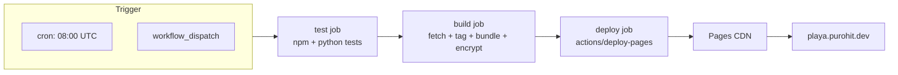

# Deployment & CI

## Overview

GitHub Actions runs the full pipeline nightly + on manual dispatch,
publishes the built artifact to GitHub Pages, and serves it from
`playa.purohit.dev`. Three jobs (`test → build → deploy`) gate each
other so a broken parser can never overwrite the live site.

## Decisions

- **Pages over a real host.** Free, custom-domain-ready, automatic
  Let's Encrypt cert, no DNS or CDN config. Trade-off: anonymous
  reads of the file. Mitigated by encrypting the data payload + the
  `noindex` meta + `robots.txt`.
- **Three jobs, hard `needs:` chain.** `test` blocks `build`; `build`
  blocks `deploy`. A failed Python test stops the world.
- **`actions/upload-pages-artifact` over commit-and-push.** Data
  never touches git history. The runner's local filesystem is the
  intermediate state; the artifact replaces it on every deploy.
- **`fetch-depth: 200` on checkout.** Default is `1`, which would
  hide all `rn:` commits from `_collect_release_notes`. 200 is plenty
  of history for any realistic gap between visits.
- **No data-side state across runs.** Every nightly fetches fresh.
  Each runner is ephemeral; nothing persists between builds except
  what's in git.

## Mechanism

### Workflow shape

### Test job

- Checkout (depth: default 1, no need for history).
- Setup Python 3.12 + Node 22.
- `pip install -e ./backend` + `npm ci` in `client`.
- Python: `unittest discover` over `backend/tests/`.
- TS: `tsc --noEmit` (typecheck) + `node --test` (unit tests).

### Build job

- Checkout with `fetch-depth: 200`.
- Same setup.
- Bundle the client (`npm run build`).
- `python -m playa all` — fetches everything, encrypts, builds.
- Verifies `openssl version`, `node --version`, etc. as a sanity
  preamble.
- Uploads `site/` as the `github-pages` artifact via
  `actions/upload-pages-artifact@v5` with `include-hidden-files:
  true` (so `.nojekyll` makes it through).

### Deploy job

- Different runner, different permissions: `pages: write`,
  `id-token: write`.
- `actions/deploy-pages@v5` consumes the artifact, publishes.
- Custom domain comes from `site/CNAME` (committed file).

### Secrets

- `SITE_PASSWORD` — drives the encrypted-payload mode. If unset,
  the build emits a plaintext payload (used for local dev only;
  CI always sets it).
- `CONTACT_EMAIL` — replaces the placeholder in the footer's
  takedown mailto.

Set both under **Settings → Secrets and variables → Actions** before
the first build.

### Local mirror of CI

`make test`, `make rebuild`, `make build` all work locally and
produce the same artifact CI does. The only CI-specific bits are:

- artifact upload (we don't simulate locally),
- the `fetch-depth: 200` trick (locally `git log` already has full
  history).

## Failure modes & trade-offs

- **Nightly cadence** means upstream content older than ~24 h shows
  in the live site. Force-refresh from the About modal pulls fresh
  bytes for the SHELL but doesn't re-fetch the directory; only the
  cron + manual workflow run can do that.
- **Pages caching window** can briefly serve a stale `version.txt`
  to the polling client. We override with `cache: 'reload'` on the
  client's polling fetch and `cache: 'no-store'` so Pages' max-age
  doesn't matter.
- **Single deploy environment**. There's no staging mirror — a
  problematic build goes straight to friends. The `MIN_CAMPS` rail
  is the main safeguard against the most common kind of "broken
  build." For risky changes, force a manual `workflow_dispatch`
  while watching the run.

## Code references

- `.github/workflows/refresh.yml` — workflow definition
- `Makefile` — local mirror of the CI steps
- `site/CNAME` — `playa.purohit.dev`
- `site/robots.txt` — `Disallow: /` for everything
- `site/.nojekyll` — disables Pages-side Jekyll
- `docs/revocation-plan.md` — operational runbook for takedowns
