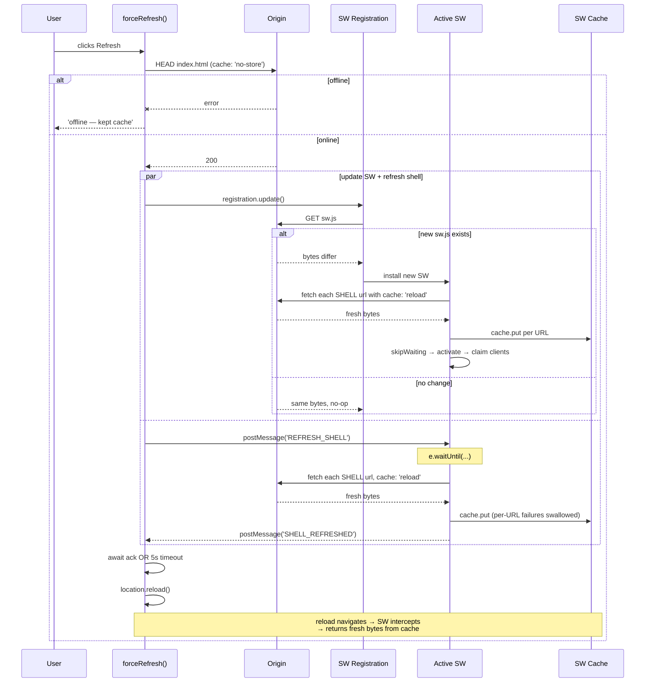

# Refresh & Force-Refresh Cycle

## Overview

Three different "refresh" paths exist in this app, and getting them
straight matters because two of them used to interact in a subtle
buggy way:

1. **Plain browser reload** — `location.reload()`. Goes through the
   SW. Returns whatever's in the SW's cache. Fastest, but you can
   land on the *previous* version.
2. **Force refresh** (About modal button + Update banner button) —
   ask the SW to re-pull the shell from origin into its cache, then
   reload. Non-destructive: any individual fetch that fails leaves
   the previous cached entry in place.
3. **Browser hard reload** (⌘⇧R / Ctrl+Shift+R) — bypasses the SW
   entirely. Fetches every asset from origin. Used by us only as a
   last-resort recovery; not exposed in app UI.

This doc traces what (2) actually does, and why the implementation is
a bit more involved than "just delete the cache."

## Decisions

- **Non-destructive refresh by default.** Earlier the button did:
  unregister SW → delete every cache → reload. If `reload()` then
  failed (flaky network), the user landed on a blank page with no
  fallback. Now we **never** delete caches preemptively; we only
  *replace* entries we successfully re-fetch. A network blip leaves
  the previous cached page intact.
- **Probe network first.** A HEAD on `./index.html` (which bypasses
  the SW because it early-exits on non-GET) tells us whether origin
  is reachable. If not, we report `offline` and skip the rest — no
  point trying to refresh from nothing.
- **Trigger `reg.update()` AND `REFRESH_SHELL` together.** The
  registration update fetches a new `sw.js` if one is at origin; the
  postMessage refreshes the *current* SW's cache for the no-new-SW
  case. Doing both covers every common deploy-vs-refresh interleaving.
- **Per-URL `cache: 'reload'` on install.** The newly-installed SW
  populates its cache via explicit `fetch(url, { cache: 'reload' })`
  per URL, NOT `cache.addAll(SHELL)`. The simpler `addAll` respects
  the HTTP cache, which on Pages's max-age window can leave the brand-
  new SW with stale bytes — defeating force-refresh until the next
  install. This was the bug behind "first force-refresh didn't pick
  up the legend, second one did."

## Mechanism

### Force-refresh sequence



### What each side does

**Page side (`utils/refresh.ts`):**

```
async forceRefresh():
  if !probeNetwork(): return 'offline'
  reg = await getRegistration()
  updatePromise = reg.update()  // fire-and-forget but awaited at end
  if controller exists:
    ack = waitForShellRefresh(5000ms)
    controller.postMessage('REFRESH_SHELL')
    await ack
  await updatePromise
  location.reload()
  return 'refreshed'
```

**SW side (`builder.py::_write_service_worker`):**

```js
self.addEventListener('install', e => {
  self.skipWaiting()
  e.waitUntil(populateCacheWithReload(SHELL))
})

self.addEventListener('activate', e => {
  e.waitUntil(deleteOldCaches() + clients.claim())
})

self.addEventListener('message', e => {
  if (e.data !== 'REFRESH_SHELL') return
  e.waitUntil(async () => {
    cache = await caches.open(CACHE)
    await Promise.all(SHELL.map(url =>
      tryFetch(url, {cache:'reload'}).then(r => r.ok && cache.put(url,r))))
    e.source?.postMessage('SHELL_REFRESHED')
  })
})
```

### Cache name pinning

`CACHE = 'playa-' + VERSION`. Every build has a unique version, so
every new SW gets a fresh cache. The activate handler deletes any
cache not matching the current version — old SW caches don't linger
after upgrade.

This is what makes the version-aware paths reliable: when
`reg.update()` actually finds a newer `sw.js`, the new SW's install
populates a *new* cache; once it activates, the navigation request
hits that new cache (which is already populated from origin via
per-URL `cache: 'reload'`).

### Update-banner vs force-refresh-button

Both call `forceRefresh()`. The only difference is the entry point:

- **Update banner**: triggered by `useVersionCheck` polling
  `version.txt` and detecting a strictly-newer build (see
  [08-versioning-and-release-notes.md](./08-versioning-and-release-notes.md)).
- **About modal "Force refresh" button**: always available,
  user-initiated, useful when a deploy has happened but polling
  hasn't fired the banner yet (or the user dismissed it).

## Failure modes & trade-offs

### The bug we fixed

Before per-URL `cache: 'reload'` on install:

```
1. User on tab A unlocks v1, sw1 installed.
2. v2 deployed.
3. User clicks Refresh in update banner.
4. forceRefresh: postMessage REFRESH_SHELL → sw1 refreshes its
   cache from origin. ✓
5. forceRefresh: location.reload().
6. During reload, browser fetches sw.js → finds sw2 → installs.
7. sw2.install runs cache.addAll(SHELL).
8. addAll respects HTTP cache. GH Pages max-age window may have
   served stale index.html during the partial update window.
9. sw2 activates, claims clients, deletes sw1's cache.
10. Navigation request → sw2 → sw2's cache (stale) → user sees
    OLD content even though THEY just clicked refresh!
11. User clicks About → Force refresh again.
12. forceRefresh → REFRESH_SHELL to sw2 → per-URL cache: 'reload'
    via the message handler bypasses HTTP cache → cache populated
    with origin-fresh bytes. ✓
13. Reload now serves fresh content.
```

The fix: have `sw.js`'s install handler use the same per-URL
`cache: 'reload'` pattern as the message handler. New SW now installs
with origin-fresh bytes regardless of HTTP cache state, and
force-refresh works on the first click.

### Other edge cases

- **Refresh while offline.** `probeNetwork` returns false; the button
  shows "Offline — kept cache" and the page state is untouched. The
  user is no worse off.
- **5-second ack timeout.** If REFRESH_SHELL takes >5s (extreme
  slowness), we reload anyway. The SW's `e.waitUntil` keeps the
  refresh alive in background; worst case the cache is stale for one
  more visit.
- **Multiple tabs hitting Refresh simultaneously.** Each tab's
  forceRefresh sends its own REFRESH_SHELL. The SW handles them
  serially; per-URL `cache.put` is idempotent. Reload is per-tab.
  Other tabs still see the old SW until they reload themselves.
- **No controller (first-ever load, hard refresh).** forceRefresh
  skips the postMessage path and just relies on `reg.update()` +
  natural install of the new SW.

## Code references

- `client/src/utils/refresh.ts` — `forceRefresh()`, `probeNetwork()`,
  `waitForShellRefresh()`
- `client/src/components/UpdateBanner.tsx` — banner button calls
  forceRefresh
- `client/src/components/InfoModal.tsx` — About-modal button calls
  forceRefresh
- `backend/src/playa/builder.py::_write_service_worker` — install,
  activate, message, fetch handlers (the entire SW source as a
  Python string)
- See also: [07-offline-pwa.md](./07-offline-pwa.md) for the SW
  lifecycle in general; [08-versioning-and-release-notes.md](./08-versioning-and-release-notes.md)
  for how the update banner gets triggered in the first place
