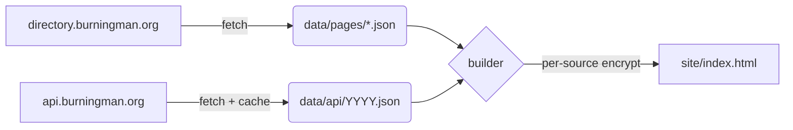

# Multi-source data architecture

## Overview

The app started life with one data source — the HTML scrape of
`directory.burningman.org`. As of 2026 we're adding a second, structured
source: the official **`api.burningman.org`** Public API (key-gated,
documented at `https://api.burningman.org/docs`). Directory stays as the
primary source for the *current pre-burn year* (it's populated weeks
earlier than the API); the API gives us **historical years** (2015–2025
according to the API spec, year-required, single-shot bulk endpoints) and
will eventually give us a more structured + reliable view of the current
year once the API releases its current-year data three weeks before
gate-open.

The user picks the active source from a header dropdown:

```
[ Directory ▾ ]   ← header pill
  ✓ Directory   (live, current year)
    API 2024
    API 2025
    API 2026     ← appears after 2026-08-09 (3 weeks before gates)
```

All user state — favorites, meet spots, friends, my camp — is **scoped to
the active source**. Switching sources is instant: every source's payload
is already embedded in `index.html` at build time.

Scope of this ADR: **camps + events only.** Art and mutant vehicles are
deferred (the API exposes them; we just don't surface them yet).

## Decisions

### D1 — Source identifier is a flat string

Each source is a single string:

| String       | Provider                       | Notes                                  |
|--------------|--------------------------------|----------------------------------------|
| `directory`  | `directory.burningman.org`     | HTML scrape; current behavior          |
| `api-2024`   | `api.burningman.org` (year=2024) | Past year, immutable                   |
| `api-2025`   | `api.burningman.org` (year=2025) | Past year, immutable                   |
| `api-2026`   | `api.burningman.org` (year=2026) | Current year (when available, see D8)  |

Why not `{provider, year}` objects: source strings show up in LS keys, DOM
ids (`<script id="camps-data-api-2024">`), URL fragments (share links),
and CLI flags. Flat strings serialize trivially in all of those.

### D2 — Schemas normalize to the existing `Camp` / `Event` dataclasses

Mapping (verified against the OpenAPI spec):

| API field                 | `Camp` field            |
|---------------------------|-------------------------|
| `uid` (18-char SFDC id)   | `id` (string)           |
| `name`                    | `name`                  |
| `location_string` (e.g., `"Esplanade & 6:30"`) | `location`     |
| `description`             | `description`           |
| `url`                     | `website`               |
| —                         | `url` = `""` (no canonical-directory link for API source) |
| (events joined post-fetch) | `events`               |
| (computed by Tagger)      | `tags`                  |

Dropped on the floor for now: `hometown`, `landmark`, `contact_email`,
`images`, structured `location` (`frontage`/`intersection`/etc.). These
are richer than what the directory provides — surfacing them is a future
enhancement. Today's UI doesn't read them, so the normalized model stays
unchanged.

| API field                 | `Event` field           |
|---------------------------|-------------------------|
| `uid`                     | `id`                    |
| `title`                   | `name`                  |
| `description`             | `description`           |
| `occurrence_set`          | `time` + `parsed_time` + `display_time` (see D3) |
| `hosted_by_camp` (Camp uid) | (used to attach event to its camp) |

### D3 — API events skip `timeparser.py`

API `occurrence_set` carries ISO-8601 timestamps with timezones — no
free-text parsing needed. We synthesize `parsed_time` directly:

- All occurrences at the same time-of-day → one `recurring` `Event` with a
  days list (matches the schedule view's existing recurring-event handling).
- Mixed times-of-day → emit one `single` `Event` per occurrence (rare,
  but preserves fidelity).

`display_time` and the raw `time` string are formatted from the parse so
the rest of the rendering pipeline doesn't need to know which source the
event came from.

The `derive_week_map` shenanigans (year-agnostic day → date map) aren't
needed for API events — we already have absolute dates.

### D4 — Per-source isolation of user state

Camp ids don't cross source boundaries (directory uses numeric, API uses
SFDC uids). So a "favorite" only makes sense within one source.

Existing LS keys gain a `/<source>` suffix:

| Old key             | New key (per source)                  |
|---------------------|---------------------------------------|
| `bm-favs`           | `bm-favs/<source>`                    |
| `bm-fav-events`     | `bm-fav-events/<source>`              |
| `bm-shared`         | `bm-shared/<source>` (friends' lists) |
| `bm-my-camp`        | `bm-my-camp/<source>`                 |
| `bm-meet-spots`     | `bm-meet-spots/<source>`              |
| `bm-hidden-days`    | `bm-hidden-days/<source>`             |

Truly global keys keep their bare names: `bm-theme`, `bm-info-seen`,
`bm-pw`, `bm-rn-seen`, `bm-source` (current selection), `bm-distance-unit`,
`bm-nickname`.

**Migration**: on first load after the multi-source upgrade, every
unsuffixed key is copied (not moved — see "rollback" below) to its
`/<source-default>` slot. Default source for the migration is
`directory`, since that's where every existing user's data came from.

Rollback safety: bare keys are left in place for one or two builds so
that loading an older bundle (cached SW, old tab) still works. A
follow-up cleanup commit removes the migration code + the bare keys
once everyone's seen the new code.

### D5 — Share links carry the source

Share-link payload gains a `source` field:

```json
{ "name": "alice", "source": "api-2024",
  "campIds": ["a1XVI…"], "eventIds": [...], ... }
```

Importing routes the friend's data into the matching `bm-shared/<source>`
bucket. If the importer's UI is currently on a different source, a banner
flags it: *"Alice's list is from API 2024 — switch sources to see
overlap."* Old share links (no `source`) are assumed `directory` for
backwards compatibility.

### D6 — Builder embeds one data script per source

`builder.py` enumerates the configured sources and emits one
`<script id="camps-data-<source>">` (plaintext) or
`<script id="camps-data-<source>-encrypted">` (encrypted) per source.
Client picks the script that matches the current selection.

Encryption is per-source — same `SITE_PASSWORD`, fresh salt each, so a
compromise of one year's payload doesn't trivially help the others.

The whole site stays one self-contained `index.html`. Multi-source bumps
the file size (~2 MB plaintext per year) but keeps the offline + zero-
runtime-network-dependency property intact.

### D7 — API caching: GitHub Releases (encrypted)

The API is rate-limited and past-year data is immutable. We don't want to
hit `api.burningman.org` on every nightly CI run.

Implementation:

1. One **GitHub Release tag per source-year** (e.g., `data-api-2024`)
   with one encrypted asset (`<year>.bin`).
2. The cache file is AES-256-CBC + PBKDF2 (same parameters as the
   deployed-site payload), in openssl's native
   `Salted__||salt||ciphertext` binary format. The cache is decrypted
   only by Python at build time, so we skip the JSON envelope used for
   the WebCrypto-side decrypt.
3. CI build, for each year in `vars.BM_API_YEARS`: `gh release
   download <tag> --pattern <year>.bin` first. Cache miss → fetch from
   the API once with `BM_API_KEY`, encrypt with `BM_CACHE_PASSWORD`,
   `gh release create + upload`. Past years thereafter cost **zero API
   hits**.
4. Local builds use the same `data/api/<year>.json` path; the
   `playa api-fetch` CLI writes encrypted whenever a cache password is
   set, plaintext otherwise (convenient for offline dev).
5. To force a re-fetch (e.g., a corrected past-year dataset, or to
   refresh the current year): `gh release delete data-api-<year>
   --yes`, then re-run the workflow. The cache miss triggers a fresh
   fetch + upload.

**`BM_CACHE_PASSWORD` vs `SITE_PASSWORD`** — separate by default,
falls back to `SITE_PASSWORD` when unset. The threat model is
identical (both are public-readable AES blobs decrypted by whoever has
the password), but rotation is independent: a leaked `SITE_PASSWORD`
can be rotated without re-encrypting + re-uploading every past year's
cache. Single-secret deployments work too; just leave
`BM_CACHE_PASSWORD` unset.

Why GitHub Releases over alternatives:

- **Orphan branch**: works, but pollutes the repo's git object database
  forever; force-pushing to keep size down breaks anyone with a stale
  reference.
- **Separate private repo** (e.g., `bm-camps-data`): clean, but doubles
  the repo + secrets surface for one cache. Marginal value over Releases.
- **Actions cache / artifacts**: ephemeral (7 / 90 days). Wrong tool for
  immutable past-year data.
- **`data-cache/` folder in main**: bloats main-branch history;
  conflicts with the "no fetched data in git" stance the project leans
  on for ToS deniability.

### D8 — Current-year API and the §6.2 location embargo

The Burning Man API ToS §6.2 enforces:

- **Camp locations**: hidden from app users until **12:01 am, first
  Sunday of build week** (e.g., 2026-08-23). Developers receive the data
  three weeks before gates (2026-08-09).
- **Art locations**: hidden until gate-open (Day 1 of the burn). Out of
  scope for now since we don't surface art.

Phase 2 will add embargo logic to the API fetcher / builder:
`load_camps_for(api-CURRENT_YEAR)` strips `location` (`""`) when
`now() < embargo_release_datetime`. Until the embargo lifts, the
current-year API source still ships — names, descriptions, tags — just
without addresses on the map.

For phase 1 we **do not** include `api-2026` (or any current-year API
source). Past years (2024, 2025) have no embargo.

**Per-tier bypass for `god-mode`** (added 2026-04-28). The embargo is
a UX gate, not a security boundary — full location data is in the
encrypted bundle so a god-mode user (inner circle) can see locations
before gate-open. `demigod-mode` and `spirit-mode` continue to honor
the embargo.

To grant the privilege without leaking tier names into the DOM, the
build emits a parallel `<meta name="bm-trusted-wrappers">` listing
the wrapper indices that belong to `god-mode` (alongside the existing
`bm-tier-wrappers`). When the user's password unwraps a trusted
wrapper, `App.tsx` flips `unlockedTrusted=true` and
`isLocationEmbargoed`/`applyLocationEmbargo` short-circuit. Burn-key
auto-unlock (D13, spirit-mode only) leaves trust at false — embargo
still applies. Only the literal tier name `god-mode` is privileged;
operator-defined synonyms aren't recognized (rename or add another
trusted-flag layer if that ever becomes desired).

### D9 — Denylist becomes per-source

`data/denylist.txt` keys on numeric directory IDs. SFDC uids won't match
those entries. Add a parallel `data/denylist-api.txt` for the API
sources; both files are committed (just IDs, no text) per the existing
ToS-mitigation pattern.

Future enhancement: per-year-source denylists. Today, treat all API
sources as sharing one denylist — a camp removed in 2024 stays removed
across all API years (typically what we want, since it's the same camp).

### D10 — Tiered access via envelope encryption

Different audiences get different source visibility from the *same
deployed bundle*, gated by the password they enter. No accounts, no
build duplication.

Three concrete tiers, fixed by intent (not user-configurable):

| Tier id        | Audience              | Sources unlocked                                                     |
|----------------|-----------------------|----------------------------------------------------------------------|
| `god-mode`     | Inner circle          | `directory` + every api-YYYY in `BM_API_YEARS`                       |
| `demigod-mode` | BM Discord testers    | every api-YYYY in `BM_API_YEARS` (no directory)                      |
| `spirit-mode`  | Unknown / linked out  | only the latest api-YYYY in `BM_API_YEARS` (current-year API)        |

Why this split:

- `directory` is the only source with **planned** pre-registration data
  weeks before the API publishes anything — the inner circle wants
  that planning view alongside the structured API.
- `demigod-mode` is for people testing the app shape against past-year
  data; they don't need the live planning leak.
- `spirit-mode` is the safest public surface — embargo-aware live API
  data only, no past-year mining, no directory leak.

Tier ids are local CI labels — they never appear in the page. Bundle
embeds use opaque sequential indices for wrapper script ids so the DOM
doesn't disclose tier names or count.

**Configuration** (env var, parsed at build time). Format:
`name1:pw1=src1+src2,name2:pw2=src3,…`. Each tier is explicitly
labeled — the build identifies `spirit-mode` by NAME, not by
position, so operator edits can't accidentally point burn-key.json
at the wrong tier. For 2026 with the initial year window
(`BM_API_YEARS=2025,2026`):

```
SITE_TIERS="god-mode:$GOD_PW=directory+api-2025+api-2026,demigod-mode:$DEMIGOD_PW=api-2025+api-2026,spirit-mode:$SPIRIT_PW=api-2026"
```

CI fills `$GOD_PW` / `$DEMIGOD_PW` / `$SPIRIT_PW` from repo secrets so
literal passwords never appear in the workflow YAML. Tier names
`god-mode` / `demigod-mode` are arbitrary identifiers — only
`spirit-mode` is reserved (D13's `BURN_OPEN=1` looks up that exact
name). Backward-compat: `SITE_TIERS` unset + `SITE_PASSWORD` set
falls through to today's "single tier covering every embedded source".

**Initial year window**: 2026 ships with `BM_API_YEARS=2025,2026`.
2024 has data (~1300 camps verified) but adds no immediate value for
the planning-app use-case; can be re-added later by setting
`BM_API_YEARS=2024,2025,2026` and running `playa api-fetch --year 2024`
once. The rolling-window note in D11 still applies: drop the oldest
year as new ones arrive.

**Why envelope encryption** (vs. multi-encrypt-per-tier):

- *Multi-encrypt*: one ciphertext per (source, tier) pair. Bundle scales
  with `Σ |tier.sources|`. For our scope (3 tiers covering 4 sources
  with overlap counts 1+2+2+3 = 8) that's ~10 MB encrypted — wasteful.
- *Envelope*: one ciphertext per source, plus a tiny key-wrapper per
  (source, tier). Bundle is `Σ |sources|` + ~150 bytes per wrapper. Same
  scope is ~5 MB encrypted + ~1 KB of wrappers — half the size.

**Build-time crypto**:

1. For every source referenced by any tier, generate a random 32-byte
   `DEK` (data encryption key) and 16-byte `IV`.
2. Encrypt the source's compressed JSON (see D12) with AES-256-CBC
   under `(DEK, IV)`. No PBKDF2 — the DEK is full-entropy random.
   Embed as `<script id="camps-data-<source>-cipher">{"iv": b64, "ct": b64}</script>`.
3. For every (tier, source) pair where the tier's source-list includes
   the source: encrypt the 48-byte `DEK || IV` blob with PBKDF2 +
   AES-256-CBC under the tier's password (fresh salt per wrapper).
   Embed as `<script id="cdk-<source>-<idx>">{"salt": b64, "iter": N, "ct": b64}</script>`.
4. Build a manifest meta tag listing wrapper indices per source so the
   client doesn't have to scan the DOM:
   `<meta name="bm-tier-wrappers" content="directory:0;api-2024:0,1;api-2025:0,1;api-2026:0,1,2">`.

**Client unlock**:

1. User enters password.
2. For each source in the manifest, walk its wrapper indices. For each:
   PBKDF2 → AES-CBC decrypt the wrapper. First success → cache the
   recovered `DEK || IV`, move to next source. All-fail for a source →
   that source is locked for this user.
3. If at least one source unlocked: enter the app. Else: "wrong
   password" (same UX as today's gate).
4. Lazy-decrypt source ciphers: when the user actually selects a source,
   decrypt its `<source>-cipher` using the cached `(DEK, IV)`. Avoids
   decrypting + parsing megabytes the user never views.

**Sanity checks** (build-time, fail loud):

- Two tier passwords identical → ambiguous tier semantics → reject.
- Tier lists a source not in the configured `--sources` set → typo →
  reject.
- Tier has zero sources → pointless → reject.
- Empty `SITE_TIERS` AND empty `SITE_PASSWORD` → site would be
  un-unlockable → reject (single-tier deploys must set one).

**Cross-tab + share**: untouched. Password is still one string per user;
`BroadcastChannel` keeps sharing it across tabs. `useSource` still maps
share-link `source` to a slot the receiver may or may not have unlocked
— if not, the source-mismatch banner from previous work covers it.

### D11 — Per-year map geometry

The structural BRC grid (clock × letter polar coordinates, 4:30 axis ≡
true north) is design-stable across years. What *does* drift annually:

- **Golden Spike** lat/lng (~100–400 ft per year — verified against
  the published 2024 / 2025 / 2026 datasets).
- **Letter-street set** (e.g., 2024 included `L`; 2026 stops at `K`).
- **Letter-street radii** (block depths shift; 2026's E↔F mid-city
  plaza is the largest current example).
- **Trash-fence pentagon** (5 outer vertices, also published per year).

We render past-year API camps directly on the map, so we want each
source to render against the geometry for its own year. Without this,
"6:00 & E" from a 2024 camp would land at the 2026 E-street radius and
end up tens to hundreds of feet off; an `L`-street 2024 address would
fail to parse entirely.

**Bundle**: a single `BRC_BY_YEAR: Record<number, BrcConstants>` map in
`client/src/map/data.ts`. Each entry is ~200 bytes JSON. Ten years
costs ~2 KB.

```ts
type BrcConstants = {
  goldenSpike: { lat: number; lng: number };
  streetLetters: string[];        // ordered Esplanade-out
  streetRadiiFeet: number[];      // parallel to streetLetters
  fencePentagon: Array<{ lat: number; lng: number }>;
};
```

**What we deliberately don't store**:

- Themed street names — never displayed (CampCard shows `location`
  raw, MapView labels with the letter only).
- Clock-hour bearings — derived from "4:30 ≡ true N" (12:00 = 225°
  compass), structurally stable.
- Letter-street naming convention (Esplanade → A → B …) — stable.

**Source → year resolver** (next to `useSource`):

| Source        | Year used                                          |
|---------------|----------------------------------------------------|
| `directory`   | `Config.burn_year` (current year being built)      |
| `api-YYYY`    | `YYYY`                                             |
| Unknown       | Most recent year in `BRC_BY_YEAR` + `console.warn` |

Wiring: `parseAddress(raw, year)`, `addressToSvgFeet(raw, year)`,
`addressToLatLng(raw, year)`, `latLngToSvgFeet(ll, year)` all become
year-parameterized. MapView pulls the year once at the top from the
active source and threads it through. Roughly a dozen call-site
updates concentrated in `client/src/components/MapView.tsx` and
`client/src/map/address.ts` — mechanical refactor.

**Update workflow**: extend the existing `.claude/skills/update-map/`
skill so it *adds* a year entry rather than overwrites. Sources of
truth per year:

- Golden Spike: `innovate.burningman.org/dataset/<YYYY>-golden-spike-and-general-city-map-data/` (KML).
- Radii + letter set + fence: `burningmantech/innovate-GIS-data` GitHub
  (historical KMZ + GeoJSON).

The skill runs once per year and commits a new entry to `BRC_BY_YEAR`.
2025 was backfilled in 2026-05 (real Golden Spike + fence + sci-fi
author themed names "Tomorrow Today"). 2024 remains a deferred
backfill — out of the current rolling year window so map pins for
api-2024 would fall back to the latest known year's geometry with a
console warning.

**Failure mode**: addresses that don't parse against any year's letter
set (e.g., "Rod's Ring Road") still fall through to "list-only, no
map pin" — same as today. No crash.

**Operational year window**: `BM_API_YEARS` follows a rolling
"current + 2 years back" policy — for 2026 builds it's `2024,2025,2026`;
for 2027 it'd be `2025,2026,2027` (drop 2024). The architecture doesn't
care; this is purely the operator's value for the env var. `BRC_BY_YEAR`
is append-only — entries for years that have left the window stay in
the bundle (~200 bytes each, harmless). Orphaned GitHub Releases
(`data-api-2024` once 2024 leaves the window) can be deleted by hand
or left in place; they cost ~few KB of repo storage each.

### D12 — Compress before encrypt

Source JSON is highly compressible (repeated keys, English prose,
shared substrings) but encrypted bytes are near-random and don't
compress at all. Pipeline:

```
JSON  →  gzip  →  AES-256-CBC  →  base64  →  embed
```

Reverse on the client. Order matters — gzip *after* AES typically
grows the output by 1–2%.

**Expected ratio**: gzip hits ~70–75% reduction on this corpus. The
2.7 MB plaintext build drops to ~800 KB–1 MB encrypted on the page.

**Browser API**: native `DecompressionStream('gzip')` — no JS
dependency, no bundle bloat. Coverage:

- Chrome / Edge: v80 (Feb 2020)
- Firefox: v113 (May 2023)
- Safari (macOS + iOS): v16.4 (March 2023)

Effectively any browser updated in the last ~2.5 years. The bottom
edge is something like an iPhone stuck on iOS 15 — vanishingly rare in
the target audience.

**Fallback**: feature-detect `'DecompressionStream' in window` on boot.
Missing → render an "your browser is too old, please update" banner
in place of the gate. Bundling fflate (~8 KB) to rescue <1 % of users
isn't worth the load cost on the 99 %.

**Brotli punted**: ~20 % better than gzip but not yet in the
`DecompressionStream` standard (Chrome flag-only as of late 2024). The
gzip win is plenty for today.

**Build-time impl**: Python `gzip.compress(payload)` before passing to
the openssl invocation. The same source ciphertext under D10 simply
takes the gzipped payload as input. DEK-wrappers are 48 bytes — not
worth gzipping.

**Test surface**: `tests/test_builder.py::EncryptPayloadTests` and
`tests/crypto.test.ts` round-trip tests both add a gzip step at build
and a `DecompressionStream` step at decrypt. Same shape as today, one
more transform.

### D13 — Burn-window auto-unlock for spirit-mode

During the burn (Aug 30 – Sep 7 2026 for this year), `spirit-mode`
should be reachable without typing a password — the friction of "share
this passphrase, sorry, copy it carefully" doesn't make sense for
walk-up dust-covered users on bad LTE looking for the nearest coffee
camp. `god-mode` and `demigod-mode` stay password-gated regardless;
this only opens up the public-safe tier.

**Honest framing first**: any auto-unlock is a *convenience* feature,
not a security boundary. The DEK has to live somewhere reachable for
the unlock to work. What we *can* do is make the DEK disappear cleanly
outside the window so it's not even sitting around to be found, and
keep the other tiers' wrappers untouched.

**Mechanism — sibling file, deployed only during the window**:

1. Build generates a random 32-byte `BURN_DEK` for the spirit-mode
   source (in addition to the per-tier-password wrappers from D10).
2. Spirit-mode's source cipher is encrypted with `BURN_DEK || IV` —
   exactly the same shape as any other source cipher in D10. The
   per-tier-password wrappers (one for `god-mode`, one for
   `demigod-mode`, one for `spirit-mode`) wrap that same DEK so the
   normal password-gated path still works.
3. Build *additionally* writes the raw `BURN_DEK || IV` to
   `site/burn-key.json` as a separate static file. **Default deploy
   omits this file** — `actions/upload-pages-artifact` is told to
   exclude it when `BURN_OPEN` is unset/false.
4. During the burn window, a workflow with `BURN_OPEN=1` (manual
   `workflow_dispatch` input, or a cron-driven date check) deploys
   *with* `burn-key.json` included.
5. Client on boot, before showing the gate: `fetch('./burn-key.json')`.
   - `200` → parse `{dek, iv}`, decrypt the spirit-mode source cipher
     directly (skip the wrapper step entirely), and proceed into the
     app on `spirit-mode`.
   - `404` / network error → fall through to today's password gate.
6. The user can still flip to a higher tier mid-session by entering a
   `god-mode` / `demigod-mode` password — the gate stays available
   under a "use a passphrase instead" affordance even after auto-unlock.

**What this gets**:

- DEK is **not in `index.html`** outside the window. A pre-burn or
  post-burn snoop downloads the bundle and finds nothing they can use
  for spirit-mode.
- Mid-burn revoke = redeploy without the file. Faster than rotating
  any password.
- Other tiers stay password-gated forever. No date check anywhere on
  their unlock path.
- Stacks cleanly on D10 — the burn-key auto-unlock is *literally* "you
  already have the DEK, skip the wrapper". No new crypto primitive.

**What this doesn't try to prevent**:

- Saved-during-window attacks: anyone who downloads `burn-key.json`
  while it's published can save it and decrypt forever (the spirit
  cipher is in the page they already have). Threat-model-equivalent
  to posting the spirit-mode password publicly on Discord — same
  outcome, just automated.
- Clock-spoofing for time-locked decryption — there is no time lock,
  just file presence. Out of scope.

**Operational config — set-once-forget by design**:

The intended operator experience is: set the window dates **once per
burn** as repo variables, never touch them again. Every nightly run
(`refresh.yml`'s existing 08:00 UTC cron) evaluates "is today inside
the window?" and includes / excludes `burn-key.json` automatically.
No human in the loop at burn-start or burn-end.

| Knob                       | Where                | Effect                                                                                |
|----------------------------|----------------------|---------------------------------------------------------------------------------------|
| `BURN_WINDOW_OPEN_FROM`    | repo *variable*      | ISO date (e.g., `2026-08-30`). Workflow auto-includes `burn-key.json` from this day.  |
| `BURN_WINDOW_OPEN_TO`      | repo *variable*      | ISO date (e.g., `2026-09-07`). Workflow auto-removes after this day (UTC end-of-day). |
| `BURN_OPEN=0\|1`           | `workflow_dispatch` input | Manual override for "open it now" / "close it now". Wins over the date check.    |

**Window evaluation** (inside `refresh.yml`):

```bash
# Pseudocode for the resolution step.
if [[ -n "$dispatch_input_BURN_OPEN" ]]; then
  effective_burn_open="$dispatch_input_BURN_OPEN"        # manual wins
elif [[ -n "$BURN_WINDOW_OPEN_FROM" && -n "$BURN_WINDOW_OPEN_TO" ]]; then
  today_utc="$(date -u +%Y-%m-%d)"
  if [[ "$today_utc" >= "$BURN_WINDOW_OPEN_FROM" && \
        "$today_utc" <= "$BURN_WINDOW_OPEN_TO" ]]; then
    effective_burn_open=1
  else
    effective_burn_open=0
  fi
else
  effective_burn_open=0   # no vars + no input = closed
fi
```

**Comparison done in UTC** for simplicity: cron fires at 08:00 UTC
(01:00 PT) and the granularity that matters is days, not hours.
Worst-case effect at the boundary is the file appearing/disappearing
~7 hours offset from local-Black-Rock midnight, which is fine — no
one's at the gate at midnight PT on Day 1 hunting for the app, and
post-burn the slop is harmless.

**Cadence**:

- Cron (every 24h) is the auto-flip pulse. Granularity = 1 day.
- `workflow_dispatch` for sub-day control: "we're opening early
  because tickets dropped a day ahead" or "kill it now, found a bug".
- The dispatch input is checked *before* the date math, so manual
  always wins.

**Failsafe behaviors**:

- Both window vars unset and no manual input → `effective_burn_open=0`
  (closed). Site behaves like today. Default-deny.
- Cron misses a day (GitHub Actions outage): no problem on the next
  run — `burn-key.json` either appears or disappears one day late.
- One of the two window vars set, the other unset → treat as misconfigured,
  fall through to closed + emit a workflow warning. (Sanity check from
  earlier in this section.)
- `BURN_WINDOW_OPEN_FROM > BURN_WINDOW_OPEN_TO` → workflow fails loud
  (already listed under build-time sanity checks).

**Setup walkthrough for the operator** (one-time per burn year):

1. Settings → Secrets and variables → Actions → Variables tab.
2. New repository variable: `BURN_WINDOW_OPEN_FROM` = `2026-08-30`.
3. New repository variable: `BURN_WINDOW_OPEN_TO`   = `2026-09-07`.
4. Done. Next nightly cron after Aug 30 deploys with `burn-key.json`;
   first cron after Sep 7 removes it.

For the next year (2027): bump both vars to the new burn dates. No
code, no rebuild beyond the next scheduled cron.

**Build flow change** (delta on D10):

```
[D10 spirit-mode encryption]
  random DEK_spirit ← generate
  cipher_spirit = AES-CBC(gzip(spirit_json), DEK_spirit, IV)
  for tier in [god, demigod, spirit]:
    if spirit ∈ tier.sources:
      wrapper[tier] = AES-CBC-PBKDF2(DEK_spirit||IV, tier_password)

[D13 addition]
  if BURN_OPEN: write site/burn-key.json = base64(DEK_spirit||IV)
```

The other two source-tier combinations (god, demigod) get no
burn-key sidecar. Even if `burn-key.json` leaks, it only unlocks
spirit-mode.

**Client flow change** (delta on D10 unlock):

```
on boot:
  if 'DecompressionStream' not in window: render upgrade banner; bail
  manifest = read <meta name="bm-tier-wrappers">
  burnKey = await fetch('./burn-key.json').then(r => r.ok ? r.json() : null)
  if burnKey:
    decrypt spirit cipher directly with burnKey.dek + burnKey.iv
    set source = 'api-CURRENT_YEAR', skip gate
    keep "Enter passphrase" affordance for tier-up
  else:
    show gate as today
```

**Failure modes**:

- `burn-key.json` exists but `dek` is wrong (operator error /
  build-skew): client tries it, AES-CBC throws, treat as 404 and fall
  through to gate. No crash.
- File present but `BURN_OPEN` was meant to be off (mistake): visible
  as soon as a public link surfaces. Mitigation = redeploy. Same blast
  radius as posting a password publicly by mistake.
- Service worker caches `burn-key.json` past the burn-end deploy: the
  SW's existing cache-first + version-stamp strategy already evicts
  on next deploy (cache key changes with `__VERSION__`). One-tab race
  where a user has the old SW + cached `burn-key.json` after a redeploy
  ends — they're already inside the app and have the cipher; not a
  new attack surface.

**Sanity checks at build time**:

- If `BURN_OPEN` is set but `SITE_TIERS` doesn't include a spirit-mode
  tier, fail loud — burn-open without a public-safe tier is operator
  confusion.
- If `BURN_WINDOW_OPEN_FROM > BURN_WINDOW_OPEN_TO`, fail loud.

**Access control for the manual dispatch** (verified against GitHub
docs + discussions, 2026-04-29):

- `workflow_dispatch` triggers — including the manual `BURN_OPEN`
  override — are **owner-only on a public repo by default**. GitHub
  requires *write* access on the repository to invoke
  `workflow_dispatch`; non-collaborators don't even see the "Run
  workflow" button. There is no separate "execute workflows"
  permission today (GitHub community has been asking for one for
  years; it's a recognized but unimplemented feature gap). For a
  single-maintainer repo this is exactly what we want — only the
  owner can flip the toggle, and the public-repo audience can't.
- Forks cannot trigger upstream's `workflow_dispatch`. Fork
  workflows run in the fork's own context, against the fork's own
  (empty) secrets. A fork-author can't reach our `BM_API_KEY` or
  `SITE_PASSWORD` via dispatch.
- Pull requests from forks don't get access to repository secrets
  by default. The `BURN_OPEN` step would just no-op (no
  `BURN_OPEN`, no `BM_CACHE_PASSWORD`, no `SITE_PASSWORD` →
  early-exit). No attacker-PR exfiltration vector.

**Optional belt-and-suspenders** for if/when this changes — e.g., a
second maintainer joins who shouldn't unilaterally flip the toggle:

- Wrap the publish step in a [GitHub
  Environment](https://docs.github.com/en/actions/reference/workflows-and-actions/deployments-and-environments)
  named `burn-open` with **required reviewers** = the operator. The
  job can't access environment secrets until a reviewer approves it.
  Mid-pipeline gate in addition to the pre-pipeline owner-only
  dispatch.
- Toggle "**Prevent self-review**" on the Environment if there are
  ever ≥2 maintainers — forces a different reviewer than the
  triggerer. Pointless for a one-person repo (can't approve your own
  dispatch).
- Tighten branch protection on `main` so `workflow_dispatch` can
  only target `main` (default behavior anyway, but explicit).

For this repo today (single owner, public): rely on the default
write-access requirement. No extra config needed. Document the
Environment + required-reviewers path here so it's easy to opt
into later.

### D14 — Art alongside camps (added 2026-05-02)

Art installations are a parallel entity — same dual-source split as
camps (directory scrape + `api.burningman.org/api/art`), same per-
source LS keys for favorites, same envelope/encryption story. Each
source emits a SECOND cipher / script tag for art alongside the
existing camps one.

**Why parallel rather than mixed:**
- Different schema (no events, has artist/category/program/image).
- Independent fetch cadence: art's API release (gate-open) lags
  camps' (build-week-Sunday) by ~1 week per BM ToS §6.2 — keeping
  the streams separate makes that asymmetry obvious.
- Independent star list: a user might have 10 starred camps but
  100 starred art pieces (or vice-versa); merging them into one
  "favorites" set would lose semantic meaning.

**Envelope crypto detail:** within a source the camps + art ciphers
share a single DEK (saves a wrapper per source-tier pair, avoiding
~150 bytes × #tiers × #sources of bundle bloat) but use SEPARATE
IVs. CBC with reused (key, IV) on different plaintexts leaks
first-block XOR; gzip headers are mostly deterministic, so the
leak would actually surface plaintext bytes. Art cipher's IV
travels in its own script-tag JSON; client `decryptSource` reads
`cipher.iv` directly (was previously sliced from `dekIv[32:48]`
— that slice is still used as a fallback for older bundle shapes).

**UI placement:** Art tab sits between Schedule and Map in the
TabBar. The Map ONLY pins art the user (or a friend) has starred —
showing every art piece on the map would clutter the city. Art
pins use a magenta diamond shape, distinct from camps' orange
circles.

**Tagging:** the existing `Tagger` taxonomy is reused via
`tag_art()` / `art_haystack()` — name + description + artist +
category + program. No separate art taxonomy because the meaningful
tags (interactive, fire, sound, sculpture, …) apply equally well
to either entity type. The `category="Mutant Vehicles"` field
specifically surfaces the existing `mutant_vehicle` tag.

**Embargo:** art uses the SAME burn_start cutoff as camps
(`isLocationEmbargoed` is type-agnostic — checks source + date
only). Per ToS §6.2 art locations release at gate-open, camps at
build-week-Sunday; we use gate-open for both (conservative for
camps, exact for art). `god-mode` trusted bypass applies
identically.

**Operational note:** the `directory` scrape's `/artwork/` page set
is much smaller than `/camps/` (~10 pages vs 30). The shared
`PAGES` env var still gates both — over-fetching empty pages is
harmless; under-fetching would silently truncate. CI uses
`PAGES=30` for camps and the same value covers art.

## Mechanism

### Build pipeline



Each source produces an independent JSON payload. The builder concatenates
the corresponding `<script>` tags into the HTML template.

### Client runtime

```mermaid
flowchart LR
  H[<select>] -->|change| S[setSource]
  S -->|persist| LS[localStorage<br/>bm-source]
  S -->|read script| P[camps-data-<source>]
  P -->|maybe decrypt| C[Camp[]]
  C --> V[CampsView / Schedule / Map]
  S -->|switch namespace| F[bm-favs/<source><br/>bm-fav-events/<source><br/>bm-meet-spots/<source>...]
```

All hooks (`useFavorites`, `useFriends`, `useMeetSpots`, `useMyCamp`)
take the active source as a key suffix. When source changes, the hooks
re-mount their LS subscription against the new key, so UI updates fall
out of the existing storage-event plumbing — no special-case wiring.

### Source registry

```python
# playa/sources.py
class Source(Protocol):
    name: str
    def load_camps(self, config: Config) -> list[Camp]: ...

class DirectorySource:
    name = "directory"
    def load_camps(self, config): ...      # current Fetcher → parsers

class APISource:
    name: str                              # "api-2024" etc.
    year: int
    def load_camps(self, config): ...      # urllib + JSON, with cache

def make_source(spec: str) -> Source: ...
```

CLI:

```bash
playa api-fetch --year 2024     # writes data/api/2024.json
playa build --sources directory,api-2024,api-2025
playa all --sources directory   # nightly default — no API hits unless asked
```

## Failure modes & trade-offs

- **Bundle size**: each year of API data adds ~1–2 MB plaintext (~1.5–3
  MB encrypted) to `index.html`. Three years live in the dropdown today is
  a soft ceiling; if we add 2015–2025 we want per-source lazy loading
  (separate files, fetched on source-change). Documented as Phase 2.

- **API rate limits**: spec exposes `X-RateLimit-Limit` headers; we have
  no published number. Phase 1 retries with backoff on 429. Phase 2
  caching makes this a non-issue for past years.

- **ID-space split**: a user with 30 starred camps under `directory`
  switches to `api-2025` and sees zero stars. By design — different IDs
  for the same camp, different city plan, different events. The
  empty-state copy in CampsView calls this out. A name-based bridge
  ("port my directory favs to API 2025") is a future enhancement.

- **Migration window**: bare LS keys left in place for one build. A user
  loading the new bundle, then opening an OLD cached bundle from another
  tab, sees the old behavior — that tab still reads `bm-favs`. Risk:
  user adds favs in the old tab → they only land in `bm-favs`, not in
  any per-source bucket. We surface this in the release notes ("multi-
  source upgrade — please refresh all open tabs").

- **API event mapping fidelity**: events whose occurrences have *different*
  start times per day get split into N events instead of one recurring
  event (D3). Star semantics: starring "this event" stars one
  occurrence, others remain unstarred. Acceptable trade-off vs.
  inventing a per-occurrence star UI.

- **Embargo staleness**: Phase 1 ships without embargo logic, but also
  without `api-CURRENT_YEAR` — so the failure mode is "we can't ship
  current-year API data until embargo logic lands." Bounded scope.

- **ToS §4 disclaimer**: the API ToS requires a verbatim
  *"This app is not affiliated, endorsed, or verified by Burning Man
  Project."* string in the footer + about modal. Already shipping (per
  the existing compliance checklist in CLAUDE.md). When the API source
  starts producing data that ships in the bundle, we re-verify.

- **ToS §5.5 modification**: tag generation + calendar canonicalization
  are transformations on Event Data; both are already disclosed in the
  About modal ("tags are keyword-matched by this app — not from Burning
  Man Project"). Continues to apply to API-sourced events.

## Code references

Backend (added in Phase 1):

- `backend/src/playa/sources/__init__.py` — `Source` protocol + `make_source()`
- `backend/src/playa/sources/directory.py` — wraps existing `Fetcher`
- `backend/src/playa/sources/api.py` — `api.burningman.org` HTTP client
- `backend/src/playa/cli.py` — new `api-fetch` subcommand; `--sources` flag
- `backend/src/playa/builder.py` — per-source data-script emission
- `backend/src/playa/templates/site.html` — `__DATA_SCRIPTS__` placeholder
- `backend/tests/test_api_source.py` — fixture-based JSON parse tests

Client (added in Phase 1):

- `client/src/types.ts` — `Source` literal type, namespaced LS keys
- `client/src/data.ts` — multi-script reader keyed on source
- `client/src/hooks/useSource.ts` — current source state + persistence
- `client/src/hooks/useFavorites.ts` — keyed by `(lsKey, source)`
- `client/src/hooks/useFriends.ts` — same
- `client/src/hooks/useMeetSpots.ts` — same
- `client/src/components/SourceSwitcher.tsx` — header dropdown
- `client/src/components/App.tsx` — wires source → all the above

Phase 3 work (decisions D10–D13, planned not yet implemented):

- Tiered access via envelope encryption (D10) — `SITE_TIERS` env, build
  emits per-source ciphers + per-(source,tier) wrappers, client unlock
  walks wrappers and lazy-decrypts ciphers.
- Per-year map geometry (D11) — `BRC_BY_YEAR` map, year-parameterized
  `parseAddress`/`addressToSvgFeet`, `/update-map` skill upgraded to
  *append* a year. 2025 + 2026 currently backfilled (real Golden Spike,
  fence pentagon, themed names). 2024 deferred per current year-window
  scope.
- Compress before encrypt (D12) — gzip in the build pipeline,
  `DecompressionStream('gzip')` on unlock, "browser too old" gate
  fallback for the <1 % below the support floor.
- Burn-window auto-unlock (D13) — sibling `site/burn-key.json` deployed
  only with `BURN_OPEN=1`; client fetches on boot, decrypts
  spirit-mode source directly when present, falls through to gate
  otherwise. Stacks on D10 with no architectural rework.

Always-deferred work (separate ADR if it grows):

- API current-year embargo logic (§6.2: hide camp `location` until
  12:01am first Sunday of build week; same for art at gate-open).
- Art / mutant vehicle support (the API exposes both via
  `/api/art` + `/api/mv`; we just don't surface them yet).
- Per-source lazy loading — split each source's data into a separate
  same-origin JSON file, fetched on source-change. Becomes attractive
  if D12 compression isn't enough as the year history grows.
- Name-based bridge across ID spaces ("port my directory favs to
  api-2025") for users who don't want to re-star.
