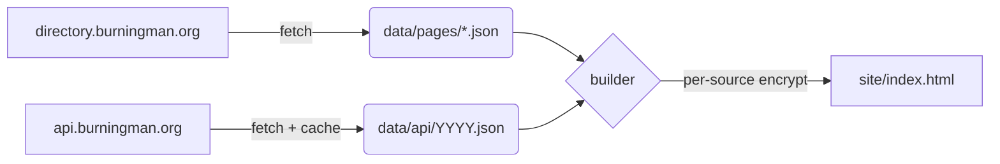

# Multi-source data architecture

## Overview

The app started life with one data source — the HTML scrape of
`directory.burningman.org`. As of 2026 we're adding a second, structured
source: the official **`api.burningman.org`** Public API (key-gated,
documented at `https://api.burningman.org/docs`). Directory stays as the
primary source for the *current pre-burn year* (it's populated weeks
earlier than the API); the API gives us **historical years** (2015–2025
according to the API spec, year-required, single-shot bulk endpoints) and
will eventually give us a more structured + reliable view of the current
year once the API releases its current-year data three weeks before
gate-open.

The user picks the active source from a header dropdown:

```
[ Directory ▾ ]   ← header pill
  ✓ Directory   (live, current year)
    API 2024
    API 2025
    API 2026     ← appears after 2026-08-09 (3 weeks before gates)
```

All user state — favorites, meet spots, friends, my camp — is **scoped to
the active source**. Switching sources is instant: every source's payload
is already embedded in `index.html` at build time.

Scope of this ADR: **camps, events, and art.** Art is implemented as a parallel
payload and UI surface (D14). Mutant vehicles are a **won't-do** (roadmap):
art cars move and have no fixed location, so there is nothing to map or plan.

## Decisions

### D1 — Source identifier is a flat string

Each source is a single string:

| String       | Provider                       | Notes                                  |
|--------------|--------------------------------|----------------------------------------|
| `directory`  | `directory.burningman.org`     | HTML scrape; current behavior          |
| `api-2024`   | `api.burningman.org` (year=2024) | Past year, immutable                   |
| `api-2025`   | `api.burningman.org` (year=2025) | Past year, immutable                   |
| `api-2026`   | `api.burningman.org` (year=2026) | Current year (when available, see D8)  |

Why not `{provider, year}` objects: source strings show up in LS keys, DOM
ids (`<script id="camps-data-api-2024">`), URL fragments (share links),
and CLI flags. Flat strings serialize trivially in all of those.

### D2 — Schemas normalize to the existing `Camp` / `Event` dataclasses

Mapping (verified against the OpenAPI spec):

| API field                 | `Camp` field            |
|---------------------------|-------------------------|
| `uid` (18-char SFDC id)   | `id` (string)           |
| `name`                    | `name`                  |
| `location_string` (e.g., `"Esplanade & 6:30"`) | `location`     |
| `description`             | `description`           |
| `url`                     | `website`               |
| —                         | `url` = `""` (no canonical-directory link for API source) |
| (events joined post-fetch) | `events`               |
| (computed by Tagger)      | `tags`                  |

Dropped on the floor for now: `hometown`, `landmark`, `contact_email`,
`images`, structured `location` (`frontage`/`intersection`/etc.). These
are richer than what the directory provides — surfacing them is a future
enhancement. Today's UI doesn't read them, so the normalized model stays
unchanged.

| API field                 | `Event` field           |
|---------------------------|-------------------------|
| `uid`                     | `id`                    |
| `title`                   | `name`                  |
| `description`             | `description`           |
| `occurrence_set`          | `time` + `parsed_time` + `display_time` (see D3) |
| `hosted_by_camp` (Camp uid) | (used to attach event to its camp) |

### D3 — API events skip `timeparser.py`

API `occurrence_set` carries ISO-8601 timestamps with timezones — no
free-text parsing needed. We synthesize `parsed_time` directly:

- All occurrences at the same time-of-day → one `recurring` `Event` with a
  days list (matches the schedule view's existing recurring-event handling).
- Mixed times-of-day → emit one `single` `Event` per occurrence (rare,
  but preserves fidelity).

`display_time` and the raw `time` string are formatted from the parse so
the rest of the rendering pipeline doesn't need to know which source the
event came from.

The `derive_week_map` shenanigans (year-agnostic day → date map) aren't
needed for API events — we already have absolute dates.

### D4 — Per-source isolation of user state

Camp ids don't cross source boundaries (directory uses numeric, API uses
SFDC uids). So a "favorite" only makes sense within one source.

Existing LS keys gain a `/<source>` suffix:

| Old key             | New key (per source)                  |
|---------------------|---------------------------------------|
| `bm-favs`           | `bm-favs/<source>`                    |
| `bm-fav-events`     | `bm-fav-events/<source>`              |
| `bm-shared`         | `bm-shared/<source>` (friends' lists) |
| `bm-my-camp`        | `bm-my-camp/<source>`                 |
| `bm-meet-spots`     | `bm-meet-spots/<source>`              |
| `bm-hidden-days`    | `bm-hidden-days/<source>`             |

Truly global keys keep their bare names: `bm-theme`, `bm-info-seen`,
`bm-pw`, `bm-rn-seen`, `bm-source` (current selection), `bm-distance-unit`,
`bm-nickname`.

**Migration**: on first load after the multi-source upgrade, every
unsuffixed key is copied (not moved — see "rollback" below) to its
`/<source-default>` slot. Default source for the migration is
`directory`, since that's where every existing user's data came from.

Rollback safety: bare keys are left in place for one or two builds so
that loading an older bundle (cached SW, old tab) still works. A
follow-up cleanup commit removes the migration code + the bare keys
once everyone's seen the new code.

### D5 — Share links carry the source

Share-link payload gains a `source` field:

```json
{ "name": "alice", "source": "api-2024",
  "campIds": ["a1XVI…"], "eventIds": [...], ... }
```

Importing routes the friend's data into the matching `bm-shared/<source>`
bucket. If the importer's UI is currently on a different source, a banner
flags it: *"Alice's list is from API 2024 — switch sources to see
overlap."* Old share links (no `source`) are assumed `directory` for
backwards compatibility.

### D6 — Builder embeds one data script per source

`builder.py` enumerates the configured sources and emits one
`<script id="camps-data-<source>">` (plaintext) or
`<script id="camps-data-<source>-encrypted">` (encrypted) per source.
Client picks the script that matches the current selection.

Encryption is per-source — same `SITE_PASSWORD`, fresh salt each, so a
compromise of one year's payload doesn't trivially help the others.

The whole site stays one self-contained `index.html`. Multi-source bumps
the file size (~2 MB plaintext per year) but keeps the offline + zero-
runtime-network-dependency property intact.

### D7 — API caching: GitHub Releases (encrypted)

The API is rate-limited and past-year data is immutable. We don't want to
hit `api.burningman.org` on every nightly CI run.

Implementation:

1. One **GitHub Release tag per source-year** (e.g., `data-api-2024`)
   with one encrypted asset (`<year>.bin`).
2. The cache file is AES-256-CBC + PBKDF2 (same parameters as the
   deployed-site payload), in openssl's native
   `Salted__||salt||ciphertext` binary format. The cache is decrypted
   only by Python at build time, so we skip the JSON envelope used for
   the WebCrypto-side decrypt.
3. CI build, for each year in `vars.BM_API_YEARS`: `gh release
   download <tag> --pattern <year>.bin` first. Cache miss → fetch from
   the API once with `BM_API_KEY`, encrypt with `BM_CACHE_PASSWORD`,
   `gh release create + upload`. Past years thereafter cost **zero API
   hits**.
4. Local builds use the same `data/api/<year>.json` path; the
   `playa api-fetch` CLI writes encrypted whenever a cache password is
   set, plaintext otherwise (convenient for offline dev).
5. To force a re-fetch (e.g., a corrected past-year dataset, or to
   refresh the current year), run `workflow_dispatch` with
   `refresh_api_years=YYYY` (comma-separated years accepted). The workflow
   deletes those releases/tags before the cache step, so each miss triggers a
   fresh fetch and upload. Manual release deletion remains a fallback.

**`BM_CACHE_PASSWORD` vs `SITE_PASSWORD`** — separate by default,
falls back to `SITE_PASSWORD` when unset. The threat model is
identical (both are public-readable AES blobs decrypted by whoever has
the password), but rotation is independent: a leaked `SITE_PASSWORD`
can be rotated without re-encrypting + re-uploading every past year's
cache. Single-secret deployments work too; just leave
`BM_CACHE_PASSWORD` unset.

Why GitHub Releases over alternatives:

- **Orphan branch**: works, but pollutes the repo's git object database
  forever; force-pushing to keep size down breaks anyone with a stale
  reference.
- **Separate private repo** (e.g., `bm-camps-data`): clean, but doubles
  the repo + secrets surface for one cache. Marginal value over Releases.
- **Actions cache / artifacts**: ephemeral (7 / 90 days). Wrong tool for
  immutable past-year data.
- **`data-cache/` folder in main**: bloats main-branch history;
  conflicts with the "no fetched data in git" stance the project leans
  on for ToS deniability.

### D8 — Current-year API and the §6.2 location embargo

The Burning Man API ToS §6.2 and the
[official annual API schedule](https://innovate.burningman.org/apis-page/)
enforce:

- **Camp locations**: the generic ToS says **12:01 am, first Sunday of
  build week**; the official 2026 schedule gives **August 23 at 12:00 am
  PDT**. The annual schedule is the exact operational value. Developers
  receive the data three weeks before gates (2026-08-09).
- **Art locations**: hidden until gate-open (Day 1 of the burn).

The implemented embargo is client-side and intentionally uses two independent,
annual, timezone-aware timestamps:

- `CAMP_LOCATION_RELEASE_AT` (2026: `2026-08-23T00:00:00-07:00`)
- `ART_LOCATION_RELEASE_AT` (2026: `2026-08-30T00:00:00-07:00`)

The builder embeds those values with `BRC_MAP_YEAR` as
`bm-camp-location-release-at`, `bm-art-location-release-at`, and
`bm-location-release-year`. They are not aliases for `BURN_WINDOW_OPEN_FROM`:
that variable controls the schedule fallback and spirit auto-unlock window,
while fetched volunteer events may move the effective schedule start earlier.
The explicit `-07:00` offset makes the releases occur at Pacific midnight,
not seven hours early at UTC midnight.

For untrusted sessions, `applyLocationEmbargo()` clears `Camp.location` until
the camp timestamp and `applyArtLocationEmbargo()` independently clears
`Art.location` until the art timestamp. Events have no separate location field;
their displayed/map location follows the host camp. Names, descriptions,
events, favorites, and public GIS overlays are not embargoed. The encrypted
payload intentionally retains raw locations; this is a UX boundary, not hard
confidentiality. Directory and past-year API sources are unaffected. A future
`api-YYYY` fails closed (locations stay masked) until `BRC_MAP_YEAR` and both
annual timestamps are advanced. A current-year API build with either timestamp
missing, timezone-naive, reversed, or from the wrong year fails before deploy.

Runtime comparisons are supplied by `client/src/utils/clock.now()` so embargo,
Food availability, and Schedule testing use one clock. Production returns the
real device time. `?now=<ISO>` freezes a clearly bannered, local-only simulated
instant for manual verification; clearing the simulation removes both its
persisted value and URL override. This is a test seam, not an embargo bypass.

**Per-tier bypass for `god-mode`** (added 2026-04-28). The embargo is
a UX gate, not a security boundary — full location data is in the
encrypted bundle so a god-mode user (inner circle) can see locations
before gate-open. `demigod-mode` and `spirit-mode` continue to honor
the embargo.

To grant the privilege without leaking tier names into the DOM, the
build emits a parallel `<meta name="bm-trusted-wrappers">` listing
the wrapper indices that belong to `god-mode` (alongside the existing
`bm-tier-wrappers`). When the user's password unwraps a trusted
wrapper, `App.tsx` flips `unlockedTrusted=true` and
`isLocationEmbargoed`/`applyLocationEmbargo` short-circuit. Burn-key
auto-unlock (D13, spirit-mode only) leaves trust at false — both embargoes
still apply. The 2026 API publishes developer fields on August 9; god-mode can
use fields present in that payload immediately, while spirit-mode waits for the
August 23 / August 30 public dates. Because the encrypted API Release cache is
not re-fetched nightly, the operator must run the workflow with
`refresh_api_years=2026` on/after August 9 (and for later upstream corrections).
Only the literal tier name `god-mode` is privileged;
operator-defined synonyms aren't recognized (rename or add another
trusted-flag layer if that ever becomes desired).

### D9 — Denylist becomes per-source

`data/denylist.txt` keys on numeric directory IDs. SFDC uids won't match
those entries. The implemented files are:

- `data/denylist.txt` — directory camps
- `data/denylist-api.txt` — API camps shared across API years
- `data/denylist-art.txt` — directory art
- `data/denylist-art-api.txt` — API art shared across API years

All contain IDs only and are committed per the existing removal pattern.

Per-year-source denylists are a **won't-do unless required** (roadmap):
build one only if a specific year's takedown ever needs it. Today, treat all
API sources as sharing one denylist — a camp removed in 2024 stays removed
across all API years (typically what we want, since it's the same camp).

### D10 — Tiered access via envelope encryption

Different audiences get different source visibility from the *same
deployed bundle*, gated by the password they enter. No accounts, no
build duplication.

The conventional deployment uses three tiers. The manifest is operator-
configurable, but the literal names `spirit-mode` and `god-mode` have the
reserved behaviors described below:

| Tier id        | Audience              | Sources unlocked                                                     |
|----------------|-----------------------|----------------------------------------------------------------------|
| `god-mode`     | Inner circle          | `directory` + every api-YYYY in `BM_API_YEARS`                       |
| `demigod-mode` | BM Discord testers    | every api-YYYY in `BM_API_YEARS` (no directory)                      |
| `spirit-mode`  | Unknown / linked out  | only the latest api-YYYY in `BM_API_YEARS` (current-year API)        |

Why this split:

- `directory` is the only source with **planned** pre-registration data
  weeks before the API publishes anything — the inner circle wants
  that planning view alongside the structured API.
- `demigod-mode` is for people testing the app shape against past-year
  data; they don't need the live planning leak.
- `spirit-mode` is the safest public surface — embargo-aware live API
  data only, no past-year mining, no directory leak.

Tier ids are local CI labels — they never appear in the page. Bundle
embeds use opaque sequential indices for wrapper script ids so the DOM
doesn't disclose tier names or count.

**Configuration** (env var, parsed at build time). Format:
`name1:pw1=src1+src2,name2:pw2=src3,…`. Each tier is explicitly
labeled — the build identifies `spirit-mode` by NAME, not by
position, so operator edits can't accidentally point burn-key.json
at the wrong tier. For 2026 with the initial year window
(`BM_API_YEARS=2025,2026`):

```
SITE_TIERS="god-mode:$GOD_PW=directory+api-2025+api-2026,demigod-mode:$DEMIGOD_PW=api-2025+api-2026,spirit-mode:$SPIRIT_PW=api-2026"
```

CI stores the fully composed `SITE_TIERS` value as a repository secret so
literal passwords never appear in workflow YAML. `spirit-mode` is reserved
because D13's `BURN_OPEN=1` looks up that exact name; `god-mode` is reserved
because its wrappers enter `bm-trusted-wrappers` for the internal embargo
bypass. Backward-compat: `SITE_TIERS` unset + `SITE_PASSWORD` set
falls through to today's "single tier covering every embedded source".

**Initial year window**: 2026 ships with `BM_API_YEARS=2025,2026`.
2024 has data (~1300 camps verified) but adds no immediate value for
the planning-app use-case; can be re-added later by setting
`BM_API_YEARS=2024,2025,2026` and running `playa api-fetch --year 2024`
once. The rolling-window note in D11 still applies: drop the oldest
year as new ones arrive.

**Why envelope encryption** (vs. multi-encrypt-per-tier):

- *Multi-encrypt*: one ciphertext per (source, tier) pair. Bundle scales
  with `Σ |tier.sources|`. For our scope (3 tiers covering 4 sources
  with overlap counts 1+2+2+3 = 8) that's ~10 MB encrypted — wasteful.
- *Envelope*: one ciphertext per source, plus a tiny key-wrapper per
  (source, tier). Bundle is `Σ |sources|` + ~150 bytes per wrapper. Same
  scope is ~5 MB encrypted + ~1 KB of wrappers — half the size.

**Build-time crypto**:

1. For every source referenced by any tier, generate a random 32-byte
   `DEK` (data encryption key), a 16-byte camps IV, and a separate 16-byte art
   IV.
2. Encrypt each compressed JSON payload (see D12) with AES-256-CBC under
   the shared source DEK and its own IV. No PBKDF2—the DEK is full-entropy
   random. Embed `camps-data-<source>-cipher` and
   `art-data-<source>-cipher`; sharing the DEK avoids extra wrappers while the
   distinct IVs prevent CBC first-block leakage.
3. For every (tier, source) pair where the tier's source-list includes
   the source: encrypt the 48-byte `DEK || IV` blob with PBKDF2 +
   AES-256-CBC under the tier's password (fresh salt per wrapper).
   Embed as `<script id="cdk-<source>-<idx>">{"salt": b64, "iter": N, "ct": b64}</script>`.
4. Build a manifest meta tag listing wrapper indices per source so the
   client doesn't have to scan the DOM:
   `<meta name="bm-tier-wrappers" content="directory:0;api-2024:0,1;api-2025:0,1;api-2026:0,1,2">`.

**Client unlock**:

1. User enters password.
2. For each source in the manifest, walk its wrapper indices. For each:
   PBKDF2 → AES-CBC decrypt the wrapper. First success → cache the
   recovered `DEK || IV`, move to next source. All-fail for a source →
   that source is locked for this user.
3. If at least one source unlocked: enter the app. Else: "wrong
   password" (same UX as today's gate).
4. Lazy-decrypt source ciphers: when the user actually selects a source,
   decrypt its `<source>-cipher` using the cached `(DEK, IV)`. Avoids
   decrypting + parsing megabytes the user never views.

**Sanity checks** (build-time, fail loud):

- Two tier passwords identical → ambiguous tier semantics → reject.
- Tier lists a source not in the configured `--sources` set → typo →
  reject.
- Tier has zero sources → pointless → reject.
- `BURN_OPEN=1` without `SITE_TIERS` or without a tier named
  `spirit-mode` → ambiguous public unlock → reject. With neither site setting,
  ordinary local builds intentionally use plaintext gzip+base64.

**Cross-tab + share**: untouched. Password is still one string per user;
`BroadcastChannel` keeps sharing it across tabs. `useSource` still maps
share-link `source` to a slot the receiver may or may not have unlocked
— if not, the source-mismatch banner from previous work covers it.

### D11 — Per-year map geometry

The structural BRC grid (clock × letter polar coordinates, 4:30 axis ≡
true north) is design-stable across years. What *does* drift annually:

- **Golden Spike** lat/lng (~100–400 ft per year — verified against
  the published 2024 / 2025 / 2026 datasets).
- **Letter-street set** (e.g., 2024 included `L`; 2026 stops at `K`).
- **Letter-street radii** (block depths shift; 2026's E↔F mid-city
  plaza is the largest current example).
- **Trash-fence pentagon** (5 outer vertices, also published per year).

We render past-year API camps directly on the map, so we want each
source to render against the geometry for its own year. Without this,
"6:00 & E" from a 2024 camp would land at the 2026 E-street radius and
end up tens to hundreds of feet off; an `L`-street 2024 address would
fail to parse entirely.

**Bundle**: a single `BRC_BY_YEAR: Record<number, BrcConstants>` map in
`client/src/map/data.ts`. Each entry is ~200 bytes JSON. Ten years
costs ~2 KB.

```ts
type BrcConstants = {
  goldenSpike: { lat: number; lng: number };
  streetLetters: string[];        // ordered Esplanade-out
  streetRadiiFeet: number[];      // parallel to streetLetters
  fencePentagon: Array<{ lat: number; lng: number }>;
};
```

**What we deliberately don't store**:

- Themed street names — never displayed (CampCard shows `location`
  raw, MapView labels with the letter only).
- Clock-hour bearings — stored per year and verified against official GIS CPN
  anchors. The measurements' “4:30 true N/S axis” describes an undirected
  line; it does not by itself distinguish 4:30 from the opposing 10:30
  direction. For 2025 and 2026, 12:00 is 45° NE and 6:00 is 225° SW.
- Letter-street naming convention (Esplanade → A → B …) — stable.

**Source → year resolver** (next to `useSource`):

| Source        | Year used                                          |
|---------------|----------------------------------------------------|
| `directory`   | Embedded `bm-directory-map-year` from `BRC_MAP_YEAR` |
| `api-YYYY`    | `YYYY`                                             |
| Year without exact geometry | No map; source data remains usable       |

Wiring: `parseAddress(raw, year)`, `addressToSvgFeet(raw, year)`,
`addressToLatLng(raw, year)`, `latLngToSvgFeet(ll, year)` all become
year-parameterized. MapView pulls the year once at the top from the
active source and threads it through. Roughly a dozen call-site
updates concentrated in `client/src/components/MapView.tsx` and
`client/src/map/address.ts` — mechanical refactor.

**Update workflow**: extend the existing `.claude/skills/update-map/`
skill so it *adds* a year entry rather than overwrites. Sources of
truth per year:

- Golden Spike: `innovate.burningman.org/dataset/<YYYY>-golden-spike-and-general-city-map-data/` (KML).
- Radii + letter set + fence: `burningmantech/innovate-GIS-data` GitHub
  (historical KMZ + GeoJSON).

The skill runs once per year and commits a new entry to `BRC_BY_YEAR`.
2025 was backfilled in 2026-05 (real Golden Spike + fence + sci-fi
author themed names "Tomorrow Today"). A source can be enabled before its
geometry is published: the Map tab then reports that the specific year's map is
not available and renders no coordinates. It never substitutes another year's
Golden Spike, streets, or fence. Schedule data remains usable, with only the
coordinate-dependent “Near me” filter disabled.

**Failure mode**: addresses that don't parse against their exact year's letter
set (e.g., "Rod's Ring Road") still fall through to "list-only, no
map pin" — same as today. No crash.

**Operational year window**: `BM_API_YEARS` follows a rolling
"current + 2 years back" policy — for 2026 builds it's `2024,2025,2026`;
for 2027 it'd be `2025,2026,2027` (drop 2024). The architecture doesn't
care; this is purely the operator's value for the env var. `BRC_BY_YEAR`
is append-only — entries for years that have left the window stay in
the bundle (~200 bytes each, harmless). Orphaned GitHub Releases
(`data-api-2024` once 2024 leaves the window) can be deleted by hand
or left in place; they cost ~few KB of repo storage each.

### D12 — Compress before encrypt

Source JSON is highly compressible (repeated keys, English prose,
shared substrings) but encrypted bytes are near-random and don't
compress at all. Pipeline:

```
JSON  →  gzip  →  AES-256-CBC  →  base64  →  embed
```

Reverse on the client. Order matters — gzip *after* AES typically
grows the output by 1–2%.

**Expected ratio**: gzip hits ~70–75% reduction on this corpus. The
2.7 MB plaintext build drops to ~800 KB–1 MB encrypted on the page.

**Browser API**: native `DecompressionStream('gzip')` — no JS
dependency, no bundle bloat. Coverage:

- Chrome / Edge: v80 (Feb 2020)
- Firefox: v113 (May 2023)
- Safari (macOS + iOS): v16.4 (March 2023)

Effectively any browser updated in the last ~2.5 years. The bottom
edge is something like an iPhone stuck on iOS 15 — vanishingly rare in
the target audience.

**Fallback**: feature-detect `'DecompressionStream' in window` on boot.
Missing → render an "your browser is too old, please update" banner
in place of the gate. Bundling fflate (~8 KB) to rescue <1 % of users
isn't worth the load cost on the 99 %.

**Brotli punted**: ~20 % better than gzip but not yet in the
`DecompressionStream` standard (Chrome flag-only as of late 2024). The
gzip win is plenty for today.

**Build-time impl**: Python `gzip.compress(payload)` before passing to
the openssl invocation. The same source ciphertext under D10 simply
takes the gzipped payload as input. DEK-wrappers are 48 bytes — not
worth gzipping.

**Test surface**: `tests/test_builder.py::EncryptPayloadTests` and
`tests/crypto.test.ts` round-trip tests both add a gzip step at build
and a `DecompressionStream` step at decrypt. Same shape as today, one
more transform.

### D13 — Burn-window auto-unlock for spirit-mode

During the burn (Aug 30 – Sep 7 2026 for this year), `spirit-mode`
should be reachable without typing a password — the friction of "share
this passphrase, sorry, copy it carefully" doesn't make sense for
walk-up dust-covered users on bad LTE looking for the nearest coffee
camp. `god-mode` and `demigod-mode` stay password-gated regardless;
this only opens up the public-safe tier.

**Honest framing first**: any auto-unlock is a *convenience* feature,
not a security boundary. The DEK has to live somewhere reachable for
the unlock to work. What we *can* do is make the DEK disappear cleanly
outside the window so it's not even sitting around to be found, and
keep the other tiers' wrappers untouched.

**Mechanism — sibling file, deployed only during the window**:

1. D10 generates the normal random source DEK and IV for every source,
   including each source listed in `spirit-mode`.
2. Spirit-mode's source cipher uses that normal `DEK || IV` shape. The
   per-tier-password wrappers (one for `god-mode`, one for
   `demigod-mode`, one for `spirit-mode`) wrap that same DEK so the
   normal password-gated path still works.
3. With `BURN_OPEN=1`, build writes a JSON mapping of each spirit source to
   base64 `DEK || camps IV` in `site/burn-key.json`. With `BURN_OPEN` false,
   the builder removes any stale file before Pages uploads `site/`.
4. During the burn window, a workflow with `BURN_OPEN=1` (manual
   `workflow_dispatch` input, or a cron-driven date check) deploys
   *with* `burn-key.json` included.
5. Client on boot, before showing the gate: `fetch('./burn-key.json')`.
   - `200` → parse `{dek, iv}`, decrypt the spirit-mode source cipher
     directly (skip the wrapper step entirely), and proceed into the
     app on `spirit-mode`.
   - `404` / network error → fall through to today's password gate.
6. The current UI enters directly with the spirit source set and does not show
   a mid-session tier-up password affordance. That affordance is a **won't-do**
   (roadmap): all real users are spirit-mode, and higher tiers exist only for
   the operator to test/compare.

**What this gets**:

- DEK is **not in `index.html`** outside the window. A pre-burn or
  post-burn snoop downloads the bundle and finds nothing they can use
  for spirit-mode.
- Mid-burn revoke = redeploy without the file. Faster than rotating
  any password.
- Other tiers stay password-gated forever. No date check anywhere on
  their unlock path.
- Stacks cleanly on D10 — the burn-key auto-unlock is *literally* "you
  already have the DEK, skip the wrapper". No new crypto primitive.

**What this doesn't try to prevent**:

- Saved-during-window attacks: anyone who downloads `burn-key.json`
  while it's published can save it and decrypt forever (the spirit
  cipher is in the page they already have). Threat-model-equivalent
  to posting the spirit-mode password publicly on Discord — same
  outcome, just automated.
- Clock-spoofing for time-locked decryption — there is no time lock,
  just file presence. Out of scope.

**Amendment (2026) — the unlock window is its own pair of variables,
`SITE_UNLOCK_START` / `SITE_UNLOCK_END`, decoupled from the burn-week
calendar.**

Originally the auto-unlock window reused `BURN_WINDOW_OPEN_FROM` /
`BURN_WINDOW_OPEN_TO`. But those two variables also feed
`Config.burn_start` / `burn_end` (`config.py`), which drive the schedule
week-map, event-date derivation, and the client's Food/Schedule "now"
logic. That overload meant you could not open the site on a different
schedule than the burn week without distorting the calendar — and it
forced a boolean escape hatch, `PLAYA_GO_LIVE`, whose only job was to
open access *before* the calendar's `FROM`.

Resolution:

- **`SITE_UNLOCK_START` / `SITE_UNLOCK_END`** (new repo variables) are the
  *only* inputs to `BURN_OPEN` resolution — the password-free access
  window. They can be any dates (e.g., open a week before the burn,
  close at year-end) without touching the calendar.
- **`BURN_WINDOW_OPEN_FROM` / `BURN_WINDOW_OPEN_TO`** keep their original
  meaning — the burn-week calendar (`burn_start`/`burn_end`) — and are
  documented with the schedule, not here. They no longer affect access.
- **`PLAYA_GO_LIVE` is removed.** "Open early" is now just an earlier
  `SITE_UNLOCK_START`; ad-hoc "open/close right now" stays covered by the
  `workflow_dispatch` `burn_open` input, which still wins over the dates.

The location embargoes (`CAMP_LOCATION_RELEASE_AT` /
`ART_LOCATION_RELEASE_AT`, D8) remain independent of both pairs: spirit
users can be let in by `SITE_UNLOCK_START` while camp/art locations stay
masked until their own timestamps.

**Operational config — set-once-forget by design**:

The intended operator experience is: set the window dates **once per
burn** as repo variables, never touch them again. Every nightly run
(`refresh.yml`'s existing 08:00 UTC cron) evaluates "is today inside
the window?" and includes / excludes `burn-key.json` automatically.
No human in the loop at burn-start or burn-end.

| Knob                       | Where                | Effect                                                                                |
|----------------------------|----------------------|---------------------------------------------------------------------------------------|
| `SITE_UNLOCK_START`        | repo *variable*      | ISO date (e.g., `2026-08-22`). Workflow auto-includes `burn-key.json` from this day.  |
| `SITE_UNLOCK_END`          | repo *variable*      | ISO date (e.g., `2026-12-31`). Workflow auto-removes after this day (UTC end-of-day). |
| `CAMP_LOCATION_RELEASE_AT` | repo *variable*      | Timezone-aware current-year camp public-release timestamp (2026: `2026-08-23T00:00:00-07:00`). Independent of the unlock window. |
| `ART_LOCATION_RELEASE_AT`  | repo *variable*      | Timezone-aware current-year art public-release timestamp (2026: `2026-08-30T00:00:00-07:00`). Independent of the unlock window. |
| `BURN_OPEN=0\|1`           | `workflow_dispatch` input | Manual override for "open it now" / "close it now". Wins over the date check.    |

`BURN_WINDOW_OPEN_FROM` / `BURN_WINDOW_OPEN_TO` are **not** in this table:
they are the burn-week calendar (`Config.burn_start`/`burn_end`) and no
longer affect access. Set them to the real burn week (2026:
`2026-08-30` / `2026-09-07`).

**Window evaluation** (inside `refresh.yml`):

```bash
# Pseudocode for the resolution step.
if [[ -n "$dispatch_input_BURN_OPEN" ]]; then
  effective_burn_open="$dispatch_input_BURN_OPEN"        # manual wins
elif [[ -n "$SITE_UNLOCK_START" && -n "$SITE_UNLOCK_END" ]]; then
  today_utc="$(date -u +%Y-%m-%d)"
  if [[ "$today_utc" > "$SITE_UNLOCK_END" ]]; then
    effective_burn_open=0          # past the window → re-locked
  elif [[ ! "$today_utc" < "$SITE_UNLOCK_START" ]]; then
    effective_burn_open=1          # inside [START, END]
  else
    effective_burn_open=0          # before START → still gated
  fi
else
  effective_burn_open=0   # no window vars + no input = closed
fi
```

**Comparison done in UTC** for simplicity: cron fires at 08:00 UTC
(01:00 PT) and the granularity that matters is days, not hours.
Worst-case effect at the boundary is the file appearing/disappearing
~7 hours offset from local-Black-Rock midnight, which is fine — no
one's at the gate at midnight PT on Day 1 hunting for the app, and
post-burn the slop is harmless.

**Cadence**:

- Cron (every 24h) is the auto-flip pulse. Granularity = 1 day.
- `workflow_dispatch` for sub-day control: "we're opening early
  because tickets dropped a day ahead" or "kill it now, found a bug".
- The dispatch input is checked *before* the date math, so manual
  always wins.

**Failsafe behaviors**:

- Both unlock vars unset and no manual input → `effective_burn_open=0`
  (closed). Site behaves like today. Default-deny.
- Cron misses a day (GitHub Actions outage): no problem on the next
  run — `burn-key.json` either appears or disappears one day late.
- Only one of `SITE_UNLOCK_START` / `SITE_UNLOCK_END` set → the resolution
  is default-closed (the `-n && -n` guard requires both). Set both.
- `SITE_UNLOCK_START > SITE_UNLOCK_END` → workflow fails loud (an unlock
  window that never opens is always an operator mistake).
- The burn-week calendar (`BURN_WINDOW_OPEN_FROM/TO`) is validated
  separately at build time and no longer touches this path.

**Setup walkthrough for the operator** (one-time per burn year):

1. Settings → Secrets and variables → Actions → Variables tab.
2. Repository variable: `SITE_UNLOCK_START` = `2026-08-22` (when the
   password-free window opens).
3. Repository variable: `SITE_UNLOCK_END` = `2026-12-31` (when it
   re-locks — the day after is password-gated again).
4. Repository variables `BURN_WINDOW_OPEN_FROM` = `2026-08-30` and
   `BURN_WINDOW_OPEN_TO` = `2026-09-07` — the real burn week (calendar).
   Leave these on the burn dates even though the site unlocks earlier.
5. Set `CAMP_LOCATION_RELEASE_AT` = `2026-08-23T00:00:00-07:00` and
   `ART_LOCATION_RELEASE_AT` = `2026-08-30T00:00:00-07:00` from the
   official annual API schedule. These do not control `burn-key.json`.
6. Done. Next nightly cron on/after `SITE_UNLOCK_START` deploys with
   `burn-key.json`; the first cron after `SITE_UNLOCK_END` removes it.

For the next year (2027): bump the unlock pair, the burn-week pair, and the two
location timestamps. No code change; the current-year API build rejects
stale-year location timestamps.

**Build flow change** (delta on D10):

```
[D10 spirit-mode encryption]
  random DEK_spirit ← generate
  cipher_spirit = AES-CBC(gzip(spirit_json), DEK_spirit, IV)
  for tier in [god, demigod, spirit]:
    if spirit ∈ tier.sources:
      wrapper[tier] = AES-CBC-PBKDF2(DEK_spirit||IV, tier_password)

[D13 addition]
  if BURN_OPEN:
    write site/burn-key.json = {spirit_source: base64(DEK_spirit||IV)}
  else:
    remove stale site/burn-key.json if present
```

The other two source-tier combinations (god, demigod) get no
burn-key sidecar. Even if `burn-key.json` leaks, it only unlocks
spirit-mode.

**Client flow change** (delta on D10 unlock):

```
on boot:
  if 'DecompressionStream' not in window: render upgrade banner; bail
  manifest = read <meta name="bm-tier-wrappers">
  burnKey = await fetch('./burn-key.json').then(r => r.ok ? r.json() : null)
  if burnKey:
    decrypt spirit cipher directly with burnKey.dek + burnKey.iv
    set source = 'api-CURRENT_YEAR', skip gate
    enter with only the burn-key sources (no tier-up affordance today)
  else:
    show gate as today
```

**Failure modes**:

- A malformed base64 entry or one not exactly 48 bytes is skipped; if no valid
  entries remain, the normal password gate appears. A well-formed but incorrect
  key reaches source decryption, logs the failure, and yields empty source data;
  it does not currently return to the gate automatically.
- File present but `BURN_OPEN` was meant to be off (mistake): visible
  as soon as a public link surfaces. Mitigation = redeploy. Same blast
  radius as posting a password publicly by mistake.
- The client requests `burn-key.json` with `cache: 'no-store'`, and the service
  worker does not add it to the shell precache. A user who saved the key while
  it was available can still retain it; that is already included in the stated
  threat model.

**Sanity checks at build time**:

- If `BURN_OPEN` is set but `SITE_TIERS` doesn't include a spirit-mode
  tier, fail loud — burn-open without a public-safe tier is operator
  confusion.
- If `BURN_WINDOW_OPEN_FROM > BURN_WINDOW_OPEN_TO`, fail loud.

**Access control for the manual dispatch** (verified against GitHub
docs + discussions, 2026-04-29):

- `workflow_dispatch` triggers — including the manual `BURN_OPEN`
  override — are **owner-only on a public repo by default**. GitHub
  requires *write* access on the repository to invoke
  `workflow_dispatch`; non-collaborators don't even see the "Run
  workflow" button. There is no separate "execute workflows"
  permission today (GitHub community has been asking for one for
  years; it's a recognized but unimplemented feature gap). For a
  single-maintainer repo this is exactly what we want — only the
  owner can flip the toggle, and the public-repo audience can't.
- Forks cannot trigger upstream's `workflow_dispatch`. Fork
  workflows run in the fork's own context, against the fork's own
  (empty) secrets. A fork-author can't reach our `BM_API_KEY` or
  `SITE_PASSWORD` via dispatch.
- Pull requests from forks don't get access to repository secrets
  by default. The `BURN_OPEN` step would just no-op (no
  `BURN_OPEN`, no `BM_CACHE_PASSWORD`, no `SITE_PASSWORD` →
  early-exit). No attacker-PR exfiltration vector.

**Optional belt-and-suspenders** for if/when this changes — e.g., a
second maintainer joins who shouldn't unilaterally flip the toggle:

- Wrap the publish step in a [GitHub
  Environment](https://docs.github.com/en/actions/reference/workflows-and-actions/deployments-and-environments)
  named `burn-open` with **required reviewers** = the operator. The
  job can't access environment secrets until a reviewer approves it.
  Mid-pipeline gate in addition to the pre-pipeline owner-only
  dispatch.
- Toggle "**Prevent self-review**" on the Environment if there are
  ever ≥2 maintainers — forces a different reviewer than the
  triggerer. Pointless for a one-person repo (can't approve your own
  dispatch).
- Tighten branch protection on `main` so `workflow_dispatch` can
  only target `main` (default behavior anyway, but explicit).

For this repo today (single owner, public): rely on the default
write-access requirement. No extra config needed. Document the
Environment + required-reviewers path here so it's easy to opt
into later.

### D14 — Art alongside camps (added 2026-05-02)

Art installations are a parallel entity — same dual-source split as
camps (directory scrape + `api.burningman.org/api/art`), same per-
source LS keys for favorites, same envelope/encryption story. Each
source emits a SECOND cipher / script tag for art alongside the
existing camps one.

**Why parallel rather than mixed:**
- Different schema (no events, has artist/category/program/image).
- Independent fetch cadence: art's API release (gate-open) lags
  camps' (build-week-Sunday) by ~1 week per BM ToS §6.2 — keeping
  the streams separate makes that asymmetry obvious.
- Independent star list: a user might have 10 starred camps but
  100 starred art pieces (or vice-versa); merging them into one
  "favorites" set would lose semantic meaning.

**Envelope crypto detail:** within a source the camps + art ciphers
share a single DEK (saves a wrapper per source-tier pair, avoiding
~150 bytes × #tiers × #sources of bundle bloat) but use SEPARATE
IVs. CBC with reused (key, IV) on different plaintexts leaks
first-block XOR; gzip headers are mostly deterministic, so the
leak would actually surface plaintext bytes. Art cipher's IV
travels in its own script-tag JSON; client `decryptSource` reads
`cipher.iv` directly (was previously sliced from `dekIv[32:48]`
— that slice is still used as a fallback for older bundle shapes).

**UI placement:** Art tab sits between Schedule and Map in the
TabBar. The Map ONLY pins art the user (or a friend) has starred —
showing every art piece on the map would clutter the city. Art
pins use a magenta diamond shape, distinct from camps' orange
circles.

**Tagging:** the existing `Tagger` taxonomy is reused via
`tag_art()` / `art_haystack()` — name + description + artist +
category + program. No separate art taxonomy because the meaningful
tags (interactive, fire, sound, sculpture, …) apply equally well
to either entity type. The `category="Mutant Vehicles"` field
specifically surfaces the existing `mutant_vehicle` tag.

**Embargo:** art has its own `ART_LOCATION_RELEASE_AT` cutoff. Per ToS §6.2,
art locations release at gate-open while camps release on build-week Sunday;
the client therefore evaluates the same source/year/trust policy against two
different timestamps. The `god-mode` trusted bypass applies identically.

**Offline images:** API art contributes at most one thumbnail URL per piece.
Art cards retain native lazy loading, and the service worker caches images as
they become visible. The client also warms remaining thumbnails one at a time
during idle periods after the source is unlocked. It pauses for hidden/offline,
Data Saver, and 2G-class states; the durable 2000-entry cache is independent of
the versioned app shell and has no user-facing bulk-download action.

**Operational note:** the `directory` scrape's `/artwork/` page set
is much smaller than `/camps/` (~10 pages vs 30). The shared
`PAGES` env var still gates both — over-fetching empty pages is
harmless; under-fetching would silently truncate. CI uses
`PAGES=30` for camps and the same value covers art.

## Mechanism

### Build pipeline


```mermaid
flowchart LR
  A[directory.burningman.org] -->|fetch| B(data/pages/*.json)
  AP[api.burningman.org] -->|fetch + cache| BP(data/api/YYYY.json)
  B --> C{builder}
  BP --> C
  C -->|per-source encrypt| D[site/index.html<br/><script camps-data-directory><br/><script camps-data-api-2024><br/><script camps-data-api-2025>]
```

Each source produces an independent JSON payload. The builder concatenates
the corresponding `<script>` tags into the HTML template.

### Client runtime

```mermaid
flowchart LR
  H[<select>] -->|change| S[setSource]
  S -->|persist| LS[localStorage<br/>bm-source]
  S -->|read script| P[camps-data-<source>]
  P -->|maybe decrypt| C[Camp[]]
  C --> V[CampsView / Schedule / Map]
  S -->|switch namespace| F[bm-favs/<source><br/>bm-fav-events/<source><br/>bm-meet-spots/<source>...]
```

All hooks (`useFavorites`, `useFriends`, `useMeetSpots`, `useMyCamp`)
take the active source as a key suffix. When source changes, the hooks
re-mount their LS subscription against the new key, so UI updates fall
out of the existing storage-event plumbing — no special-case wiring.

### Source registry

```python
# backend/src/playa/sources/__init__.py
class Source(Protocol):
    name: str
    def load_camps(self, config: Config) -> list[Camp]: ...
    def load_art(self, config: Config) -> list[Art]: ...

class DirectorySource:
    name = "directory"
    def load_camps(self, config): ...      # normalized cached page JSON
    def load_art(self, config): ...

class APISource:
    name: str                              # "api-2024" etc.
    year: int
    def load_camps(self, config): ...      # encrypted/plain year cache
    def load_art(self, config): ...

def make_source(spec: str) -> Source: ...
```

CLI:

```bash
playa api-fetch --year 2024     # writes data/api/2024.json
playa build --sources directory,api-2024,api-2025
playa all --sources directory   # nightly default — no API hits unless asked
```

## Failure modes & trade-offs

- **Bundle size**: each year of API data adds ~1–2 MB plaintext (~1.5–3
  MB encrypted) to `index.html`. Three years live in the dropdown today is
  a soft ceiling; if we add 2015–2025 we want per-source lazy loading
  (separate files, fetched on source-change). This remains future scaling work.

- **API rate limits**: spec exposes `X-RateLimit-Limit` headers; we have
  no published number. The API adapter retries with backoff on 429, and the
  implemented encrypted Release cache makes this a non-issue for past years.

- **ID-space split**: a user with 30 starred camps under `directory`
  switches to `api-2025` and sees zero stars. By design — different IDs
  for the same camp, different city plan, different events. The
  empty-state copy in CampsView calls this out. A name-based bridge
  ("port my directory favs to API 2025") is a **won't-do** (roadmap): users
  don't switch sources — the switch is operator-only for testing/history.

- **Migration window**: bare LS keys left in place for one build. A user
  loading the new bundle, then opening an OLD cached bundle from another
  tab, sees the old behavior — that tab still reads `bm-favs`. Risk:
  user adds favs in the old tab → they only land in `bm-favs`, not in
  any per-source bucket. We surface this in the release notes ("multi-
  source upgrade — please refresh all open tabs").

- **API event mapping fidelity**: events whose occurrences have *different*
  start times per day get split into N events instead of one recurring
  event (D3). Star semantics: starring "this event" stars one
  occurrence, others remain unstarred. Acceptable trade-off vs.
  inventing a per-occurrence star UI.

- **Embargo staleness**: masking is applied when payloads enter client memory.
  A tab kept open across either camp or art release timestamp needs a refresh
  to reveal that field. The app tracks and acknowledges the two notices
  independently, so dismissing the August 23 camp notice cannot suppress the
  August 30 art notice. Raw encrypted data and the trusted internal bypass make
  this a UX boundary, not confidentiality.

- **ToS §4 disclaimer**: the API ToS requires a verbatim
  *"This app is not affiliated, endorsed, or verified by Burning Man
  Project."* string in the footer + about modal. It ships for every source.
  Directory attribution/verification/takedown copy is additionally conditional
  on the selected source so API-only users do not see irrelevant directory copy.

- **ToS §5.5 modification**: tag generation + calendar canonicalization
  are transformations on Event Data; both are already disclosed in the
  About modal (tags are generated from listing text and event times are
  formatted against the configured burn-week calendar). Continues to apply
  to API-sourced events.

## Code references

Backend:

- `backend/src/playa/sources/__init__.py` — `Source` protocol + `make_source()`
- `backend/src/playa/sources/directory.py` — wraps existing `Fetcher`
- `backend/src/playa/sources/api.py` — `api.burningman.org` HTTP client
- `backend/src/playa/cli.py` — new `api-fetch` subcommand; `--sources` flag
- `backend/src/playa/builder.py` — per-source data-script emission
- `backend/src/playa/templates/site.html` — `__DATA_SCRIPTS__` placeholder
- `backend/tests/test_api_source.py` — fixture-based JSON parse tests

Client:

- `client/src/types.ts` — `Source` literal type, namespaced LS keys
- `client/src/data.ts` — multi-script reader keyed on source
- `client/src/hooks/useSource.ts` — current source state + persistence
- `client/src/hooks/useFavorites.ts` — keyed by `(lsKey, source)`
- `client/src/hooks/useFriends.ts` — same
- `client/src/hooks/useMeetSpots.ts` — same
- `client/src/components/SourceSwitcher.tsx` — header dropdown
- `client/src/components/App.tsx` — wires source → all the above

Implemented work (decisions D10–D14):

- Tiered access via envelope encryption (D10) — `SITE_TIERS` env, build
  emits per-source ciphers + per-(source,tier) wrappers, client unlock
  walks wrappers and lazy-decrypts ciphers.
- Per-year map geometry (D11) — `BRC_BY_YEAR` map, year-parameterized
  `parseAddress`/`addressToSvgFeet`, `/update-map` skill upgraded to
  *append* a year. 2025 + 2026 currently backfilled (real Golden Spike,
  fence pentagon, themed names). 2024 deferred per current year-window
  scope.
- Compress before encrypt (D12) — gzip in the build pipeline,
  `DecompressionStream('gzip')` on unlock, "browser too old" gate
  fallback for the <1 % below the support floor.
- Burn-window auto-unlock (D13) — sibling `site/burn-key.json` deployed
  only with `BURN_OPEN=1`; client fetches on boot, decrypts
  spirit-mode source directly when present, falls through to gate
  otherwise. Stacks on D10 with no architectural rework.
- Art (D14) — parallel directory/API models, payloads, ciphers, favorites,
  search, cards, map pins, denylists, and current-year location masking.

Always-deferred work (separate ADR if it grows):

- Mutant vehicle support as a distinct surface (the API exposes `/api/mv`;
  ordinary art category data can still receive the `mutant_vehicle` tag).
- Per-source lazy loading — split each source's data into a separate
  same-origin JSON file, fetched on source-change. Becomes attractive
  if D12 compression isn't enough as the year history grows.
- Name-based bridge across ID spaces ("port my directory favs to
  api-2025") for users who don't want to re-star.
