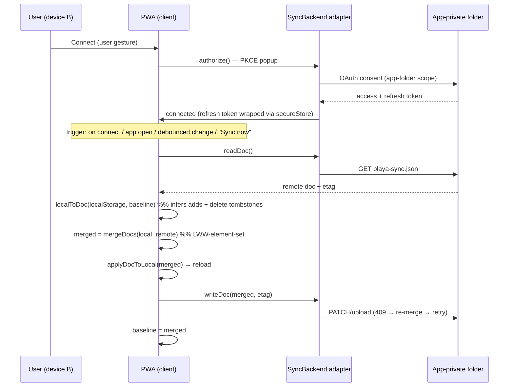

# Optional cloud sync of user state

## Overview

Playa Camps is a single-file, offline-first PWA. Every piece of *user* state —
starred camps/events/art, nickname, imported friends, home camp, meet spots,
hidden schedule days, and display preferences (theme, distance unit, map
layers) — lives as **plaintext JSON in `localStorage`**, scoped per data source
(see [15-data-sources.md](./15-data-sources.md) D4). The only ways to move that
state to another device or browser today are **manual**: the JSON snapshot
export/import ([09-share-and-import.md](./09-share-and-import.md),
`client/src/utils/exportImport.ts`) and fragment share links
(`client/src/utils/share.ts`). Both are additive-only, single-source, and
**never propagate deletions** — there are no tombstones or per-item timestamps
anywhere in `client/src`.

This ADR proposes an **opt-in** cloud sync so a user's own state follows them
across devices and browsers, saved into **their own** cloud account via OAuth.
It must:

- keep the app **fully offline and zero-dependency by default** — nothing
  changes for anyone who does not turn sync on;
- correctly handle **soft deletes** (unstarring on one device must remove the
  item on another — the "missing piece" problem the owner called out);
- use the **least-privilege** scope each provider offers;
- **not** require the operator to manage friends' email addresses, and **not**
  require going through a provider publish / app-review process.

> Status: this document is a **design decision record only**. No code has been
> written. It exists so the trade-offs (especially provider choice and the
> soft-delete model) are settled before anyone implements it.

## Requirements locked with the owner

| Requirement | Decision |
|---|---|
| What is synced | **Everything**: all 7 per-source scoped keys + the 4 global prefs (see D8). |
| Backup at-rest form | **Plaintext** inside the provider's app-private folder (data is just IDs + a nickname; folder is scoped to the user's own account). |
| Operator burden | **No email allowlist, no publish/review.** This is the hard constraint that decides the provider (D3). |
| Least privilege | App-scoped folder only, never full-drive access (D4). |
| Soft delete | Required and non-negotiable — solved by D6/D7. |

## Decisions

### D1 — Opt-in, build-flagged; offline-by-default is preserved

Sync is dark unless the build is configured for it. Two build-time settings —
`SYNC_PROVIDER` (`""` | `dropbox` | `onedrive`) and `SYNC_CLIENT_ID` (the
provider's **public** OAuth client id, safe to embed for client-side flows) —
flow through `Config` → `refresh.yml` → `builder.py` placeholder replacement →
`<meta name="bm-sync-provider">` / `<meta name="bm-sync-client-id">`, mirroring
the existing embargo-timestamp plumbing (D8 in
[15-data-sources.md](./15-data-sources.md), `__CAMP_LOCATION_RELEASE_AT__`).

When `SYNC_PROVIDER` is unset the client renders **no** Sync UI and references
**no** external origin. The default public build therefore keeps the
"zero runtime network dependencies … everything ships in the one static file"
invariant (CLAUDE.md) intact. Sync is the *first* opt-in cross-origin traffic
in the app; gating it behind a build flag keeps the invariant true for everyone
who does not deliberately enable it.

### D2 — Provider-agnostic engine behind a thin `SyncBackend` interface

The merge / soft-delete engine is provider-independent. A backend implements
only:

```ts
interface SyncBackend {
  authorize(): Promise<void>;            // PKCE popup; persists a refresh token
  isConnected(): boolean;
  readDoc(): Promise<{ doc: SyncDoc | null; etag: string | null }>;
  writeDoc(doc: SyncDoc, etag: string | null): Promise<{ etag: string }>;
  signOut(): void;
}
```

Everything hard (the CRDT, the local⇄doc translation, the baseline) sits above
this line and is written once. Swapping or adding a provider is a single new
adapter file with no change to merge logic.

### D3 — Provider choice: Dropbox default, OneDrive fallback, Google rejected

The operator's "no email allowlist, no review" constraint is the deciding
factor. Realistic providers for *save-to-the-user's-own-account, from a static
site with no backend/secret, least-privilege*:

| Provider | Least-priv scope | Token durability (no backend) | Account reach | Allowlist / review to let any friend connect |
|---|---|---|---|---|
| **Google Drive** | `drive.appdata` (hidden app folder) | ~1h access token, **no refresh token** in browser; silent re-token only if a Google session is active | Highest | **Fails the bar**: Testing mode needs a test-user *email allowlist*; Production needs *verification* (`appdata` is sensitive) |
| **Dropbox** *(default)* | **App folder** (`/Apps/<app>` only) | **PKCE issues a refresh token to public clients** → durable silent sync | Medium | **Meets the bar** under ~50 linked users (no allowlist, no review); production approval only past that |
| **OneDrive / Graph** *(fallback)* | `Files.ReadWrite.AppFolder` (`approot`) | MSAL / PKCE silent refresh | Medium | **Meets the bar**: personal-account user consent, no allowlist, no user cap, publisher verification optional |
| GitHub Gist | `gist` (all the user's gists) | PKCE | Dev-only audience | Rejected — scope is not app-scoped |

**Google is rejected as the default** precisely because it cannot satisfy the
no-allowlist-and-no-review constraint for `drive.appdata`. It could be added
later as a third adapter if the operator ever accepts one of those paths.

**Dropbox is the default** because it meets the constraint at friends-scale,
gives the best silent-sync UX (durable PKCE refresh tokens), and can be
implemented with **plain OAuth2 PKCE + REST — no SDK and no external `<script>`
tag** — which best preserves the offline invariant. Its two caveats: a
production-approval gate past ~50 linked users, and a feasibility check on
browser **CORS** for the token endpoint (see Failure modes).

**OneDrive/Graph is the documented fallback** and the safer choice if the
friend group could exceed 50 or if Dropbox's token-endpoint CORS proves
unusable: it has no user cap, no mandatory review, and CORS is first-class for
SPAs. The abstraction (D2) makes this a one-adapter swap.

### D4 — Least-privilege: app-scoped folder only

The sync file lives in the provider's **app-private folder** (Dropbox App
folder `/Apps/<app>`; Graph `approot`). The app can read/write only its own
folder — never the user's other files. This is the minimum scope that supports
a hidden per-user config blob and, for Dropbox/Graph, avoids the restricted-
scope security assessments that broad drive scopes trigger.

### D5 — Auth: PKCE popup, refresh token wrapped at rest, no SDK

- **PKCE, popup flow — not full-page redirect.** The service worker is
  cache-first on the shell ([07-offline-pwa.md](./07-offline-pwa.md)), so a
  redirect back to `/` would be served the cached `index.html` and reboot the
  app mid-flow. A popup that returns the authorization code to a same-origin
  handler via `postMessage` avoids that entirely. Trigger `authorize()` only
  from a direct user gesture ("Connect") so popup blockers don't eat it.
- **Refresh token is stored wrapped**, not plaintext: reuse the AES-GCM
  non-extractable `CryptoKey` in IndexedDB from
  `client/src/utils/secureStore.ts` (the same mechanism that protects the cached
  site password — [05-password-management.md](./05-password-management.md)). The
  refresh token grants ongoing app-folder access, so it is more sensitive than
  the plaintext *contents* and gets the extra wrap. (The owner's "plaintext"
  choice was about the backup contents, not the credential.)
- **Drive I/O is plain `fetch`** with `Authorization: Bearer` against the
  provider's REST files endpoints. No provider SDK is bundled; for Dropbox no
  external script is loaded at all.

### D6 — Sync document schema (`playa-sync.json`, `playa-sync-v1`)

A single JSON file in the app folder, with two structures:

- **`sets`** — every scoped set-collection keyed `"<base>/<source>"`
  (`favs/directory`, `favEvents/api-2026`, `favArt/api-2026`,
  `hiddenDays/directory`, …). Value is an **LWW-element-set**:
  `{ [id]: { t: <ms>, del?: 1 } }`. Presence with no `del` = active; `del:1` =
  a **tombstone**.
- **`registers`** — LWW single values: `nickname`, `theme`, `distanceUnit`,
  `mapLayers` (whole value), per-source `myCampId/<source>` and
  `meetSpots/<source>` (whole array), and imported friends as one register per
  friend under `sharedFavs/<source>/<name>` carrying the existing `FriendFavs`
  (it already has an `importedAt`). Each register: `{ v: <value>, t: <ms> }`.

Plus top-level `schema`, `updatedAt`, `deviceId` (random, for debugging).
`t` is wall-clock `Date.now()` at the moment of the change.

The document is validated adversarially on download — reuse the guards already
in `exportImport.ts` (`parseSnapshot`: size cap, exact schema string) and
`share.ts` (`__proto__` / `constructor` / `prototype` key bans on maps keyed by
friend name).

### D7 — Soft delete via LWW-element-set + a local baseline (core requirement)

Local hooks stay unchanged (`Set`-based, still the UI source of truth).
Deletions are recovered by diffing current local state against a **baseline** —
the state as of the last successful sync — stored in a new global key
`bm-sync-base`. This is what turns "a `Set` with an id missing" into an explicit
"this id was deleted at time `t`" operation without instrumenting every toggle.

Merge is a classic LWW-element-set (commutative, associative, idempotent → safe
for eventual consistency with no coordinating server). Per id (and per
register), the entry with the **higher `t`** wins; on a tie, **active beats
deleted** (bias toward not losing data). A tombstone with a newer `t` than a
remote active entry propagates the deletion; a re-add with a still-newer `t`
resurrects it.

Safety property: if `bm-sync-base` is ever missing (fresh install, "clear all
local data"), the first sync treats all remote items as adds and propagates
**no** deletes — the safe direction. Deletions are only ever inferred against a
known baseline, so a wiped device can never accidentally erase another device's
data.

Tombstones are retained but **garbage-collected past ~90 days** during merge to
bound file growth. A device offline longer than the GC window could resurrect a
deleted item on reconnect — an accepted, documented bound.

### D8 — What is synced (and what is deliberately not)

**Synced** (`Everything`): the 7 per-source scoped keys — `favs`, `favEvents`,
`favArt`, `sharedFavs` (friends), `myCampId`, `meetSpots`, `hiddenDays` — across
**all** embedded sources, plus the 4 global prefs `nickname`, `theme`,
`distanceUnit`, `mapLayers`. The canonical field list is the union of what
`buildSnapshot`/`applySnapshot` already cover (`exportImport.ts`) **plus** those
four prefs.

**Not synced** (device-local / ephemeral / security): `password` (device
secret), `source` (active view), `infoSeen`, `releaseNotesSeen`,
`eventCampReconciled`, `legacyKeysMigrated`, `embargoLiftAcked`, and the dead
`viewMode`. These are either per-device UX state, one-shot flags, or the unlock
credential — none belong in a cross-device document.

### D9 — Apply-then-reload; optimistic concurrency on write

After a merge changes local state, write the merged values to `localStorage`
and then `location.reload()`. This matches the existing snapshot/share import
flows, which already reload because hooks read their initial state on mount
(cross-tab `storage` events don't fire for same-tab writes). `writeDoc` uses the
provider's optimistic-concurrency token (Dropbox `rev`, Graph `eTag`); on a
409/conflict, re-download → re-merge → retry. Because merge is idempotent and
commutative, retries converge.

### D10 — Clock model: wall-clock LWW, with a documented skew caveat

`t` is wall-clock `Date.now()`. Across a single user's handful of devices, skew
is typically small and LWW is adequate. A device with a badly wrong clock could
win or lose conflicts incorrectly; the blast radius is one user's own favorites.
A hybrid logical clock (HLC) is the future hardening if this ever bites — it is
explicitly **out of scope for v1**.

### D11 — Contents plaintext, credential wrapped; content encryption is future

Per the owner, the sync document is plaintext inside the app-private folder —
acceptable because it is favorite IDs + a nickname, and the folder is scoped to
the user's own account with app-only access. Optional client-side encryption of
the document (a passphrase-derived key) is noted as a **future enhancement**,
rejected for v1 because a lost passphrase means a lost backup and it adds a
prompt on every new device. The OAuth **refresh token** is the exception and is
always wrapped (D5).

### D12 — Keep file export/import + share links as the offline fallback

Cloud sync does not replace the existing manual paths
([09-share-and-import.md](./09-share-and-import.md)). They remain the
always-available, zero-account, fully-offline way to move state — important for
anyone who will not connect a cloud provider. Do not remove them.

## Mechanism



Merge is the whole game; it is deterministic and needs no server:

1. Acquire an access token (silent refresh if a wrapped refresh token exists).
2. `remote = readDoc()` (empty if the file doesn't exist yet).
3. `local = localToDoc(localStorage, baseline)` — changed-vs-baseline items get
   `t = now` (adds, or `del:1` tombstones); unchanged items carry the baseline's
   old `t` so they never clobber a newer remote edit.
4. `merged = mergeDocs(local, remote)` — per key, max `t` wins; tie → active.
5. `applyDocToLocal(merged)` writes active ids / drops tombstoned ids / sets
   registers → `location.reload()`.
6. `writeDoc(merged, etag)` with optimistic concurrency.
7. `baseline = merged`.

## Build & deployment configuration

Mirrors the existing config pattern (no secrets in the repo — the OAuth client
id is public for client-side flows):

- `backend/src/playa/config.py`: add `sync_provider` + `sync_client_id` fields
  and read them in `from_env`.
- `.github/workflows/refresh.yml`: pass `vars.SYNC_PROVIDER` /
  `vars.SYNC_CLIENT_ID` into the build env.
- `backend/src/playa/builder.py` + `templates/site.html`: placeholder-replace
  into the two `<meta>` tags.

Provider console setup (one-time, no per-user management, no review at
friends-scale):

- **Dropbox:** create an app, access type **App folder**, enable the scope,
  register redirect URIs `https://playa.purohit.dev` and `http://localhost:PORT`
  (dev). Copy the App key → `SYNC_CLIENT_ID`. App stays in Development status
  (no review) under ~50 linked users.
- **OneDrive (fallback):** register an Entra app, "personal Microsoft accounts",
  SPA redirect URIs (same two), delegated `Files.ReadWrite.AppFolder` +
  `offline_access`. Client id → `SYNC_CLIENT_ID`. No allowlist, no cap, no
  mandatory review.

## Failure modes & trade-offs

- **Token-endpoint CORS (Dropbox) — spike this first.** A static SPA can only
  use a provider whose token + files endpoints send browser CORS headers from
  `playa.purohit.dev`. If Dropbox's `oauth2/token` does not, switch the default
  to OneDrive (one-adapter swap). This is the single biggest feasibility risk.
- **No true background sync.** Browsers give no way to run OAuth'd sync while the
  app is closed (no refresh-token use from a service worker, no Background Sync
  with third-party auth). Sync is foreground/opportunistic: on connect, on app
  open with a valid/refreshable token, debounced after changes, and via a
  manual "Sync now". This is inherent to a no-backend static site.
- **Dropbox 50-user production wall.** Past ~50 linked accounts Dropbox requires
  production approval (a review). OneDrive avoids the cap entirely.
- **Tombstone GC window.** A device offline longer than ~90 days can resurrect a
  deleted item. Accepted bound; adjustable.
- **Wall-clock skew (D10).** A badly-set device clock can mis-resolve LWW
  conflicts; blast radius is one user's own list. HLC is the future fix.
- **Cleared baseline never deletes.** Intentional safe direction — worst case is
  a resurrected favorite, never silent data loss.
- **Popup blockers / standalone PWA.** Auth must be user-gesture triggered.
- **Offline UX.** When offline, the app is fully usable; Sync surfaces an
  "offline" status and converges on reconnect.

## Alternatives considered (rejected)

- **Google Drive `drive.appdata`** — best ubiquity, rejected as default because
  it cannot avoid both an email allowlist and a verification review.
- **Self-hosted sync endpoint** (Cloudflare Worker + KV, per-user Gist) — adds a
  backend and a secret and per-user auth, breaking the no-backend stance
  (CLAUDE.md). Could be revisited only alongside the roadmap's "Cloudflare
  Access instead of the password gate" idea.
- **Client-side-encrypted document for v1** — deferred (D11): lost-passphrase
  risk and per-device friction outweigh the marginal privacy gain for
  low-sensitivity data in an already app-private folder.

## Verification (when implemented)

- **Unit (`node --test` + happy-dom):** `mergeDocs` CRDT laws (commutative,
  idempotent, tie→active-wins); add-here / delete-elsewhere propagates the
  delete; concurrent add+delete resolves by `t`; missing-baseline propagates no
  deletes; tombstone GC; `applyDocToLocal` round-trips every scoped key +
  register; adversarial `parseSyncDoc` (oversize, bad schema, prototype
  pollution).
- **Backend (`unittest`):** `Config.from_env` + builder emit the two meta tags;
  unset provider ⇒ empty flag and **no** provider origin string in `index.html`.
- **Manual E2E** (local build, `SYNC_PROVIDER=dropbox`, dev app key, localhost
  redirect): profile A stars + sets nickname → Sync; profile B connect → Sync →
  sees them; A unstars one → Sync; B → Sync → it disappears (soft-delete
  verified); prefs propagate; offline still works and converges on reconnect;
  default build (no provider) shows no Sync UI and makes no external calls.
- `make test` (both suites) + `npm run typecheck` green.

## Code references

Entry points for whoever implements this (all new unless noted):

- `client/src/utils/syncDoc.ts` — schema, `localToDoc` / `mergeDocs` /
  `applyDocToLocal`, baseline, tombstone GC, adversarial `parseSyncDoc`.
- `client/src/sync/SyncBackend.ts` — the interface (D2).
- `client/src/sync/dropboxBackend.ts` — default adapter (PKCE + REST).
- `client/src/sync/oneDriveBackend.ts` — fallback adapter (Graph `approot`).
- `client/src/hooks/useSync.ts` — orchestration + status + triggers.
- `client/src/components/SyncSettings.tsx` — Connect/Disconnect/Sync-now UI,
  mounted in `client/src/components/InfoModal.tsx` (About tab, near
  Export/Import).
- Reuse: `client/src/utils/storage.ts`, `client/src/types.ts` (`scopedKey`, LS
  keys — add `syncBase`, `syncRefreshToken`, `syncMeta`; add them to InfoModal's
  "Clear all local data"), `client/src/hooks/useSource.ts`
  (`availableSources`/`yearForSource`), `client/src/utils/secureStore.ts` (wrap
  the refresh token), `client/src/utils/exportImport.ts` +
  `client/src/utils/share.ts` (validation patterns; canonical field list).
- Build plumbing: `backend/src/playa/config.py`,
  `backend/src/playa/builder.py`, `backend/src/playa/templates/site.html`,
  `.github/workflows/refresh.yml`.
