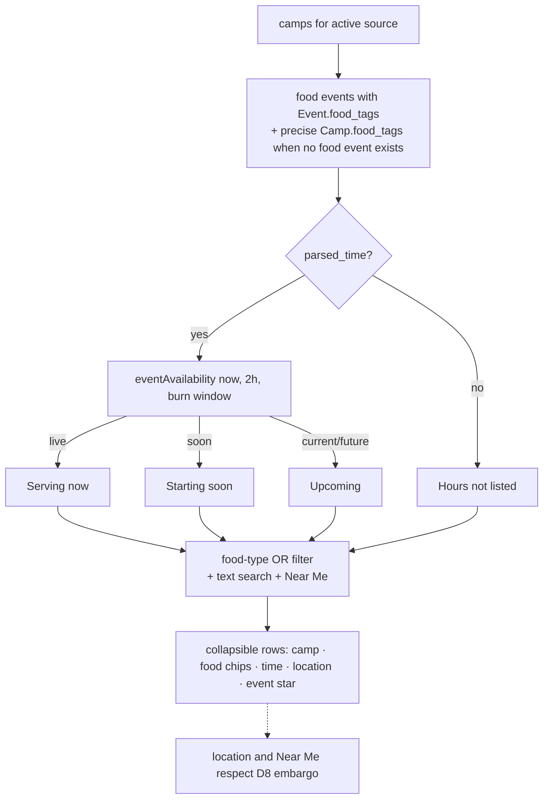

# Food tab — currently & soon-available food, by type

## Overview

A new **Food** tab answers one question fast on playa: *"where can I get food
right now, or soon, and what kind?"* It lists camps offering food, grouped by
**availability** (serving now / starting soon / upcoming / hours-not-listed) and
filterable by **food type** (breakfast, BBQ, tacos, pizza, sweets, snacks,
dietary options, international food, grilled cheese, …). Drinks are
intentionally outside this surface.

The implementation adds two capabilities:

1. **Event-level food classification.** `Event.food_tags` identifies which
   events serve food and what type. `Camp.food_tags` separately classifies a
   camp's own name and description for the no-event, hours-not-listed case.
   Both are distinct from the broad `Camp.tags` taxonomy.
2. **A time-aware "now / soon" view over all food events**, not just starred
   ones. The [Schedule](./11-schedule-system.md) view computes a simpler
   starred-event "Now" filter; Food uses a focused availability utility for
   full service windows, recurrence, midnight crossings, and date gating.

Availability is inherently **client-side** (it depends on the viewer's clock),
exactly like the Schedule "Now" filter and the [D8 location embargo](./15-data-sources.md).
The build ships `parsed_time` + per-event food types; the client decides
live/soon at render.

> Status: **implemented** (2026-08-09; reconciled 2026-08-11). This includes
> `Event.food_tags`, precise camp-level `Camp.food_tags`, the 34-bucket
> `FOOD_TYPES` taxonomy, `FoodView`, live availability, search, type filters,
> event stars/friend stars, Near Me, inline details, shared mockable clock/GPS,
> and the aggregate-only `playa food-audit`. The current population is derived
> only from configured annual API snapshots; aggregate counts should be
> recaptured after each explicit annual refresh.

## Decisions

### D1 — Event classification plus a camp-prose fallback, server-side

`food_tags: list[str]` exists on both Event and Camp. Event values are populated
from each event's `name + description`; Camp values use only the camp's own
`name + description` and support Hours-not-listed when no classified food event
exists. Rationale:

- Availability + type are per-*offering*, not per-camp: a camp can run
  "Pancakes 9–11a" and "Taco Tuesday 6p" — different types, different windows.
- Keeps classification server-side and testable in Python, consistent with the
  existing tagging philosophy (ship results, keep the client lean).
- The camp-level `TAGS` families (including the drink tags `bar` / `coffee` /
  `tea`) stay as-is for camp cards and search — they are a **separate** taxonomy
  from `FOOD_TYPES`, which is food-only.

Payload cost is bounded: both Event and Camp `to_dict` methods omit
`food_tags` when empty, so only classified records carry the list.

### D2 — `FOOD_TYPES`: food-only, granular per-dish buckets (no drinks)

`FOOD_TYPES: dict[str, list[str]]` in `backend/src/playa/tagger.py` is a
**separate** taxonomy from the ~120-entry camp-level `TAGS`. Two deliberate
properties (per owner direction, 2026-08-09):

1. **Food only — no beverages.** Bar/alcohol, coffee/tea, and juice/smoothie/
   soda buckets are excluded. A pure-drink event (e.g. "Cocktail Bar",
   "Espresso & Chai") yields **zero** `food_tags` and does not appear in the
   Food tab. (This is enforced by a `test_drinks_are_not_food` regression test.)
2. **Granular, per-dish.** Instead of coarse groups, buckets are specific things
   people scan for. 34 buckets grouped as:
   - **Dishes/mains:** `pizza`, `hot-dog`, `burger`, `grilled-cheese`, `grill`,
     `bbq`, `tacos`, `noodles`, `sushi`, `curry`, `dumplings`, `sandwich`,
     `soup`, `pickles`, `fruit`, `international`
   - **Breakfast items:** `breakfast`, `pancakes`, `waffles`, `bacon`, `eggs`
   - **Sweets:** `ice-cream`, `chocolate`, `cookies`, `cake`, `candy`, `donuts`,
     `pastries`, `smores`
   - **Snacks:** `snacks` (popcorn, pretzel, chips, fries, trail mix)
   - **Dietary flags** (cross-cutting): `vegan`, `vegetarian`, `gluten-free`
   - **General:** `meal` — the catch-all (food, meal, feed, dinner, lunch,
     breakfast, brunch, kitchen, buffet, potluck) so a generic food offering
     ("free dinner", "camp kitchen") still registers as a food event even with
     no specific dish. NO drink words here.

An event is a "food event" ⇔ it has ≥1 `food_tag`. The bucket set was chosen
data-driven against cached API events (buckets with real hit counts;
recognizable low-count ones like `sushi`/`smores` kept because they'll grow with
API-year data). Multiple buckets can fire on one event ("Breakfast tacos with
bacon" → `tacos` + `bacon`, plus `meal` if it says breakfast).

The taxonomy is tuned/extended with the `update-tags` workflow — always
reporting **aggregate counts only**, never dumping fetched records
([13-tos-compliance.md](./13-tos-compliance.md)).

Ambiguous abbreviations are not sufficient evidence. In particular, bare
`sub` was removed from the `sandwich` classifier after it created a non-food
Hours-not-listed result; explicit `sandwich`, `wrap`, `panini`, and `hoagie`
terms remain. Focused unit tests plus `make food-audit` cover this class of
false positive.

Known non-offering phrases are masked before positive `FOOD_TYPES` matching by
`FOOD_FALSE_POSITIVE_PHRASES`. Masking the phrase—not suppressing the resulting
bucket wholesale—preserves real evidence elsewhere in the same record: “cake
is a lie, but we serve cake” still classifies from the second `cake`, while
bare Portal jokes, figurative feeding/nourishment, meal plans, and food-storage
or shared-kitchen facilities do not classify by themselves.

Re-runnable analysis: `make food-audit` (or `python -m playa food-audit` when
the build environment is already exported) loads camps via the same
builder path, classifies, and prints **aggregate counts only** (never fetched
records, per the ToS stance) — food-event coverage, camps-with-food,
Hours-not-listed camps, and both per-type distributions. Classification itself
re-runs automatically on every `make tag` / `make rebuild`. Taxonomy edits
continue to use the approval and aggregate-delta workflow in CLAUDE.md.

### D3 — "Food camp" and availability are derived, not a new source

A camp appears in the Food tab if it has ≥1 event with non-empty `food_tags`,
**or** it has non-empty `Camp.food_tags` and no food-classified event (the
"anytime / hours-not-listed" case, D4). An unparsed food event supplies its own
Hours-not-listed row; it is not replaced by a camp-level row.
`Camp.food_tags` is the **precise** `FOOD_TYPES`
classifier run over the camp's own **name + description** (server-side,
`Tagger.food_types_for_camp`) — deliberately NOT the coarse camp `food` tag.
The coarse tag matched the camp's whole event haystack and pulled unrelated
camps into Food when an event happened to contain a food keyword. Using the
precise per-type match on name+description removed 24 such false positives
while retaining genuine no-event food camps. No new data source is introduced;
classification remains inside each existing per-source payload.

After classification, `SiteBuilder` applies the reviewed API-year-scoped
`data/food-exclusions-api-YYYY.txt` list. `camp:<id>` clears only
`Camp.food_tags`; `event:<id>` clears only that event's `food_tags`. The source
record, coarse camp tags, schedule entry, location, and all other views remain
untouched. Malformed entries fail the build, while stale/unmatched entries emit
an aggregate warning without printing IDs.

### D4 — Availability buckets (client-side, from `parsed_time`)

Each food *event* is placed by comparing `parsed_time` to the viewer's clock:

- **Serving now** — `start_time ≤ now < end_time` on a matching day (handle the
  midnight wrap via `end_day`, as `parsed_time` already encodes it).
- **Starting soon** — `now < start_time ≤ now + NOW_WINDOW_HOURS` today
  (the same two-hour policy used by Schedule).
- **Upcoming** — remaining current/future timed events in one collapsible list,
  sorted by canonical start date, then start time, then camp name.
- **Hours not listed** (`anytime` internally) — food with **no** parsed
  food-event time: camps whose food is only in prose, or events with no
  `parsed_time`. Deliberately **not** labeled "Anytime" — many are actually
  time-bound (e.g. a night-only camp) and we simply lack a structured time.

**Date-gating (`utils/foodAvailability`).** Availability is DATE-aware, not just
weekday+time — an event is "now"/"soon" only when today is genuinely a day it
occurs: inside the **burn window** (`bm-burn-start`/`bm-burn-end` passed to
FoodView), on a matching weekday, and **on/after its start date**. Recurring
events don't carry a date in the raw parse (`start_date` is null), so the
builder now **stamps `parsed_time.start_date`** for recurring events with the
earliest occurrence date (the same value the display's "(starts M/D)" uses).
The earliest occurrence is chosen by its mapped calendar date, not a
Monday-first weekday ordering; this matters when a source window starts on a
Sunday. Off-window (pre/post burn) → "now/soon" are empty by design; current or
future events fall to Upcoming/Hours not listed. Known limitation: the
weekday→date map has one date per weekday, so a two-week "Mon–Fri" recurrence
resolves to a single week — a pre-existing Schedule limitation, not solved here.

Overnight service checks both sides of midnight. Before midnight it validates
the current day's occurrence; after midnight it validates the previous day's
occurrence. A missing `end_day` is treated as an overnight range when the end
time is earlier than the start time. Completed single-occurrence events are
removed from the Food view, including Upcoming and Your upcoming picks, rather
than relabeled as future food.

The clock snapshot is owned by `App`, refreshed whenever Food is opened, and
updated once per minute during long-lived PWA sessions. FoodView's manual
Refresh control uses the same snapshot, so every availability section advances
together. Its freshness label includes the playa-local date, time, and timezone
(for example, “Updated at 1:00 PM PDT on Aug 31, 2026”), which avoids ambiguity
when planning from another timezone. The tabs do not display counts.

**Simulated clock.** All time-based logic (Food availability, Schedule
now/near-me, the location embargo) reads `utils/clock.now()` instead of
`new Date()`. Add `?now=<ISO>` to the URL (e.g.
`/?now=2026-08-31T13:00:00-07:00#food`) to freeze a simulated instant for
manual testing; it persists in `localStorage['bm-mock-now']` and a banner makes
it obvious. This is how the date-gating above is verified at pre-burn vs.
mid-burn times.

**Simulated GPS.** Add `?gps=<latitude>,<longitude>` before the route hash
(for example, `/?gps=40.786958,-119.202994#food`) to exercise Near Me without
a browser location permission prompt. The shared geolocation hook uses the
fixed coordinate in Food, Schedule, and Map, persists it in
`localStorage['bm-mock-gps']`, and shows a prominent banner. “Use real
location” clears the override and reloads. It can be combined with `?now=`:
`/?now=2026-08-31T13:00:00-07:00&gps=40.786958,-119.202994#food`.

Food resolves every instant into **playa (Pacific)** wall-clock fields with
`Intl.DateTimeFormat(..., {timeZone: 'America/Los_Angeles'})` before comparing
it with the source's unzoned `parsed_time`. This keeps live availability and
the “Updated at” label correct when planning from another timezone and makes
explicit-offset simulations deterministic on UTC CI runners.

### D5 — Food owns a focused availability utility

The original design proposed extracting Schedule's inline day-cell engine.
Implementation showed that the semantics differ enough to keep them separate:

- Schedule is a calendar of starred events and its "Now" filter is start-time
  oriented.
- Food classifies every food offering into a live service window, starting
  soon, upcoming, or hours-not-listed; it also handles overnight service and
  filters completed single events.

Food therefore uses the pure `client/src/utils/foodAvailability.ts` utility
(`occursOn`, `eventAvailability`, `isFoodEvent`, `isUpcomingFood`). Both views
share the two-hour policy and `utils/clock.now()`, while retaining focused test
suites. A shared engine should be reconsidered only if the semantics converge;
extracting merely to remove similar-looking code would couple different rules.

### D6 — Tab wiring mirrors the existing tabs

- `client/src/hooks/useHashRoute.ts`: add `'food'` to `VALID` and the `View`
  union (route `#food`).
- `client/src/components/TabBar.tsx`: add `['food', '🍽', 'Food']` to `TABS`.
  Tabs intentionally have no count badges: a Schedule or Art count would mean
  saved items, while a Food count would mean live availability, so a shared
  badge treatment would imply a consistency that does not exist.
- `client/src/components/App.tsx`: render `<FoodView>` when `view === 'food'`,
  wired to the same per-source camps, event favorites, friends, GPS, and map
  geometry the other views receive. On mobile, Food search remains sticky while
  the global chrome collapses; see [ADR 18](./18-mobile-scroll-chrome.md).

### D7 — Inherits per-source scoping, favorites, friends, near-me, embargo

The Food tab is a **view**, not new state. It respects:

- **Per-source scoping** — reads the active source's camps
  ([15-data-sources.md](./15-data-sources.md) D4).
- **Favorites + friends** — food-event rows reuse event stars and show friend
  stars. Camp-only Hours-not-listed rows have no invented event to star. A
  separate "Your upcoming picks" section shows the user's starred food events.
  It uses the same accessible plus/minus disclosure as the availability groups
  and starts collapsed, alongside Upcoming and Hours not listed, so a long plan
  does not consume the Food tab's initial screen space.
- **Near-me** — reuse the Schedule/Map GPS model and ~1 km cutoff. It filters
  every availability section, including Hours not listed. The button is a
  reversible toggle: pressing the active button again restores the prior
  search/type-filtered list and stops Food's GPS watch. It is disabled when the
  selected source has no matching map geometry and treats masked/unparseable
  locations as unavailable.
- **Location embargo (D8)** — availability uses *time only*, so "serving now"
  works even when a camp's location is masked pre-release. The Food row omits
  the location and Near Me cannot match it; no new bypass is introduced.

### D8 — Availability uses the existing encrypted payload channel

The build adds optional `Event.food_tags` and `Camp.food_tags` fields and runs
the `FOOD_TYPES` classifier on each source load. No new meta tag, encrypted
script, or network request is introduced. Everything time-based is computed in
the browser from the already-embedded `parsed_time`.

### D9 — Keep operational caveats in About, not the working surface

Food's inline copy explains the task (find meals, search, refresh availability)
without exposing classifier implementation details or repeating warning text.
The centrally maintained About modal still discloses the actual
transformations—tags are generated from source text and event times are
formatted against the configured burn-week calendar—because that applies to
every annual source and satisfies the existing ToS stance. Users are reminded
that snapshots can be stale or incomplete.

### D10 — Audit Hours-not-listed semantics locally and conservatively

`make food-audit` remains the deterministic aggregate coverage check. The
separate `make food-review` operator workflow loads the exact Hours-not-listed
population, sends private text only to two loopback Ollama models, and emits
ID-only advisory reports outside the repository. An exclusion requires
high-confidence agreement and still needs human approval; the audit never
changes `FOOD_TYPES` or deployable data itself. See
[ADR 19](./19-food-classification-audit.md) for the privacy boundary, annual
runbook, and failure modes.

The local audit produces advisory ID-only proposals outside the repository.
After human approval, record-specific API decisions remain tracked in the
matching annual exclusion file. The 2026 file retains 22 reviewed camp IDs;
directory-scoped decisions were retired with that source. Ambiguous model
decisions remain visible rather than being silently removed.

## Mechanism

Build time (`python -m playa build`):

```
for each camp:
  camp.food_tags = Tagger.food_types_for_camp(camp) # own name+description only
  for each event:
    event.food_tags = Tagger.tag_event_food(event)  # FOOD_TYPES vs name+desc
  # camp still gets coarse Camp.tags via existing tag_camp (unchanged)
→ Event/Camp.to_dict() omit empty food_tags
→ embedded per source through the existing payload/encryption path
```

Client render (`FoodView`, per-source):



## Failure modes & trade-offs

- **Clock/timezone.** Food treats source event times as playa-local and converts
  the current instant to `America/Los_Angeles` before comparing. Schedule still
  has its older device-local “Now” behavior; converging that filter onto the
  same helper is separate work because its window semantics differ (D5).
- **Source changes.** Food-type selections reset when the active source
  changes, and stale types are pruned after payload refreshes, so an invisible
  filter cannot strand the view in an empty state.
- **Untimed food camps.** Camps that serve food but publish no timed event
  can't be placed in "now/soon"; they live under "Hours not listed." This is
  more accurate than inventing an all-day window.
- **Classification precision.** Keyword tagging will miss/mis-hit some events
  (for example, metaphorical or abbreviated food terms). Word-boundary
  patterns, focused negative tests, and the aggregate `food-audit` keep this
  bounded. The About modal's general tag-transformation disclosure applies.
- **Payload size.** Optional Event/Camp `food_tags` are omitted when empty and
  are negligible beside the source text already embedded.
- **Embargo interaction.** Pre-release, "serving now" is useful but the *where*
  is masked until the D8 timestamps — acceptable and consistent; the tab must
  not leak location via the food path.
- **Separate availability engines.** Schedule and Food intentionally implement
  different semantics (D5). Shared clock and window policy reduce accidental
  differences, while focused tests protect Food's recurrence/midnight rules.
  Revisit extraction if future requirements actually converge.

## Alternatives considered

- **Client-side food classification at render** (no `Event.food_tags`) —
  rejected: duplicates taxonomy logic in TS, bloats the bundle, not
  Python-testable, and re-runs on every render. Server-side build-time tagging
  matches the existing model.
- **Generic `Event.tags` (all ~120 tags per event)** — rejected for v1:
  multiplies payload across thousands of events for little gain. A focused
  `food_tags` is enough; a general per-event tag field can come later if
  another time-aware, typed view needs it.
- **A dedicated food *filter* on the Camps tab instead of a tab** — weaker: the
  value here is the *time-aware* "now/soon" grouping, which the Camps grid
  isn't built for. A first-class tab matches the mental model.

## Verification

- **Backend (`unittest`):** `FOOD_TYPES` positive/negative and word-boundary
  cases; drinks excluded; ambiguous bare `sub` excluded; event vs camp-own-text
  haystacks; Event/Camp round-trips and empty omission; recurring earliest-date
  selection; builder load-path classification.
- **Client (`node --test` + happy-dom):** now/soon/later/anytime, explicit and
  inferred overnight windows, recurring date gating, expired singles, source
  filter reset, search/type/Near Me composition, event stars/friend stars,
  inline disclosure controls, refresh behavior, mock-clock/GPS clear paths, and
  restoring the complete list after Near Me is toggled off.
- **Manual E2E** (local build): set device clock inside burn week → confirm
  "Serving now"/"Starting soon" populate against known fixture events; toggle
  food-type chips, search, and Near Me; use `?gps=` to confirm Hours not listed
  is filtered and the second click restores the prior list; verify pre-embargo
  builds omit location while retaining food and time; clear simulated time/GPS
  and confirm real values resume. Tabs must remain free of count badges.
- `make test`, `npm run typecheck`, `make rebuild`, and `make food-audit` are
  the release checks. Audit output is aggregate-only.

## Code references

- `backend/src/playa/models.py` — optional Event/Camp `food_tags` fields and
  serialization.
- `backend/src/playa/tagger.py` — `FOOD_TYPES`, event classification, and
  camp-own-text classification, including phrase masking.
- `backend/src/playa/builder.py` / `backend/src/playa/config.py` — per-source
  classification, API-year Food exclusions, and recurring canonical-date
  stamping.
- `data/food-exclusions-api-2026.txt` — approved ID-only API-2026 suppressions.
- `backend/src/playa/timeparser.py` — parsing, canonical week maps, and
  earliest mapped occurrence selection.
- `backend/src/playa/cli.py` / `Makefile` — aggregate-only `food-audit` command.
- `backend/src/playa/foodreview.py` / `scripts/food_hours_ollama_audit.py` —
  local semantic Hours-not-listed audit and ID-only proposals (ADR 19).
- `client/src/utils/foodAvailability.ts` — pure availability/date logic.
- `client/src/utils/clock.ts` — real or simulated shared clock.
- `client/src/utils/mockGps.ts` — persistent query-string GPS simulation.
- `client/src/components/FoodView.tsx` — search, filters, availability sections,
  Near Me, event stars, picks, inline details, and refresh control.
- `client/src/components/App.tsx` — per-minute Food clock snapshot and feature
  wiring; `client/src/components/TabBar.tsx` — count-free Food route.
- `client/tests/foodAvailability.test.ts`, `client/tests/FoodView.test.ts`,
  `client/tests/clock.test.ts`, `backend/tests/test_tagger.py`,
  `backend/tests/test_timeparser.py`, `backend/tests/test_builder.py` — focused
  regression coverage.
