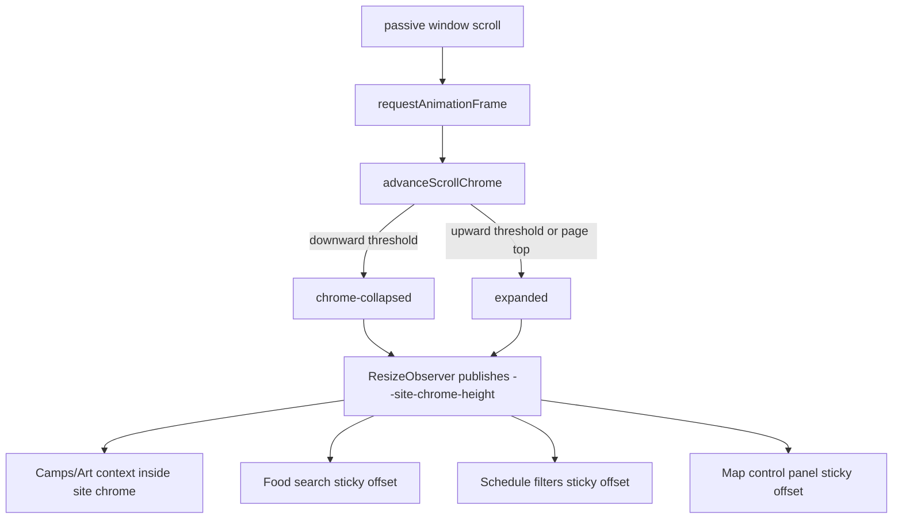

# Mobile scroll-aware chrome

## Overview

The full header, tabs, sharing actions, and transient banners consume valuable
vertical space on a phone. On viewports up to 600px, they now collapse after
sustained downward page movement and return as soon as the user reverses
direction. Each tab keeps its task-critical controls sticky, so reclaimed space
does not make the active task harder.

This is commonly called an auto-hiding, scroll-aware, or “headroom” header.
Desktop retains the existing always-visible sticky chrome.

## Decisions

### D1 — Collapse only global chrome; retain contextual controls

`App` divides `.site-chrome` into two layers:

- `.site-chrome-primary` — Header, TabBar, ActionBar, and status/import/release
  banners. This layer collapses on mobile.
- `.site-chrome-context` — Camps and Art search/filter controls. This layer
  remains inside the sticky container while the primary layer is collapsed.

The other tabs own their persistent controls inside their views:

| Tab | Controls retained while global chrome is collapsed |
|---|---|
| Camps | Search plus favorites/website filter row |
| Schedule | Now and Near Me filter row |
| Food | Food search |
| Art | Search plus favorites filter row |
| Map | Map actions, zoom, distance units, and layer controls |

Food type chips and Food refresh controls continue to scroll with content; the
entire filter set is too tall to pin without recreating the original space
problem. Schedule's short filter row and Map's consolidated control panel are
small enough—and important enough—to retain.

### D2 — Direction requires accumulated travel, not one wheel event

`client/src/utils/scrollChrome.ts` is a pure state transition. On mobile:

- The chrome is always visible within 32px of the document top.
- Hiding is allowed only below 96px and after 24px of accumulated downward
  travel.
- Reversing direction reveals after 10px of accumulated upward travel.
- Direction changes reset accumulated travel.
- A 240ms settle guard rebases scroll-anchoring deltas while the 180ms layout
  transition runs. Without it, changing the sticky header's height can look
  like an immediate user reversal and reopen it without user input.

This makes reveal intentionally quicker than hide and prevents touch/trackpad
jitter from repeatedly toggling the header. `App` batches scroll processing in
`requestAnimationFrame`; the listener remains passive.

The Camps search input does not autofocus when the mobile viewport first
mounts. Besides opening the on-screen keyboard without intent, mobile Chromium
can rescale the layout viewport around a focused sub-16px input. Desktop keeps
initial autofocus, and explicit focus actions still work on every viewport.

### D3 — One live height coordinates every sticky layer

`App` observes `.site-chrome` with `ResizeObserver` and publishes its current
height as `--site-chrome-height`. Food search, Schedule filters, and Map controls
use that variable for their sticky `top` offset. As the primary layer animates
closed or open, contextual controls follow the changing boundary instead of
using hard-coded pixel offsets or overlapping the header.

The resize listener is the fallback update path when `ResizeObserver` is not
available. Once camp data is loaded, all tabs stay mounted, so the shared
measurement remains stable across route switches.

### D4 — Tab changes reveal navigation and preserve scroll memory

Per-tab scroll positions remain owned by `App`. Changing tabs reveals the
global chrome as an orientation cue, restores that tab's saved position, then
restarts direction tracking from the restored offset. Programmatic scroll
restoration therefore does not immediately re-collapse the header.

### D5 — Mobile-only motion and accessibility

The collapsed primary layer is visually hidden, removed from pointer/focus
interaction with `visibility: hidden`, and marked `aria-hidden`. Reversing
scroll direction restores it. Under `prefers-reduced-motion: reduce`, the state
change remains but CSS transitions are disabled. At desktop widths the tracker
always resolves to expanded and none of the mobile collapse CSS applies.

## Mechanism

The CSS grid row on `.site-chrome-primary-shell` transitions between `1fr` and
`0fr`, allowing an unknown-height collection of banners to collapse without a
brittle maximum height. When a tab has no `.site-chrome-context`, the outer
container also removes its mobile vertical padding and background while
collapsed.

## Failure modes & trade-offs

- **Important transient banners hide with the primary layer.** Any small upward
  movement reveals them; they are not dismissed or unmounted.
- **Very short pages do not collapse.** They cannot scroll far enough to cross
  the thresholds, which is the desirable result.
- **Browser UI and page scroll direction differ in casual language.** The code
  uses increasing `window.scrollY` as “down into content” and decreasing values
  as “back toward the document top.”
- **Sticky stacks depend on live measurement.** If both ResizeObserver and
  resize events fail, view controls fall back to a zero offset and may sit under
  expanded chrome. Supported target browsers provide ResizeObserver.
- **Map retains a taller contextual surface.** Zoom and layer controls are
  essential to using the map and deliberately remain visible even though they
  occupy more height than the search/filter rows on other tabs.

## Verification

- `client/tests/scrollChrome.test.ts` covers top-of-page visibility, accumulated
  downward hiding, quicker reverse reveal, and desktop non-collapse.
- Component tests cover the retained Food, Schedule, and Map control surfaces.
- `npm run typecheck`, `make test`, and `make rebuild` are required.
- Mobile review at 390×844 should scroll each tab down and reverse direction,
  checking that the correct contextual surface stays pinned, no sticky layers
  overlap, and the document has no horizontal overflow. The encrypted artifact
  must be restored after any temporary plaintext review.

## Code references

- `client/src/components/App.tsx` — direction listener, route reset, DOM split,
  and live chrome-height publication.
- `client/src/utils/scrollChrome.ts` — pure threshold state machine.
- `client/src/components/FoodView.tsx` — sticky Food search wrapper.
- `client/src/components/ScheduleView.tsx` — retained Schedule filter row.
- `client/src/components/MapView.tsx` — retained map control panel.
- `backend/src/playa/templates/site.html` — mobile collapse, sticky offsets,
  reduced-motion behavior, and transitions.
- `client/tests/scrollChrome.test.ts` — state-machine regressions.
