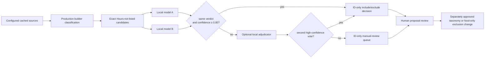

# Local semantic audit of Food classification

## Overview

`FOOD_TYPES` is intentionally deterministic and cheap, but a keyword cannot
always distinguish an actual playa food offering from a metaphor, joke, member
meal plan, or kitchen facility. `make food-review` is the annual, operator-run
precision audit for the Food tab's **Hours not listed** section. It reviews the
exact UI candidate population with two local Ollama models and produces an
ID-only proposal. It never edits the taxonomy, applies an exclusion, contacts a
cloud model, or becomes a build/CI dependency.

This complements `make food-audit`: that command measures aggregate classifier
coverage; this command performs private semantic review of the ambiguous
records behind one UI bucket.

## Decisions

### D1 — Review the UI population, not a parallel approximation

The audit loads every configured source through `SiteBuilder`, which applies
the production `FOOD_TYPES` classifier and event-time parser. It then selects:

- food-classified events with no parsed start time; and
- camp-prose food matches when that camp has no food-classified event.

Those are the two paths `FoodView` places in Hours not listed. Reviewing only
camp prose would miss false-positive untimed events; reviewing every food match
would spend most effort on timed offerings that are easier to verify.

### D2 — Raw records may go only to a loopback Ollama server

The script accepts only an `http://` loopback URL (`127.0.0.1`, `localhost`, or
`::1`). It verifies that both requested models are already installed and never
pulls a model or falls back to a remote service. Prompts instruct models not to
repeat source text, and malformed responses are not printed in error messages.

Normal output is aggregate counts. Checkpoints and reports are required to live
outside the repository and contain IDs, food-tag names, decisions, reason
codes, confidences, and content fingerprints—never camp/event names or
descriptions. This preserves the public-code/private-data boundary in
[ADR 13](./13-tos-compliance.md).

### D3 — Conservative multi-model agreement is required for a proposal

The default reviewers are `qwen3:30b` and `qwen2.5:32b`, both already local on
the operator machine. Every candidate goes to both at temperature zero using a
strict JSON contract. A final `include` or `exclude` requires the same verdict
from both models with confidence at or above 0.80. Everything else becomes
`manual-review` unless an optional, distinct `--adjudicator-model` supplies a
second high-confidence vote. The third model sees only unresolved records, so
the stronger review does not triple the normal run.

The default adjudicator example is another qwen2.5 size and therefore shares
model-family blind spots with the verifier. Their correlated majority may not
overrule a primary `include` or `uncertain` verdict to create an exclusion. The
primary must itself say `exclude`; the other models can then confirm it. This
asymmetry is intentional because a false exclusion is harder to notice than an
extra row left for manual review.

This is deliberately conservative. Model agreement is useful evidence, not a
source of truth; model disagreement is never resolved by silently picking the
larger model or averaging confidence scores.

### D4 — The audit proposes; a human applies two precision layers

The command writes three outside-repo files:

- `food-hours-review.json` — all ID-only decisions;
- `proposed-exclusions.json` — high-confidence agreed false positives; and
- `manual-review.json` — disagreements, uncertainty, or low confidence.

It does not modify `FOOD_TYPES`, tests, or deployable exclusion files. After
owner approval, generalizable mistakes become narrow
`FOOD_FALSE_POSITIVE_PHRASES` masks; record-specific mistakes become
`camp:<id>` or `event:<id>` entries in
`data/food-exclusions-<source>-<year>.txt`. Apply phrase masks first, rerun the
review against the smaller population, and add only the remaining approved
IDs. Both layers suppress only Food classification—not the source record in
Camps, Schedule, or Map.

The builder fails on malformed exclusion lines and prints only aggregate
applied/unmatched counts. An unmatched entry is a prompt to rerun the audit: a
record may have changed during the year, or a generic mask may now cover it.

### D5 — Operator tool, never nightly infrastructure

Ollama is not installed in GitHub Actions and is not a runtime dependency. The
semantic audit is run after a fresh annual data load, after meaningful
`FOOD_TYPES` changes, or when a user reports a suspicious Hours-not-listed
entry. Deterministic unit tests and `make food-audit` remain the CI-safe checks.

## Mechanism



Annual/operator flow:

```bash
# .env supplies the configured source years and burn window.
make food-audit
make food-review FOOD_REVIEW_ARGS='--output-dir /tmp/playa-food-review-YYYY'

# Optional stronger pass: the third model sees unresolved candidates only.
make food-review FOOD_REVIEW_ARGS='--output-dir /tmp/playa-food-review-YYYY --adjudicator-model qwen2.5:14b'

# An interrupted run resumes from the same ID-only checkpoint.
make food-review FOOD_REVIEW_ARGS='--output-dir /tmp/playa-food-review-YYYY'
```

After reviewing and approving `proposed-exclusions.json`, update the matching
source/year ID files manually. The command intentionally never copies its own
model output into deployable data.

Models, sources, threshold, and batch size can be changed through
`FOOD_REVIEW_ARGS`; run `python3 scripts/food_hours_ollama_audit.py --help` for
the full interface. `FOOD_REVIEW_OLLAMA_URL` can override the loopback endpoint;
remote hosts remain rejected. Do not point output at the repository.

## Failure modes & trade-offs

- **Model drift.** A model tag can change behavior after an Ollama update. The
  report records model digests, the prompt/schema digest, and the reconciliation
  policy version; changed model weights or prompt text invalidate matching
  checkpoints. Aggregate deltas and human approval are still required before a
  code/data change.
- **Shared blind spots.** Two models can agree and still be wrong. Phrase-level
  negative tests are preferred for stable, generalizable mistakes; ID-only
  exclusions are the escape hatch for record-specific ambiguity.
- **Incomplete local data.** The audit only covers configured cached sources.
  Always refresh data and confirm the printed per-source candidate counts
  before treating the result as an annual review.
- **Long runs.** Local 20–30B models are slow. Batches checkpoint after each
  successful response, so the same output directory safely resumes.
- **Schema failure.** A batch is retried once. Repeated malformed output stops
  the run without logging the response, because it may contain source text.
- **No scheduling inference.** A genuine food offering without structured
  hours remains in Hours not listed. Semantic review decides whether food is
  offered, not when it is available.

## Code references

- `backend/src/playa/foodreview.py` — candidate selection, loopback client,
  structured validation, reconciliation, checkpointing, and ID-only reports.
- `scripts/food_hours_ollama_audit.py` — thin operator entry point.
- `backend/tests/test_foodreview.py` — UI-population, privacy, URL, schema, and
  reconciliation invariants.
- `Makefile` — `food-review` operator target.
- `backend/src/playa/tagger.py` — deterministic `FOOD_TYPES` classifier and
  approved generic phrase masks.
- `backend/src/playa/config.py` / `backend/src/playa/builder.py` — source/year
  exclusion paths, strict ID-list parsing, and Food-only application.
- `data/food-exclusions-*.txt` — approved ID-only decisions; no source text.
- `client/src/components/FoodView.tsx` — production Hours-not-listed paths.
