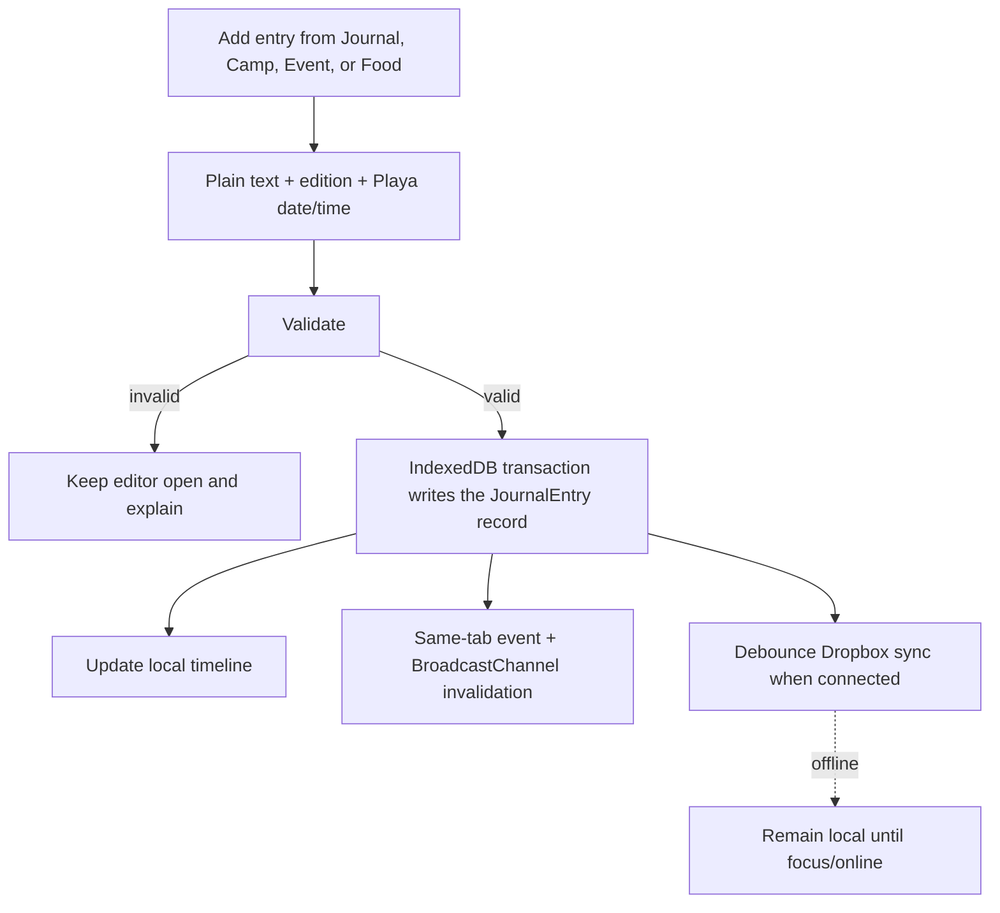
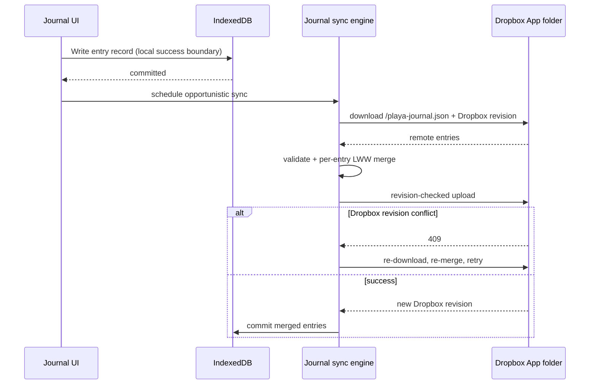

# Offline journal and Dropbox archive

## Overview

Playa Camps will add a private, text-only journal for recording memories and
notes before, during, and after the burn. Entries are written locally first and
remain fully usable without a network. A journal entry may stand alone or carry
a small snapshot of the camp, event, or Food item from which it was created.

The Journal view brings every entry together as a searchable timeline. Entries
belong explicitly to a burn edition such as **2026**, so a future 2027 build
defaults to the new journal while still allowing the user to open and search
their 2026 story. Context stores human-readable names only—never source IDs,
routes, or links—so old entries remain meaningful after source data and the app
itself change.

Dropbox-connected users receive opportunistic backup and cross-device merge in
one readable file inside the existing Playa Camps Sync App folder. Dropbox is
not required to journal, and loss of network or a sync failure never blocks a
local save.

## Requirements

| Requirement | Decision |
|---|---|
| Offline use | Create, edit, delete, browse, and search entirely from local storage |
| Entry points | Standalone entries plus contextual actions on camps, events, and Food items |
| Story time | Default to current Playa time; user may edit date and time manually |
| History | Explicit burn-year ownership; all years shown grouped on one page, no source/edition toggle for normal users |
| Context durability | Snapshot display names only; no source IDs or links |
| Content | Plain text only; no Markdown, HTML, photos, or attachments |
| Search | Case-insensitive local search across text and saved context names, spanning all years |
| Cloud | Optional readable Dropbox backup using the existing App-folder authorization |
| Conflicts | Per-entry last-write-wins by `(modifiedAt, writeToken)`; editing overwrites in place, deletes win permanently, no version history |
| Editing | Simple editor — no draft autosave; a save commits or the entry is discarded on close |
| Deletion | Soft-delete with a brief in-memory undo, then a durable tombstone (no persistence) |
| Recovery | Offline export **plus** validated import — genuine cross-device migration/recovery without Dropbox |
| Access | Ungated and password-rotation-durable; only data views require the site password |
| iOS durability | Home-Screen install exempts storage from the ~7-day tab-eviction cap; export/Dropbox back it up |
| Privacy | Never in **Share** / friend-import; rides the general Export/Import snapshot only as a self-restore-only `journal` section that friend-import structurally never reads (D12) |
| Personality (D18) | Day grouping, time-of-day glyph/tint, labeled per-entry mood, playful empty state, auto time-of-day hero — all inline/offline, theme-aware (no selectable background look) |

## Decisions

### D1 — Local-first IndexedDB, independent of Dropbox

The journal is a local feature first. Saves commit to IndexedDB before the UI
reports success. Reading, searching, editing, and deleting do not wait for a
service worker, Dropbox, or any other network request.

Use a dedicated versioned database (provisional name `playa-journal`) rather
than `localStorage`:

- journal text can grow beyond the small synchronous-storage budget;
- one record per entry permits atomic writes without rewriting the full journal;
- IndexedDB is already an accepted browser dependency in this project; and
- journal queries and migrations can evolve without crowding the existing
  source-scoped key namespace.

An unavailable or failed IndexedDB open must produce a visible error before the
editor accepts text. The app must never imply that an entry was saved when the
transaction failed.

Dropbox remains optional. When disconnected or offline, a successful local
transaction is the end of the user-facing save path; sync catches up later.

### D2 — A source-independent, year-owned entry schema

The persisted value is intentionally small and denormalized:

```ts
type JournalContextKind = 'camp' | 'event' | 'food' | 'art';

interface JournalContext {
  kind: JournalContextKind;
  title: string;       // camp name, event title, or Food offering title
  campName?: string;   // host camp for event/Food context
}

interface JournalEntryValue {
  burnYear: number;         // edition ownership, e.g. 2026
  occurredAt: string;       // BRC wall time: YYYY-MM-DDTHH:mm
  createdAt: number;        // immutable epoch milliseconds
  title?: string;           // optional single-line heading; card falls back to first line of text
  text: string;             // plain text
  context?: JournalContext;
}

interface JournalEntry {
  entryId: string;          // stable identity (crypto.randomUUID()); never a source record ID
  modifiedAt: number;       // ordering clock (see below); not user editable
  writeToken: string;       // random per-save UUID; deterministic tiebreak on equal modifiedAt
  deleted?: 1;              // tombstone: entry removed, no value (D10)
  value?: JournalEntryValue; // the single current value; absent iff deleted
}
```

`burnYear` identifies the Burning Man edition and is independent of both the
current calendar year and `occurredAt`. That permits a user to add a 2026 memory
later without reclassifying it as 2027.

`occurredAt` is the story timestamp. `modifiedAt` orders saves and is never user
editable. Editing the visible date/time must not make an older edit defeat a
newer one merely because the entry was moved earlier in the timeline.

**One record per entry; editing overwrites it.** There is exactly one
`JournalEntry` per `entryId`. Creating an entry mints a new `entryId`; editing
**overwrites** its `value`, `modifiedAt`, and `writeToken` in place — the prior
text is not retained. This is a journal, not a version manager: an edit is meant
to replace, and a delete is meant to remove. The only per-entry metadata is the
clock and a tiebreak, both used solely by the merge (D10).

Every save sets `modifiedAt = max(Date.now(), greatest locally known modifiedAt +
1)` (a Lamport-style logical clock, so a new save becomes current even if an
observed device clock ran ahead) and a fresh random `writeToken`. `writeToken`
breaks an exact `modifiedAt` tie deterministically, so any two devices pick the
same winner without needing version vectors, content hashes, or device IDs.

A delete sets `deleted` and drops `value`; its delayed, permanent behavior is
defined in D10 and D15.

The context is a snapshot, not a foreign key:

- camp entry: `{kind:'camp', title:'Camp Name'}`;
- event entry: `{kind:'event', title:'Event Name', campName:'Camp Name'}`;
- Food entry: `{kind:'food', title:'Offering or event name', campName:'Camp Name'}`;
- art entry: `{kind:'art', title:'Art Name'}` (no camp).

No camp/event ID, source name, URL, route, location, tag, or full upstream
description is retained. Renames in future source data deliberately do not
rewrite old memories.

This name-snapshot rule is also an **access** requirement, not only a durability
one: a normal (spirit-level) user has no multi-year source toggle and never
loads historical multi-year camp/art payloads, so an old entry could not resolve
a camp, event, or art record by ID even in principle — the stored name is the
only thing that can render it (see D6, D16).

### D3 — Plain text only

Entries accept Unicode plain text with preserved line breaks. Rendering uses
normal Preact text nodes and CSS `white-space`, never `innerHTML`. Markdown,
HTML, photos, file attachments, drawing, audio, and rich-text formatting are
out of scope.

This keeps offline storage, validation, sync, export risk, and mobile editing
predictable. A single entry is capped at 20 KiB of UTF-8 text; empty or
whitespace-only entries are not saved. Context title and camp name are each
capped at 300 characters after the same control/bidi sanitization used by other
user-importable state.

### D4 — First-class Journal view plus contextual entry actions

The feature owns a first-class `journal` view. Its exact responsive navigation
placement may differ by width rather than forcing six equal-width mobile tabs,
but **Journal** must be directly reachable from global navigation.

The view contains:

1. an **Add entry** action for a standalone note;
2. local search across the whole journal;
3. one continuous timeline of **every** entry the user has ever written, grouped
   by burn year (newest year first) and, within each year, by Playa calendar day
   (newest first) — see D6; and
4. edit (overwrites in place), delete (with undo — D15), and an **Export
   journal** action (D15).

There is no annual-source toggle on this surface — that belongs only to
god-mode data browsing. A normal user sees a single Journal tab with all their
years on one page; nothing is hidden behind an edition selector. The current
burn edition (e.g. **2026**) is shown prominently at the top of the page so the
active year is always clear, and earlier years appear as group headers down the
timeline; a year anchor may aid navigation but never filters entries out of
reach.

Camp cards/details, scheduled-event rows, and Food rows receive an **Add journal
entry** action. It opens the same editor with immutable context prefilled. The
user may remove the context before saving, but the editor does not silently
replace it when upstream data later changes.

The editor shows the context, plain-text field, edition, and Playa date/time.
It defaults the story time to the shared app clock so the existing `?now=`
simulation can exercise the flow. Saving from any surface inserts the entry
into the same timeline.

### D5 — Manual time uses Black Rock City wall time

All displayed and edited journal times use `America/Los_Angeles`, matching Food
and Schedule. The stored `occurredAt` is a minute-resolution wall-time string,
not the browser's local-time formatting and not an implicit UTC timestamp.

This is intentional: the journal is a Playa story, and a user reviewing it from
another timezone should still see “11:30 PM” as it occurred in Black Rock City.
The date/time editor interprets its value in the Playa timezone. The selected
burn edition remains independently editable and does not change automatically
when the timestamp crosses a year boundary. Journal "today" expansion, daily
quote rotation, and export filenames use that same Playa calendar date rather
than the browser/device calendar date.

### D6 — Year rollover is archival, never migratory

Entries are never migrated from one year to another during a source switch,
annual data refresh, app upgrade, or map-year change.

- New entries default to the **builder-emitted `BRC_MAP_YEAR`** as the *sole*
  authority for the edition — not the Playa clock, and not whichever source a
  god-mode user happens to be viewing. Keep the two roles clean: the clock
  (including a simulated `?now=`) determines `occurredAt`; `BRC_MAP_YEAR`
  determines `burnYear`. This prevents both a mid-August-vs-September clock from
  flipping the edition and historical source browsing from misfiling a
  present-day memory.
- The Journal view always shows **every** year present locally, grouped by burn
  year, on one page. There is no active-edition filter and no source toggle; the
  grouping *is* the navigation. Within a year group, entries form a simple
  timeline ordered by `occurredAt` (then `createdAt` as a stable tiebreak).
- In a 2027 deployment, new entries default to 2027, and every earlier year the
  user wrote in stays visible in the same grouped timeline even when no
  camp/event payload for those years is embedded.
- The user may explicitly change an entry's burn year while editing it; the year
  group is keyed on `burnYear`, so a corrected edition simply moves the entry to
  that group — no separate "mismatch" state exists.

Because saved context contains names rather than IDs, rendering an old year has
no dependency on historical source payloads.

### D7 — Search stays local and simple

Search is a case-insensitive substring match over entry text,
`context.title`, and `context.campName`, spanning **all** years — there is no
edition scope to select. Results retain the burn-year grouping and within-year
day ordering.

No search query, index, or journal text leaves the browser for search. At the
expected friends-scale volume, an in-memory normalized haystack per loaded
entry is simpler and sufficiently fast; full-text indexes or fuzzy ranking are
not justified.

### D8 — Multi-tab updates use an explicit journal channel

IndexedDB does not emit `storage` events. A successful journal transaction
therefore publishes a small invalidation message on a dedicated
`BroadcastChannel` (provisional name `playa-journal`) and dispatches a same-tab
custom event. Other mounted views reload the affected record/year from
IndexedDB; journal text is not copied through the channel.

Messages are invalidations only. Each tab reloads the affected entry record from
IndexedDB, so message arrival order cannot overwrite data — a reload always shows
the current per-entry LWW winner (D10). If `BroadcastChannel` is unavailable,
focus revalidation provides eventual same-browser convergence.

### D9 — One separate, fixed Dropbox journal file

Dropbox stores a second readable document at `/playa-journal.json` inside the
same private **Apps → Playa Camps Sync** folder:

```ts
interface JournalDocument {
  schema: 'playa-journal-v1';
  entries: Record<string, JournalEntry>; // keyed by entryId; one record (value or tombstone) each
}
```

The journal does **not** extend `playa-sync-v1`. Keeping it separate:

- lets older Playa Camps builds continue syncing plans without parsing or
  deleting journal state;
- permits journal-specific validation, limits, and tombstone retention;
- prevents a large journal from consuming the existing 5 MB plan-state
  validation budget; and
- lets a journal failure surface independently without blocking favorites,
  home camp, meet spots, or preferences.

The Dropbox transport should be generalized to revision-check a caller-supplied
fixed path while retaining the existing path allowlist; arbitrary user paths
must not be accepted.

One all-years file is deliberate. Per-year files would require discovering
which editions exist on a clean device, which would add listing/metadata API
behavior and could broaden the current Dropbox permission request. A fixed path
needs no `files.metadata.read` scope and preserves the existing
`files.content.read files.content.write` authorization.

The journal file is readable JSON and is not application-encrypted. This is an
accepted choice: it lives in the user's own app-private Dropbox folder, the
user explicitly opted into Dropbox, and avoiding a second recovery key keeps
the offline feature usable. The Privacy page and About copy must disclose that
journal text is stored readably in Dropbox when sync is connected.

### D10 — Per-entry last-write-wins; deletion is permanent

Journal merge is intentionally small. For each `entryId` present on either side,
keep a single winning record by this fixed rule:

1. **A tombstone wins permanently.** If either side's record is `deleted`, the
   merged entry is deleted; keep the tombstone with the greater
   `(modifiedAt, writeToken)`. A stale upsert can never resurrect a deleted entry
   or its text.
2. **Otherwise the newer value wins.** Keep the upsert with the greater
   `(modifiedAt, writeToken)`; its `value` is the current text and the other
   side's older text is discarded — editing overwrites, nothing is retained.

Entries present on only one side pass through unchanged. This is a per-entry
last-write-wins register with tombstones — a proper CRDT join, so the merge is
**order-independent and idempotent** with no version vectors, content hashes,
device identities, conflict copies, or saved history.

The deliberate trade-off: two devices that edit the **same** entry while
disconnected keep only the greater-`(modifiedAt, writeToken)` version — the
other's text is overwritten, not preserved. For a personal journal edited on a
device or two this is rare and is exactly the requested "editing overwrites"
behavior; concurrent edits to *different* entries never interact.

A completed delete (after the D15 undo window) is final: recreating a note later
uses a new `entryId`. The tombstone is a tiny `{entryId, modifiedAt, writeToken,
deleted}` marker — **not** retained history — kept indefinitely in v1 (unlike the
90-day plan-state tombstones) so a deleted personal note cannot reappear merely
because an old device was offline for a season. An offline device keeps its old
local copy until it next syncs; the merge then removes that text and propagates
only the tombstone.

The cloud cycle mirrors ADR 16's safe transport:

1. download `/playa-journal.json` and its Dropbox revision;
2. validate it without mutating local data;
3. merge remote changes with the local IndexedDB changes;
4. if the merged file differs, upload it with revision-checked update (or add);
   otherwise treat the validated remote revision as a successful no-op;
5. retry a Dropbox 409 from a fresh download, up to three times; and
6. commit the merged changes locally only after the no-op/write succeeds.

If the remote file is missing, local changes create it. A clean device unions
the downloaded changes; it never interprets local absence as a
deletion because deletions exist only as explicit tombstones.

**Local loss is recovery, never deletion (critical invariant).** iOS storage
eviction (D17), a cleared browser cache, **Clear all local data** (D12), or a
brand-new device all present as an empty or reduced local store. Because a
missing entry is *not* a tombstone, the next connected sync **restores** those
entries from `/playa-journal.json` and never uploads their absence as a removal.
Implementations must not "optimize" by tombstoning or dropping remote entries
merely because they are absent locally — only an explicit user delete creates a
tombstone. This is a required regression test: an empty-local + populated-remote
merge must yield full restoration and a no-op (or identical) upload, never a mass
deletion, and must not wipe the Dropbox copy.

The final IndexedDB transaction merges into the then-current local changes;
it never clears and replaces the store from an earlier sync snapshot. An entry
saved or edited while a Dropbox request is in flight therefore survives, wins
when newer, and schedules the next sync if it was not part of the upload.

### D11 — Opportunistic foreground sync, never a save dependency

Journal sync shares the existing wrapped Dropbox session and runs:

- immediately after Dropbox Connect/restore;
- after a debounced local journal mutation;
- on app open, focus, and return online;
- after another tab reports a journal mutation; and
- when the user taps **Sync now**.

There is no authenticated service-worker background sync. Closing the app
offline simply leaves changes in IndexedDB until the next connected
foreground opportunity.

The shared **menu Sync** covers the journal: the plan-state sync engine
(`useSync.run`) runs `syncJournalOnce` on every one of its triggers, so there is
no separate journal-tab Sync/Connect button in the normal app (only the locked
shell surfaces its own — D16). When the shared sync updates the journal DB it
notifies the mounted `JournalView` (BroadcastChannel) to reload. Plan-state and
journal sync report independently internally, while the Dropbox UI summarizes
both. A journal validation/network error must not roll back its local save or
prevent `playa-sync.json` from syncing. The UI should say that the journal is
waiting or failed rather than claiming all Dropbox data is up to
date.

### D12 — Journal content is private user state, not share state

Journal entries are excluded from:

- friend share URLs;
- the existing nickname-based JSON snapshot/import flow;
- imported-friend records; and
- release notes, analytics, logs, error strings, and build artifacts.

The existing snapshot can become “import as friend” on another device, so the
journal must never reach the friend-import path. It is therefore kept out of
**Share** entirely. Export/Import (D15) is unified into the global Export/Import
UI for one place to manage everything, but the journal rides as a **self-restore-
only `journal` section** of the exported file: the friend-import path
structurally never reads it (it builds a friend only from the favorite/plan
fields), and only a self-restore merges the journal into the local database. A
journal-only export needs no nickname. Implementation: `Snapshot.journal?`
validated by the journal's own parser (D13); `ExportModal` offers it as a
selectable item with select-all/deselect-all; `App.onApplySnapshotSelf` merges
it, `Share` and friend-import ignore it.

Disconnecting Dropbox keeps both the local journal and the cloud file. **Clear
all local data** must explicitly mention the journal in its destructive
confirmation and delete the local journal database, but it does not silently
delete the user's Dropbox copy. Reconnecting can therefore restore it. Deleting
entries through Journal creates cloud-propagating tombstones.

### D13 — Treat downloaded journal JSON as hostile input

The cloud document — and any **imported file** (D15), which runs the identical
path — is validated before merge:

- exact `playa-journal-v1` schema and plain-object shapes;
- 10 MB encoded document cap;
- at most 10,000 entries;
- valid UUID `entryId` and `writeToken` values, with the map key matching
  `entryId`;
- exactly one of `value` (an upsert) or `deleted:1` with no `value` (a tombstone);
- finite, plausible `modifiedAt` timestamps;
- burn years in a broad supported range (2000–2100);
- a real calendar date and time in exact minute-resolution `occurredAt` syntax;
- 20 KiB UTF-8 entry-text cap;
- 300-character sanitized context fields;
- known context kinds only; and
- prototype-sentinel/control/bidi rejection where applicable.

Invalid cloud or imported data aborts that merge without modifying IndexedDB and
without uploading over the good file. Local journaling remains available and the
UI offers retry after the user resolves the problem.

### D14 — Additive rollout and old-client safety

The first journal-capable build creates a new IndexedDB database and a new
Dropbox file; it does not rewrite existing favorites, schedule, Food, map,
friend, or sync state. Users upgrading from an older build therefore cannot
lose pre-existing app state merely by opening Journal or connecting Dropbox.

Older clients know only `/playa-sync.json`. They ignore
`/playa-journal.json`, cannot overwrite it, and continue syncing other state.
The journal schema is independently versioned so future journal migrations do
not require changing `playa-sync-v1`.

### D15 — Bias every failure toward keeping the text

The journal's content is irreplaceable, so the design errs toward preservation
even when it costs a little duplication:

- **No draft autosave — kept simple by choice.** The editor holds text in
  component state only; there is no IndexedDB draft store, debounce, or
  hide/unload flush. A save commits the entry (D1); closing the editor discards
  the in-progress text. This is a deliberate simplicity trade: the small risk of
  losing an uncommitted note is accepted rather than carrying draft persistence,
  restore prompts, and multi-tab draft reconciliation.
- **Editing overwrites; there is no version history.** By design (D2/D10) an
  edit replaces the entry's value and a delete removes it — the journal is not a
  version manager. "Keeping the text" therefore means protecting the committed
  *save and sync* path (local-first save, export/import), not retaining
  superseded versions. The one accepted loss is the requested one: an overwrite
  discards the previous text, and disconnected concurrent edits to the same entry
  keep only the LWW winner (D10).
- **Undo on delete — in-memory only.** Deleting an entry hides it and starts a
  brief in-memory timer; **Undo** cancels it, otherwise the durable tombstone
  (D10) commits when the timer elapses. There is no persisted pending-delete: if
  the tab closes before the timer fires, the delete was simply never committed
  and the entry survives. Simple, and safe — a delete only becomes permanent once
  the tombstone is actually written.
- **Export/Import in the global UI, journal as a self-only section.** Rather
  than separate journal-tab buttons, the journal is one selectable item in the
  app's global Export/Import (with select-all/deselect-all). The exported file is
  the machine-readable snapshot carrying a self-restore-only `journal` section —
  the complete set of records (current values and tombstones). Import feeds that
  section through the *same* D13 validation and *same* D10 merge as a Dropbox pull
  (union by ID, never a blind overwrite), and only a self-restore applies it
  (D12). This is the real cross-device migration/recovery path for users without
  Dropbox. (The locked shell, which has no global menu, still surfaces its own
  export/import — D16.) A future human-readable, non-importable text archive
  remains possible but is not in v1.

### D16 — The journal is ungated and survives rotation and re-lock

The password gate is a standing audience-control measure, and rotation is a
discretionary/reactive lever (audience
drift, or a takedown — see `docs/13`, `revocation-plan.md`), not a calendar
expiry. Absent an intervening event, Camps, Art, Food, Map, and Schedule data
stay available to whoever holds the current password.

This is not an absolute guarantee, though: access can also end through a
**takedown**, or through **termination/discontinuation** of the Innovate API
agreement, which requires stopping use and destroying Event Data "and any other
information" received under the agreement (see the
[Burning Man API terms](https://innovate.burningman.org/terms-of-service-for-burning-man-apis-and-datasets/)
and `revocation-plan.md`). The user's own text and timestamps are clearly their
own record. The **context snapshots are less settled**: an API-derived camp or
event *name* stored in `context` may itself qualify as "information received
under the agreement," even attached to user-authored text. This ADR does **not**
assert it is exempt; that is accepted residual risk for the small display-name
snapshot. If termination or a takedown ever requires removing journal context,
the response will preserve user-authored text and ship best-effort cleanup in an
updated client. The exact stale-device/Dropbox cleanup protocol is deliberately
not designed in journal v1; document the operational response in
`revocation-plan.md` if that situation arises.

Access must also survive a future **re-lock**. When the operator begins the 2027
migration — embedding new camps/events/locations and rotating
`SITE_PASSWORD`/`SITE_TIERS` to close the site down again — an existing user who
does not receive the new key loses the *data* views but must still open Journal
and relive every prior year. Three operator concerns are deliberately **separate
knobs**, none derived from another and none gating the journal:

- **Schedule end** — the reviewed end date committed for an annual API source.
  It does not re-lock the site or roll the journal edition.
- **Edition rollover** — happens when the 2027 build is deployed and
  `BRC_MAP_YEAR` advances; *that*, not burn-end, is what makes new entries
  default to 2027 (D6).
- **Site re-lock** — an independent rotation of `SITE_PASSWORD`/`SITE_TIERS` at
  migration time.

This mirrors the standing rule that schedule dates must never be reused for
location disclosure or access: those concerns stay orthogonal on purpose.

The journal is therefore independent of both the encrypted payload and the site
password:

- It reads only from IndexedDB (snapshot names, per D2), never from the gated
  camp/art payload, so it renders with no password and after a rotation. A user
  can relive their journal after the burn even if they never receive the rotated
  password.
- The Gate scopes to **data-dependent views only** (Camps, Art, Food, Map, and
  the event data inside Schedule). Journal stays reachable from global navigation
  while those views show a locked / enter-password state. This is a change from a
  whole-app gate: unlocking is required to read *shared source data*, not to read
  *your own writing*.
- The journal is **tier-agnostic** — per-device local data, unrelated to
  god/demigod/spirit tiers or the spirit auto-unlock artifact (D13). Its protection
  boundary is device security, matching every other piece of local app state.

**Ungated bootstrap (required).** Today the gate renders before global navigation
(`App.tsx` returns the gate ahead of the shell) and Dropbox sync initializes
*inside* the gated app. For ungated recovery to actually work, these must move
into an **ungated shell** that initializes before, and independently of, payload
decryption:

- global navigation with the Journal route, and the journal IndexedDB open;
- Dropbox **session restoration** from the wrapped store, plus the Connect /
  reconnect controls and status;
- **OAuth callback processing** (both popup and same-tab redirect return); and
- the **journal sync engine**.

Only the camp/art/Food/Map/Schedule-event views and their decryption stay behind
the gate. Without this, the failure the whole decision guards against still
happens: an evicted device whose Dropbox token has expired could open Journal but
have **no way to reconnect and restore** without the new site password. The
implementation must lift session/sync init and the gate boundary in `App.tsx`
above the gate return, and the "empty local, expired token, no password" path
must be an explicit tested scenario.

### D17 — iOS storage durability: install helps, sync/export are the guarantee

The dominant iOS risk is not private browsing but WebKit's cap on script-writable
storage: for a site opened in an ordinary Safari **tab**, IndexedDB / Cache /
localStorage are cleared after ~7 days *of no user interaction with the site* —
an inactivity trigger, not a hard timer. Note WebKit counts **interaction** as a
tap, click, or keyboard event, not merely opening or scrolling the page — so the
safe habit is "*interact* with it at least once a week," which any real journal
use satisfies. On playa, daily journaling never trips it; the real exposure is
dormant stretches before and after the burn. And because eviction presents as an
empty local store, a Dropbox-connected user is **recovered on the next connected
open** for everything that had synced (D10's restore-not-delete invariant).
Recovery is therefore guaranteed only for entries **confirmed synced or
exported** — not merely for installed apps: the inactivity cap is not the only
eviction path, and an installed-but-unsynced app can still be cleared under
storage-pressure/quota eviction. Only entries that reached Dropbox or an export
file are safe. (Verify the exact window and interaction definition against
current WebKit behavior; the policy evolves.)

Two tempting shortcuts do **not** work:

- **Switching IndexedDB for "non-indexed" storage does not help.** The seven-day
  cap applies to *all* script-writable storage as one bucket — `localStorage`,
  Cache API, service-worker registrations, and OPFS are evicted alongside
  IndexedDB. No browser-tab storage on iOS escapes it, and IndexedDB is still the
  right local primary for size and atomic per-entry writes (D1). Cookies survive
  longer but are tiny, sent on every request, and wrong for journal text.
- **Making Dropbox the state machine breaks the core requirement.** The journal
  must be fully usable off-grid for a week (D1), so the source of truth has to be
  local; Dropbox needs network, an account, and is rate-limited, so it cannot be
  the synchronous save boundary, and forcing Dropbox on every user contradicts
  "Dropbox is optional." Dropbox is the *backup*, not the store — but for a
  connected user it is exactly the iOS durability answer: if the local store is
  evicted, the next connected open **rehydrates** it from `/playa-journal.json`
  (D10's clean-device union). The strongest safety advice for an iOS user is
  therefore: install to the Home Screen **and** connect Dropbox.

Mitigations, in order:

- **Installed-PWA exemption — of the inactivity cap only.** A site added to the
  Home Screen and launched standalone is exempt from the seven-day *inactivity*
  cap (it runs its own use-counter outside Safari). It is **not** immune to
  quota-limit or storage-pressure eviction, so install narrows the risk but does
  not make local storage unconditionally permanent. The app already ships the iOS
  Add-to-Home-Screen flow (`InstallPrompt`); journal onboarding should nudge iOS
  users to install *before* relying on offline journaling, and the copy must say
  installing protects against the *inactivity* cap, not that it guarantees
  permanence.
- **Dropbox sync (D9–D11)** as the cloud backstop that rehydrates an evicted
  local store for connected users.
- **`navigator.storage.persist()` — a real, documented exemption.** MDN and
  WebKit confirm the eviction "skips over origins that have been granted data
  persistence." The catch on iOS: Safari decides automatically (no prompt) from
  engagement heuristics, and a primary heuristic is *whether the site is a Home
  Screen web app* — so persistence is most reliably granted once installed,
  making it complementary to install, not a substitute. Request it and re-check
  `persisted()` on every journal open.
- **Local export (D15)** as the manual backstop for everyone, especially
  journal-only users.
- **Private-mode handling.** Where IndexedDB is unavailable or ephemeral (iOS
  private tabs), D1's visible-error rule applies, and the UI additionally warns
  that entries will not persist rather than appearing to save.

The feature stays usable on iOS, but stated honestly: **installation avoids the
inactivity cap; Dropbox sync, export, and granted persistent storage are the
durability backstops.** No single measure makes local storage permanent, so the
UI copy must frame durability as "synced or exported" rather than implying any
on-device store — tab or installed — is guaranteed to survive.

### D18 — Delight layer (day grouping, time-of-day, moods, hero)

A visual-personality pass over the Journal view. Status: **accepted —
implemented.** It follows the same non-negotiables as the rest of the app:

- **Inline only.** Every graphic is inline SVG or CSS — no fetched images, no
  external requests, no image uploads. This preserves the offline / single-file
  / no-CSP-external stance. Uploads are explicitly rejected: they would break
  offline packaging, consume the same iOS storage we just simplified around
  (D15/D17), and add a safety surface.
- **Theme-aware.** Everything must stay legible across all five themes
  (paper / daylight / dusk / night / eclipse). Colored tints are low-opacity
  overlays or theme tokens, never opaque fills that fight the background.
- **Minimal, backward-compatible data.** The only entry-schema addition is an
  optional `mood?`. Everything else is derived from existing data (`occurredAt`,
  the clock). Old entries with no `mood` render fine.

**1. Day grouping.** The timeline gains a middle level: burn year → **day** →
entries. Day headers read like `Thu · Aug 28` (sticky, matching Schedule).
Days sort newest-first within a year; entries sort newest-first within a day
(`occurredAt` then `createdAt`). This is a pure regroup of the existing
`group()` output — no new stored data.

**2. Time-of-day bucket + glyph + tint.** Each entry is bucketed from its
`occurredAt` hour by a pure function `timeOfDayBucket(hour)`:

| Bucket | Hours | Glyph | Accent |
|---|---|---|---|
| dawn | 5–8 | sunrise | peach |
| morning | 8–12 | sun | sky |
| afternoon | 12–17 | high sun | gold |
| dusk | 17–20 | sunset | orange |
| night | 20–5 (wraps) | moon | indigo |

The entry summary shows a small **inline-SVG** glyph (drawn in the JournalIcon
style, `currentColor`-friendly) plus a low-opacity accent (a tinted left border
or gradient). Buckets are the same across devices/themes and are unit-tested.

**3. No selectable "look".** An earlier draft offered a background-preset picker.
It was **cut**: a per-tab background chooser is a theme-within-a-theme that
competes with the app's five real themes and adds a synced cosmetic setting for
little value. The time-of-day *hero* (point 6) always auto-follows the current
Playa time and provides the ambience; the page background is left to the theme.

**4. Per-entry mood.** An optional `mood?: string` on `JournalEntryValue`: a key
the user taps from a **curated allowlist** of ~16 playa-flavored vibes (Grateful,
Energized, Blissful, Awestruck, Dusty, Connected, Reflective, Euphoric, Peaceful,
Overwhelmed, Inspired, Playful, Wild, Tender, Exhausted, Curious) — deliberately
*not* a happy-scale of faces. The editor shows **labeled chips** (emoji + word)
so the mood is unmistakable, under a "Mood (optional)" heading; the card summary
shows just the emoji. `mood` stores the key, so the emoji/label are a rendering
detail. D13 validates it strictly — membership in the fixed allowlist, never an
arbitrary string. Optional, synced/exported, backward-compatible.

**5. Playful empty state with a rotating prompt.** When there are no entries,
show a friendly inline-SVG illustration and a prompt drawn from a small array
(e.g. *"What did the dust teach you today?"*, *"Best thing you ate on playa?"*).
The prompt rotates per load (or per day) — purely presentational, no stored data.

**6. Time-of-day hero.** A compact inline-SVG banner atop the Journal view: a
Black Rock City horizon silhouette with a sky gradient reflecting the **current**
Playa time (`clock.now()` → `playaTimeParts` → bucket), so it honors the `?now=`
simulation. Dawn peach, midday blue, dusk orange, night indigo with stars. Small
enough not to dominate; decorative, computed, no data.

**Trade-offs.** The main legibility risk is the time-of-day hero on the already-
dark themes — mitigated by keeping it subtle and testing across the five themes.
The `mood` allowlist keeps a corrupt/hostile file from injecting text. Everything
degrades gracefully and adds no dependency.

**Code:** `timeOfDayBucket`/`timeOfDayFor` + day-grouping helper + `mood`
validation in `journalStore.ts` (pure, unit-tested); `types.ts` (`mood?`);
`TimeOfDayIcon.tsx`, `JournalHero.tsx`; `JournalView.tsx` (day grouping,
glyph/tint, hero, empty state); `JournalEditor.tsx` (labeled mood chips);
template CSS. The optional `mood` field flows through the existing D10 merge;
no other sync/merge change.

## Mechanism

### Local entry flow



### Dropbox flow



## Failure modes & trade-offs

- **Dropbox sees readable journal text.** App-folder isolation limits access but
  is not end-to-end encryption. This is accepted and disclosed.
- **Concurrent edits to one entry lose the older text.** Per-entry LWW (D10)
  keeps only the greater-`(modifiedAt, writeToken)` version; a disconnected
  concurrent edit to the *same* entry overwrites the other. This is the accepted
  cost of "editing overwrites" and no version history; it is rare for a personal
  journal, and edits to *different* entries never interact.
- **Clock skew can pick the wrong winner between two concurrent edits.** Story
  time is separate; `modifiedAt` is a Lamport clock, so a badly-skewed device can
  win a same-entry race. There is no history to fall back on, so this is a real
  (if rare) way to lose the losing edit — the trade for simplicity.
- **One entry per record keeps the file bounded to live entries.** No edit
  history accumulates, so the file grows only with the number of entries (plus
  small tombstones), not with edit count. The 10 MB / 10,000-entry caps are
  generous; if ever approached, split by predictable year manifests before adding
  Dropbox metadata/list scope.
- **Tombstones grow forever.** Keeping delete markers indefinitely prevents
  seasonal resurrection at the cost of a small permanent record per deleted entry.
  Revisit only with a safe compaction protocol that knows every device has
  observed the deletion.
- **Clearing browser data or iOS storage eviction can lose unsynced entries.**
  Dropbox can restore only changes that had a connected foreground sync
  opportunity; export/import (D15) is the manual backstop. Home-Screen install
  (D17) avoids the *inactivity* cap but does not make on-device storage permanent
  (quota/pressure eviction still applies), so durability rests on sync or export,
  not on any local store. UI copy must never imply local storage is permanent.
- **Context names can become historically stale.** That is the point of the
  snapshot: an old story reflects what the user saw then, independent of future
  later source corrections.
- **No media or rich formatting.** The limitation avoids storage, copyright,
  offline-download, rendering, and sync complexity.
- **No sharing in v1.** This protects private writing but means journal-only
  users without Dropbox have no *automatic* cross-device sync yet; the offline
  export **and validated import** (D15) are their deliberate move-between-devices
  and recovery path.

## Rejected alternatives

- **Put entries inside `playa-sync.json`.** Rejected because journal text,
  indefinite delete tombstones, validation limits, and old-client behavior
  should not be coupled to critical plan state.
- **One Dropbox file per year.** Rejected for v1 because a clean device needs a
  discovery/index mechanism and potentially broader Dropbox metadata access.
- **Store source IDs and reopen old records.** Rejected because IDs and source
  payloads are annual, mutable, and may disappear; saved names tell a more
  durable story.
- **Use `localStorage`.** Rejected because synchronous quota and whole-value
  rewrites are a poor fit for a growing journal.
- **Encrypt the journal with an app-managed key.** Rejected by product choice;
  the user's App-folder Dropbox storage is sufficient, and another key creates
  recovery failure modes.
- **Markdown, photos, or attachments.** Rejected to keep v1 safe, offline, and
  maintainable.

## Planned code references

These paths are directional and should be finalized during implementation:

- `client/src/types.ts` — journal value/context/entry types
- `client/src/utils/journalStore.ts` — pure model, per-entry LWW merge, and
  validation (D2, D10, D13)
- `client/src/utils/journalDb.ts` — the single-store `playa-journal` IndexedDB
  (entries only), overwrite-in-place mutations, tombstones, clear
- `client/src/hooks/useJournal.ts` — local state, search, multi-tab reload,
  in-memory delete-undo, opportunistic sync
- `client/src/sync/journalSync.ts` — cloud + import validation and convergent,
  idempotent per-entry merge with permanent deletion (D10)
- `client/src/sync/dropboxBackend.ts` — allowlisted fixed-path transport
- `client/src/components/App.tsx` / `Gate.tsx` — the **ungated bootstrap**: lift
  nav, journal IDB, Dropbox session/reconnect, OAuth callback, and journal sync
  above the gate; scope the gate to data-dependent views only (D16)
- `client/src/components/JournalView.tsx` — all-years grouped timeline, search,
  delete-with-undo; export/import surfaced globally (locked shell only here)
- `client/src/components/JournalEditor.tsx` — simple create/edit form (no drafts)
- Camp/event/Food row components — contextual entry actions
- `client/src/components/InfoModal.tsx` and
  `backend/src/playa/templates/privacy.html` — disclosure and user guidance
- `client/tests/` — store, year rollover, search, multi-tab, UI, plus the
  merge-correctness suite the design depends on:
  - union is order-independent and idempotent;
  - equal-`modifiedAt` edits resolve deterministically by `writeToken`;
  - a newer edit overwrites an older one and the older text is not retained;
  - a delete wins permanently and stale devices cannot resurrect it;
  - pending deletes remain local/export the active entry until they commit;
  - the **eviction/restore invariant** (empty-local + populated-remote ⇒ full
    restore, never a mass delete or Dropbox wipe);
  - the **ungated-recovery** path (empty local + expired token + no password ⇒
    can reconnect and restore — D16); and
  - JSON export/import round-trips all entries including tombstones.
- `docs/16-cloud-sync.md` — update shared Dropbox orchestration once implemented
