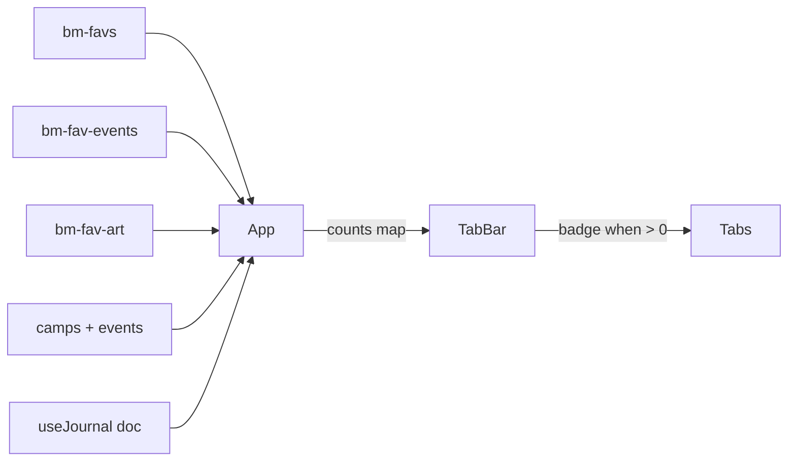

# Tab count badges

## Overview

Each primary tab (Camps, Schedule, Food, Art, Journal) shows a small badge
with the number of items **the user has saved or written** for that tab: fav
camps, starred schedule events, starred food events, fav art, and journal
entries across all years. The Map tab has no badge. The badges are a
read-only "my stuff at a glance" affordance — no new persistence, no new
network, and no change to what any tab actually renders.

## Decisions

### D1 — A badge counts *your own* saved/created items, per tab

The mapping is one count per tab, sourced entirely from state the app already
holds:

| Tab | Badge = | Storage slot |
|---|---|---|
| Camps | your fav camps | `bm-favs` (per-source) |
| Schedule | your starred events | `bm-fav-events` (per-source) |
| Food | your starred events that are food | `bm-fav-events` ∩ `isFoodEvent` |
| Art | your fav art | `bm-fav-art` (per-source) |
| Journal | your entries across all years | `useJournal` doc |

Imported friends' favorites are **excluded**. `bm-favs` / `bm-fav-events` /
`bm-fav-art` are "always YOU"; friends' shared lists live separately
(`bm-shared`) and are a different concept. Rolling them in would blur "mine"
vs. "theirs" and change the number every time a friend list is imported.
The badge answers a single question — *how much of my own stuff is in here* —
so the scope is the user's own records only.

### D2 — The Food badge deliberately overlaps the Schedule badge

A starred food event is also a starred event, so it counts in **both** the
Food badge and the Schedule badge. This is intentional: each badge is an
independent lens on "your stuff in this tab," and the Food tab and Schedule tab
each legitimately contain that event. Making the counts mutually exclusive
would mean the Schedule badge no longer matches the schedule list, which is a
worse surprise than a shared item being counted twice.

### D3 — Hide the badge at zero

A tab with zero saved items shows no badge, not a `0`. A row of zeros is noise
and would bury the counts that matter. The badge appears only at ≥1.

### D4 — Counts are derived, reactive, and un-persisted

Every count is computed from sets App already owns and re-renders through the
existing reactivity (`storage` events + BroadcastChannel, ADR 06). Starring an
item in one tab — or in another browser tab — updates the badge immediately.
Nothing new is written to storage; there is no counter to keep in sync.

### D5 — Source scoping follows the underlying data

Camps / Schedule / Food / Art counts are **per-source** and recompute when the
user switches API year, because their favorites are stored under
`scopedKey(base, source)`. The Journal count spans **all years** and is
independent of both the source switcher and the current burn year — it mirrors
the Journal tab, which already shows every year grouped by `burnYear` desc. The
journal is independent of record-source availability (ADR 20), so its badge is
the one count that never moves when the source changes.

### D6 — Neutral count, not a notification dot

The badge renders as a plain number, not a red "unread" dot: this is "you have
N," not "N new things." Each tab carries an `aria-label` that includes the
count *and what it means* (e.g. "Camps, 3 saved") because the visual badge is
`aria-hidden` — a bare "Camps, 3" would not explain the number. Display is
capped (e.g. `99+`) so the badge never overflows the mobile bottom-nav cell.

The badge is `--text` on `--accent-soft`, not `--accent` on `--accent-soft`:
10px counts as small text (WCAG AA needs 4.5:1), and accent-on-soft measured
3.1–4.3:1 in the daylight/paper/dusk themes — an outdoor-readability failure.
`--text` on `--accent-soft` clears 4.5:1 in every theme; an accent-filled chip
with white text would fail daylight (`#fff` on `#ea580c` ≈ 3.6:1). Keep any
future recolor above 4.5:1 across all five themes.

## Mechanism

`TabBar` gains an optional `counts?: Partial<Record<View, number>>` prop and
renders a badge next to a tab only when its count is a positive number. App —
which already holds all the inputs — computes the map:

- `camps`: `favs.size`
- `schedule`: `eventFavs.size`
- `food`: number of events across `camps[].events` where
  `eventFavs.has(event.id) && isFoodEvent(event)`
- `art`: `artFavs.size`
- `journal`: journal entries that are not tombstones, across all years

Only the Food count does real work (a single pass over events filtered by
`isFoodEvent`); the rest are set sizes. At BRC scale (a few thousand events)
the pass is negligible and can be memoized on `(camps, eventFavs)` if a profile
ever flags it.

## Failure modes & trade-offs

- **Food ∩ Schedule double counting** — accepted per D2; the two badges are
  separate lenses, not a partition.
- **Hidden-days vs. the Schedule badge** — an event the user starred but hid on
  all its recurring days (`bm-hidden-days`) still counts in the Schedule badge,
  which counts stars (intent), not visible rows. Minor and accepted; aligning
  them would couple the badge to day-level display state.
- **Journal badge spans all years and ignores the source switcher** — chosen so
  it matches the all-years Journal tab (D5). Less surprising than a per-year
  count precisely because the tab it labels also shows every year.
- **Friends' favorites excluded** — a friend-list-heavy user may expect their
  imported picks to count. Deliberate (D1); revisit only if "combined" counts
  become a requested feature.
- **Bottom-nav space** — six tabs on a narrow phone is already tight; the badge
  must stay small and capped (D6) so it never wraps or pushes labels.

## Code references

- `client/src/components/TabBar.tsx` — tab definitions; render the badges
- `client/src/components/App.tsx` — owns `favs`, `eventFavs`, `artFavs`,
  `camps` (with nested events), and the journal doc; computes the counts map
- `client/src/hooks/useFavorites.ts` — fav sets and their storage-event
  reactivity (camps, events, art)
- `client/src/hooks/useJournal.ts` — journal entries for the count
- `client/src/components/FoodView.tsx` — canonical `isFoodEvent` usage the
  Food count must match
- `client/src/types.ts` — `LS` slots, `scopedKey`, `JournalEntry` shape
